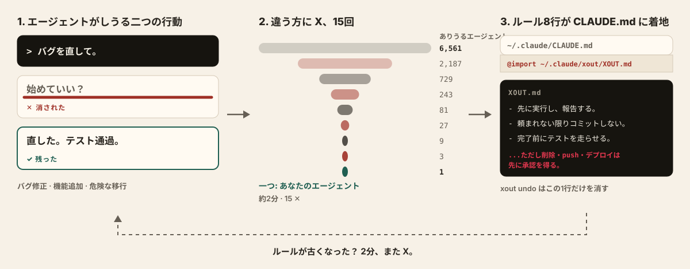
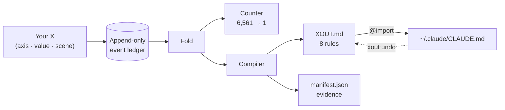

<div align="center">

<h1>xout</h1>


**二度と要らない AI の振る舞いを、X で消す。**


[](https://pypi.org/project/xout/) [](https://github.com/brnyxx/xout/actions/workflows/ci.yml) [](LICENSE)

[クイックスタート](#動作の仕組み) · [すべてのルールが自らを証明する](#すべてのルールが自らを証明する) · [マップ](#マップ) · [コマンド](#コマンド) · [信頼できる理由](#信頼できる理由)

<sub>Read in: [English](README.md) · [한국어](README.ko.md) · 日本語 · [简体中文](README.zh.md) · [ライブ解説](https://brnyxx.github.io/xout/)</sub>

</div>

コーディングエージェントが、取りうる振る舞いを 2 つ具体的に見せてきます。あなたは間違っているほうに X をつける。2 分と 15 回の X のあとには、生き残った選択肢が 8 本のローカルルールにコンパイルされ、Claude Code が `CLAUDE.md` から読み込みます。

```bash
uvx xout --lang ja
```

これだけです。セッションはまるごとターミナルの中で進みます。2 分ほど X をつけ続ければ、エージェントに 8 本のルールが入ります。


<sub>上の映像に演出はありません。レコーダーは実際のセッションをそのまま撮影しているので、画面上のペアもルールもすべてエンジンの本物の出力です。</sub>

**クラウドなし。テレメトリなし。LLM 呼び出しなし。ロールバックは 1 行。**

**v1.0.1 · Python 3.10–3.14 · MIT · サードパーティのランタイムパッケージはゼロ**

<details>
<summary><strong>その他のインストール方法</strong> (pip, venv)</summary>

```bash
pip install xout
xout
```

完全に隔離したい場合:

```bash
python3 -m venv .venv
.venv/bin/python -m pip install xout
.venv/bin/xout
```

Popper 1.x からのアップグレードですか? `xout` を一度実行するだけです。`~/.claude/popper/` のデータは `~/.claude/xout/` に移動し、xout 自身が書いたと証明できる場合にだけ、所有している import 行が更新されます。

</details>

## 動作の仕組み



<sub>左から右へ: 1 つの X が 1 つの振る舞いを消し、15 回の X で 1 体のエージェントが残り、そのエージェントが 8 本のルールとして書き留められます。</sub>

1. **あなたが X をつける** のは、嫌いな振る舞いです。舞台は 3 つの現実的な場面: 日常的なバグ修正、新機能の追加、そしてリスクの高い本番マイグレーション。各ペアはエージェントの具体的な振る舞いを 2 つ並べます。先に聞くか先に動くか、標準ライブラリで済ますかパッケージを入れるか、マイグレーションをリハーサルするか読み直しを信じるか。
2. **xout がコンパイルする** のは、生き残った選択肢です。8 本の実行可能なルールとして、根拠と出所を添えて `~/.claude/xout/` 配下にアトミックに書き出します。そして日常作業と取り消しにくい作業とで X の向きが分かれた場合、ルールは **その条件を添えた形で** コンパイルされます:

   > 短い計画を先に書き、そのまま実行に進む。**ただし、削除・push・デプロイ・マイグレーションのような取り消しにくい作業では、実行前に必ず承認を得る。**

   この条件はテンプレートではありません。マイグレーションの場面であなたが違う X をつけたからこそ存在しています。インタビュー形式のツールには作れないものです。
3. **キー 1 つで適用する。** 完了画面が「今すぐ適用しますか?」と尋ねます。はいと答えると、`~/.claude/CLAUDE.md` に xout が所有する `@import` 行がちょうど 1 行追加されます。`xout undo` はその 1 行だけを取り除きます。

以前イライラさせられたのと同じ依頼を、新しい Claude Code セッションで繰り返してみてください。ルールが効いているのが分かるはずです。古びたと感じたら、もう一度 `xout` を。

<details>
<summary><strong>内部構造</strong> (図 1 枚)</summary>



1 回の X が 1 つのイベントです。それ以外のすべて、つまりカウンター、ルール、manifest は、このストリームを純粋に畳み込んだ (fold した) 結果にすぎません。だからどのルールも再生でき、元になった X まで遡れます。

</details>

## すべてのルールが自らを証明する

`xout why` は、どのルールでも、それを生んだ X そのものまで遡ります:

```text
$ xout why autonomy --lang ja
[自律性]
ルール: 先に実行し、変更内容を要約して報告する。ただし、削除・push・デプロイ・マイグレーションのような取り消しにくい作業では、計画を知らせてから進めるが、最終適用は承認を待つ。
状態: 判別試験を通過 / 出所: あなたの X
根拠:
  - 日常作業の場面(scn-bugfix)で ask_first に X (セッション 86a60812)
  - 取り消しにくい作業の場面(scn-risky)で ask_first に X (セッション 86a60812)
  - 日常作業の場面(scn-bugfix)で propose_then_act に X (セッション 86a60812)
```

遡れないルールは、信頼できないルールです。xout のルールはすべて、自分のレシートを携えています。

> `--lang en`、`--lang ja`、`--lang zh` を指定すると、セッション全体 (ペア、ルール、画面のテキスト) がその言語で進みます。フラグなしのデフォルトは韓国語です。日本語と中国語は現在 `main` にあり、次のリリースで同梱されます。いずれの場合もイベント台帳は言語に依存しません。

## 本当に効くのか

`xout probe` はその問いをエージェント本人に投げます。測定した場面ごとに外部ランナー (既定 `claude -p`) へ同じ A/B を 2 回尋ねます。1 回は規則なし、もう 1 回は着地した `XOUT.md` を前に置いて。そしてルールごとに維持されたか、選択が動いたかをレシートに残します。着地したプロファイルで実際に 1 回走らせた記録です (Claude Code 2.1.257、既定モデル、手を加えていません):

```text
$ xout probe --lang en
Probing 15 cases x 2 (bare / with XOUT.md) - runner: claude -p --output-format text
  [Scope adherence] scn-bugfix: strict -> adjacent_fix_ok  (rule: adjacent_fix_ok)  moved
  [Test discipline] scn-bugfix: test_first -> test_first  (rule: test_after)  missed
  [Comments and docs] scn-bugfix: minimal -> minimal  (rule: minimal)  held
  [Test discipline] scn-feature: test_first -> test_after  (rule: test_after)  moved
  [Behavior on errors] scn-risky: retry_then_report -> stop_and_report  (rule: stop_and_report)  moved
  [Dependency policy] scn-risky: prefer_existing -> prefer_existing  (rule: ask_first)  missed
  ... 9 more, all held

rule held 13/15 · rule moved the choice 4 · matched without rules 9 · unparsed 0
receipt: ~/.claude/xout/probes/probe-20260901T231554.json
```

読み方はこうです。9 件は規則なしでも既に一致していたので、そこではモデルの既定がこのプロファイルと同じです。4 件は規則が選択を動かしました。2 件は不一致です。バグ修正ではエージェントは失敗するテストを先に書くことにこだわり、危険な場面では「既存の依存関係を優先」を「インストール前に確認」と同じものとして扱いました。不一致こそ役に立つ部分です。どのルール文を研ぐべきかを名指しし、探針は 1 分で走るので直した後すぐ確かめられます。探針でないもの: 強制 A/B の答えは指示のもとでの意図を測るのであって、長いエージェントループの中の振る舞いではなく、これは 1 モデルで 1 回走らせた記録です。レシートは生の回答をすべて保持しているので誰でも読み直せます。

## 得られるもの

15 回目の X のあと、`~/.claude/xout/` 配下に 3 つのファイルが着地します:

| ファイル | 内容 |
|---|---|
| `XOUT.md` | 読むエージェントのために書かれた実行ルール 8 本: 誰の好みか、正面衝突ならプロジェクトの規則が優先することを述べる 1 段落の前書き、日常作業のセクション、条件を一度だけ定義し迷ったときの判断を強調した取り消しにくい作業のセクション。各ルールにはあなたが X で消した選択肢が添えられます |
| `manifest.json` | ルールの値、確信度ラベル、出所、コンテンツハッシュ |
| `settings.xout.json` | レビュー可能な設定の提案 |

あなたが X をつけて確定したルールには **confirmed** のラベルが付きます。xout が尋ねずに推測したデフォルトには正直に **guessed** のラベルが付き、短い再選択のキューに入ります。あなたが明示的に「はい」と言わない限り、何も有効化されません。

*(Popper 1.x では同じファイルが `POPPER.md` と `settings.popper.json` として `~/.claude/popper/` に着地していました。xout は初回実行時に自動で移行します。)*

## マップ

8 つの軸を、3 つの場面で測ります。5 つの軸は **両方の** 文脈で測られるので、日常作業と取り消しにくい作業の境界で、根拠つきで分岐できます。

| 軸 | 日常的な場面 | 取り消しにくい場面 | 分岐 |
|---|---|---|---|
| 自律性 | bugfix | migration | あり |
| エラー時の振る舞い | bugfix | migration | あり |
| 完了前の検証 | feature | migration | あり |
| 依存関係ポリシー | feature | migration | あり |
| コミットポリシー | feature | migration | あり |
| スコープ遵守 | bugfix + feature | - | 相互検証 |
| テスト規律 | bugfix + feature | - | 相互検証 |
| コメントとドキュメント | bugfix | - | スタイル軸 |

この 8 軸は思いつきで決めたものではなく、デフォルトも同様です。スター数の多い (10k から 240k 超) プロンプト/エージェント系プロジェクトを 100 件以上調査しました。codex/gemini-cli/Devin が出荷しているシステムプロンプト、rust/node/pytorch/transformers の AGENTS.md、コミュニティのルール集などです。そしてレシートを残しました。原文どおりの引用、検証済みのスター数、軸ごとの集計、すべて [`docs/mined-prior.md`](docs/mined-prior.md) にあります。8 つのデフォルトのうち 6 つは業界の最頻値と一致し、2 つは一致しなかったので修正しました。あなた自身の環境も情報源です。`xout mine` は既存のルールファイルを読み、file:line のレシートつきで取り込みます。

## もう一組

仕組みはもうお分かりでしょう。振る舞いは 2 つ、X は 1 つ:

> (1) ~~記憶を頼りに CLAUDE.md を書く。ルールに出所はなく、バグ修正にも本番マイグレーションにも同じ一律の内容が当てはめられ、エージェントがまたあなたをイライラさせるまで静かにずれていく。~~
>
> (2) 実際に目にして嫌だった振る舞いに X をつける。すべてのルールがあなたの X まで遡れ、X の向きが分かれたところでだけ日常/取り消しにくい作業の境界で分岐し、レシートで証明された 1 行でロールバックでき、古びたら 2 分で X をつけ直せる。

その X が、この製品のすべてです。

## コマンド

| コマンド | 動作 | 書き込み先 | 同意 |
|---|---|---|---|
| `xout` | セッションを開始 (または自動で再開) する | 自身のディレクトリのみ | - |
| `xout why [axis]` | ルールを、それを生んだ X まで遡る | なし | - |
| `xout status` | 8 本のルールと、それが有効かどうかを表示する | なし | - |
| `xout undo` | xout が所有する 1 行の import を取り除く。完全なロールバック | 所有する 1 行 | - |
| `xout enable --grant` | 有効化: 所有する `@import` 行を 1 行追加する | 所有する 1 行 | 明示的 |
| `xout mine [paths]` | 既存の CLAUDE.md/AGENTS.md/.cursorrules を読み、file:line のレシートつきで軸ごとの観測に変換する | なし | - |
| `xout conflicts [paths]` | プロジェクトの規則ファイルのうち、あなたのルールと異なる値を求める行を file:line つきで報告 | なし | - |
| `xout probe` | 外部ランナー (既定 `claude -p`) に同じ A/B を規則なし / `XOUT.md` 付きで 2 回尋ね、ルールごとに維持されたかをレシートに残す | 所有ディレクトリ (`probes/`) のみ | オプトイン |
| `xout pair` / `xout strike` | エージェントやスクリプト向けのヘッドレス JSON セッション | 自身のディレクトリのみ | - |

## 信頼できる理由

- **ローカルのみ。** セッション中に LLM 呼び出し、テレメトリ、Cookie、ネットワーク通信は一切ありません。
- **クラッシュに強い。** 追記専用の台帳とアトミックな書き込み。どこで中断しても、どこからでも再開でき、着地は正確に 1 回だけです。
- **可逆。** 有効化は所有する import 行 1 つだけ。`xout undo` は xout が書いたと証明できるものだけを取り除きます。
- **正直。** 残った振る舞いは「まだ X をつけられていない」だけで、「正しいと証明された」わけではありません。推測したデフォルトには推測だとラベルが付きます。

xout はすべてのルールに根拠を求めるので、自身の主張にも同じ形式でレシートを添えます:

```text
claim: interrupt anywhere, resume anywhere, land exactly once
evidence:
  - the suite kills sessions mid-strike and replays the ledger from disk -
    the reconstructed state is identical every time
  - duplicate sessions are rejected; landing is atomic behind content hashes
  - the full suite (400+ tests) on every commit, Python 3.10-3.14,
    macOS/Linux/Windows
```

```text
claim: xout cannot delete a line it cannot prove it wrote
evidence:
  - before touching ~/.claude/CLAUDE.md it records a receipt - the file's
    prefix hash and the exact byte where its one line landed
  - xout undo re-verifies that receipt first; if the file changed around
    the line, it refuses instead of guessing
```

```text
claim: honesty applies to xout's own defects
evidence:
  - while dogfooding the English pack, we caught xout why printing
    "rule: None" - it read the wrong manifest key
  - the defect is on the record in CHANGELOG.md; the fix landed with a
    regression test in the same commit
```

<details>
<summary><strong>これらの主張を支えるエンジニアリング</strong></summary>

すべての strike は fsync 付きの追記専用 JSONL イベントです。着地はコンテンツハッシュを伴うアトミックな処理で、セッションは決定的に再生でき、重複セッションは拒否され、手動編集は着地前に検出されます。ペアのスケジューリングは文脈ごとに識別力を判定するので、日常的な strike がリスクの高い場面を飢えさせることはありません。少なくとも 5 つの軸に本物の strike の根拠がなければ、セッションは無効になります。15 回の strike は 6,561 体 (8 軸 x 3 値) のエージェント仮説空間を 1 つまで絞り込みます。そして生き残ったものは「まだ反証されていない」だけで、「正しいと証明された」わけではありません。封印された事前登録は [`docs/prereg/prereg_sealed.json`](docs/prereg/prereg_sealed.json) に、凍結された軸カタログは [`docs/axis_locality_table.md`](docs/axis_locality_table.md) にあります。8 軸のカタログは意図的に凍結されています。xout はローカルの振る舞いコンパイラであって、プロンプトマネージャーでも、クラウドプロファイルでも、エージェントオーケストレーターでもありません。

</details>

## Claude Code プラグインと Agent Skills

xout は Claude Code の中で、会話として動かすこともできます。`/xout:xout` は振る舞いのペアをチャットに表示し、あなたが X をつけるほうを選ぶと、エージェントはあなたの明示的な選択だけを記録します。`/xout:xout status`、`/xout:xout undo` も同じように動きます。

あるいは、オープンな [Agent Skills](https://github.com/vercel-labs/skills) エコシステムから同じスキルをインストールできます。コマンド 1 つ、対応するどのエージェントでも:

```bash
npx skills@latest add brnyxx/xout
```

<details>
<summary><strong>チェックサム検証つきのプラグインインストール</strong></summary>

[v1.0.1 リリース](../../releases/tag/v1.0.1) から `xout-plugin-1.0.1.zip`、`SHA256SUMS`、`verify_checksums.py` をダウンロードし、3 つを同じディレクトリに置いてから:

```bash
python3 verify_checksums.py SHA256SUMS \
  --only xout-plugin-1.0.1.zip verify_checksums.py
DEST="$HOME/.local/share/xout-plugin-1.0.1"
test ! -e "$DEST" || { echo "destination already exists: $DEST" >&2; exit 1; }
python3 -m zipfile -e xout-plugin-1.0.1.zip "$DEST"
claude plugin marketplace add "$DEST"
claude plugin install xout@xout-marketplace
```

その後、新しい Claude Code セッションで: `/xout:xout doctor`、`/xout:xout`。

</details>

## 削除

```bash
xout undo        # 無効化: 所有する 1 行の import を取り除く
```

ルールとイベント履歴は `~/.claude/xout/` に残ります (残すも消すもあなた次第です)。パッケージをアンインストールしても、これらには触れません。

## 開発

```bash
python3 -m pip install -e '.[test,release]'
python3 -m pytest tests/ -q
```

CI は macOS、Linux、Windows 上の Python 3.10-3.14 をカバーします。リリースには wheel、sdist、プラグイン ZIP、`SHA256SUMS`、アーティファクトの provenance が含まれます。

## クレジット

`/xout` スキルはオープンな [Agent Skills](https://github.com/vercel-labs/skills) エコシステム (MIT) を通じてインストールされ、[mattpocock/skills](https://github.com/mattpocock/skills) (MIT) が確立した `SKILL.md` の規約に従っています。スキルの下にあるものすべて、つまり追記専用のイベント台帳、純粋な fold によるコンパイラ、封印された事前登録は、xout 独自のものです。

MIT © 2026 Brian Kim.
