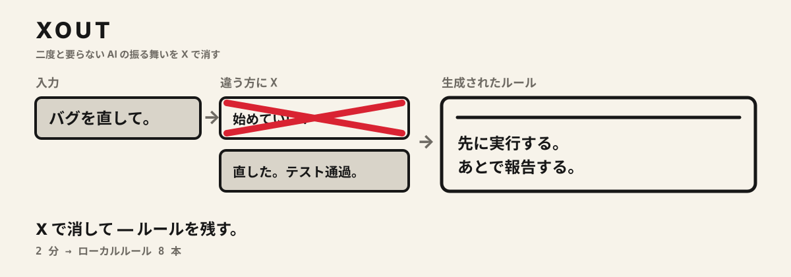
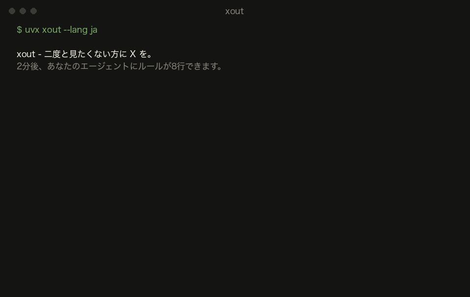
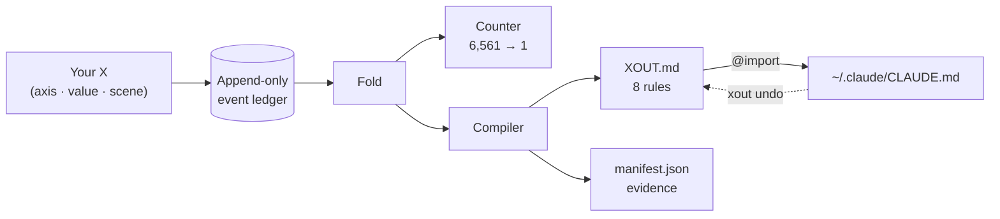

<div align="center">

<h1>xout</h1>


**二度と要らない AI の振る舞いを、X で消す。**



[](https://pypi.org/project/xout/) [](https://github.com/brnyxx/xout/actions/workflows/ci.yml) [](LICENSE)

[五つのステップ](#全体は五つのステップ) · [対応ツール](#対応ツール) · [動作の仕組み](#動作の仕組み) · [本当に効くのか](#本当に効くのか) · [コマンド](#コマンド) · [信頼できる理由](#信頼できる理由)

<sub>Read in: [English](README.md) · [한국어](README.ko.md) · 日本語 · [简体中文](README.zh.md) · [ライブ解説](https://brnyxx.github.io/xout/ja/)</sub>

</div>

**AI コーディングツールはどれもルールファイルに従います。ところが、良いルールファイルを書ける人はめったにいません。** そこを xout が肩代わりします。質問攻めにはしません。AI が取りうる振る舞いを 2 つ並べて見せるので、二度と見たくないほうに X をつけるだけ。X は 15 回、時間にしておよそ 2 分。生き残った選択肢が 8 本の平易なルールにまとまり、普段使っているツールにそのまま差し込まれます: Claude Code、Codex、OpenCode、Gemini CLI、Copilot CLI、pi、oh-my-pi、Kiro、そして `AGENTS.md` を読むツールならどれでも。


<sub>左から右へ: X 1 つで振る舞いが 1 つ消え、X 15 回でエージェントが 1 体だけ残り、そのエージェントが 8 本のルールとして書き留められます。</sub>

```bash
uvx xout --lang ja
```

これだけです。セッションは最初から最後までターミナルの中で完結します。2 分ほど X をつけて最後に `y` を押せば、エージェントに 8 本のルールが入ります。



<sub>上の映像は演出なしです。レコーダーは実際のセッションをそのまま録画しているので、画面に出るペアもルールも、すべてエンジンが実際に出力したものです。</sub>

**クラウドなし。テレメトリなし。セッション中に LLM を呼ぶこともありません。自分のフォルダの外に書く内容はすべてセーブポイントを取ってからで、コマンド 1 つで元に戻せます。**

**v1.1.0 · Python 3.10–3.14 · MIT · 実行時のサードパーティ依存はゼロ**

<details>
<summary><strong>その他のインストール方法</strong> (pip, venv)</summary>

```bash
pip install xout
xout
```

完全に隔離した環境に入れたい場合:

```bash
python3 -m venv .venv
.venv/bin/python -m pip install xout
.venv/bin/xout
```

Popper 1.x から上げる場合も、`xout` を一度実行するだけです。`~/.claude/popper/` のデータは `~/.claude/xout/` へ移り、import 行は xout 自身が書いたものだと証明できる場合に限って書き換えられます。

</details>

## 全体は五つのステップ

| | 何が起きるか | 入力するもの |
|---|---|---|
| **1. すでにあるものを読む** | 既存のルールファイル (`CLAUDE.md`、`AGENTS.md`、`.cursorrules`、グローバルの `~/.claude/CLAUDE.md`) を一度だけ読み、画面に出ている振る舞いについて書かれた行があれば各ペアの横に表示します。コピーも書き換えもしません。 | なし (`xout mine` で一覧できます) |
| **2. X を 15 回つける** | 同じタスクに対する具体的な振る舞いを 2 つ並べるので、二度と見たくないほうを消します。場面は現実的な 3 つ: バグ修正、新機能、リスクの高いマイグレーション。 | `xout` |
| **3. ルールが着地する** | 根拠つきのルール 8 本が `~/.claude/xout/` 配下に書き出されます。この時点ではほかのファイルには触れません。 | なし |
| **4. 差し込む** | Claude Code なら xout 管理の `@import` 行を 1 行。ほかのツールなら、そのツール自身のルールファイル末尾に xout 管理のブロックを 1 つ。どちらもレシート付きです。 | 最後に `y`、または `xout enable --grant --target codex` |
| **5. 確かめて、整理して、いつでも戻す** | ルールが効いているかをエージェント本人に聞きます。古いファイルの中で、いまや XOUT.md と重複している行を取り除きます。xout のフォルダ外を編集するときは、必ず先にセーブポイントを取ります。`xout undo` は xout が書いたものだけをきっちり取り除きます。 | `xout probe` · `xout reconcile` · `xout undo` |

## 対応ツール

xout のルールはただの markdown なので、ツールごとに違うのは *どこからルールを読むか* だけです。以下のパスはどれも各ツールの公式ドキュメントで確認したもので、確認できなかったツールは xout に登録していません。

| ツール | ルールの置き場所 | 差し込み方 | `xout enable --grant --target …` |
|---|---|---|---|
| [Claude Code](https://code.claude.com/docs/en/memory) | `~/.claude/CLAUDE.md` | xout 管理の `@import` 行 1 つ | `claude` (既定) |
| [OpenAI Codex CLI](https://learn.chatgpt.com/docs/agent-configuration/agents-md) | `~/.codex/AGENTS.md` | xout 管理のブロック | `codex` |
| [OpenCode](https://opencode.ai/docs/rules/) | `~/.config/opencode/AGENTS.md` | xout 管理のブロック | `opencode` |
| [Gemini CLI](https://geminicli.com/docs/cli/gemini-md/) | `~/.gemini/GEMINI.md` | xout 管理のブロック | `gemini` |
| [GitHub Copilot CLI](https://docs.github.com/en/copilot/how-tos/copilot-cli/customize-copilot/add-custom-instructions) | `~/.copilot/copilot-instructions.md` | xout 管理のブロック | `copilot` |
| [pi](https://github.com/badlogic/pi-mono/blob/main/packages/coding-agent/README.md) | `~/.pi/agent/AGENTS.md` | xout 管理のブロック | `pi` |
| [oh-my-pi](https://github.com/can1357/oh-my-pi/blob/main/docs/context-files.md) | `~/.omp/agent/AGENTS.md` | xout 管理のブロック | `omp` |
| [gajae-code](https://github.com/Yeachan-Heo/gajae-code/blob/main/docs/customization.md) | `~/.gjc/agent/AGENTS.md` | xout 管理のブロック | `gjc` |
| [Kiro](https://kiro.dev/docs/steering/) | `~/.kiro/steering/xout.md` | xout 管理の steering ファイル | `kiro` |
| [AGENTS.md を読むすべてのもの](https://agents.md) | プロジェクト内の `./AGENTS.md` | xout 管理のブロック | `agents` |

`xout targets` を実行すると、この表が各ツールの現在の状態つきで表示されます。`xout enable --grant --target all` で全ツールに一度に差し込み、`xout undo` でまとめて取り除けます。

xout 管理のブロックは次のような形です。そのファイルの中で xout が触るのはこの範囲だけです:

```markdown
<!-- xout:begin sha256=… -->
<!-- managed by xout - edit XOUT.md, not this block; remove with: xout undo -->
# xout Rules
…
<!-- xout:end -->
```

gajae-code の公開ドキュメントにはルールファイルの記載がありません。上のパスはインストール済みパッケージのソース (`@gajae-code/coding-agent` 0.15.6, `system-prompt.d.ts`: "Native user-global files (`~/.gjc/agent/AGENTS.md`) come first") で確認したものです。つまりドキュメントではなくソースによる検証です。

## 動作の仕組み

1. **X をつける** のは、見たくない振る舞いです。舞台は現実的な 3 つの場面: 日常的なバグ修正、新機能の追加、リスクの高い本番マイグレーション。各ペアには、エージェントの具体的な振る舞いが 2 つ並びます。先に聞くか先に動くか、標準ライブラリで済ますかパッケージを入れるか、マイグレーションをリハーサルするか読み直しだけで済ませるか。
2. **xout がコンパイルする** のは、生き残った選択肢です。実行可能な 8 本のルールとして、根拠と出所を添え、`~/.claude/xout/` 配下にアトミックに書き出します。日常作業と取り消しにくい作業とで X の向きが分かれていれば、ルールには **その条件が添えられます**:

   > 短い計画を先に書き、そのまま実行に進む。**ただし、削除・push・デプロイ・マイグレーションのような取り消しにくい作業では、実行前に必ず承認を得る。**

   この条件は定型文ではありません。マイグレーションの場面で違う向きに X をつけたからこそ生まれたもので、インタビュー形式のツールには作れません。
3. **キー 1 つで差し込む。** 完了画面で「今すぐ適用しますか?」と聞かれます。`y` と答えると、`~/.claude/CLAUDE.md` に xout 管理の `@import` 行がちょうど 1 行追加されます。ほかのツールなら `xout enable --grant --target codex` (または `opencode`、`gemini`、`copilot`、`pi`、`omp`、`kiro`、`agents`、`all`) で、そのツール自身のルールファイルに xout 管理のブロックが 1 つ追加されます。`xout undo` で取り除かれるのは、xout が書いたものだけです。

以前イラッとさせられたのと同じ依頼を、エージェントの新しいセッションでもう一度投げてみてください。ルールが効いているのが分かります。古くなったと感じたら、また `xout` を実行するだけです。

<details>
<summary><strong>内部構造</strong> (図 1 枚)</summary>



X 1 回がイベント 1 件です。カウンターもルールも manifest も、それ以外はすべてこのストリームを純粋に畳み込んだ (fold した) 結果にすぎません。だからどのルールも再生でき、元になった X まで遡れます。

</details>

## すべてのルールが自らを証明する

`xout why` を使えば、どのルールもそれを生んだ X まで遡れます:

```text
$ xout why autonomy --lang ja
[自律性]
ルール: 先に実行し、変更内容を要約して報告する。ただし、削除・push・デプロイ・マイグレーションのような取り消しにくい作業では、計画を知らせてから進めるが、最終適用は承認を待つ。
状態: 判別試験を通過 / 出所: あなたの X
根拠:
  - 日常作業の場面(scn-bugfix)で ask_first に X (セッション c07d734f)
  - 取り消しにくい作業の場面(scn-risky)で ask_first に X (セッション c07d734f)
  - 日常作業の場面(scn-bugfix)で propose_then_act に X (セッション c07d734f)
```

遡れないルールは信用できません。xout のルールにはすべて、自分のレシートが付いています。

> `--lang en`、`--lang ja`、`--lang zh` を指定すると、ペアもルールも画面の文言も、セッション全体がその言語になります。フラグを省略したときの既定は韓国語です。どの言語でもイベント台帳の中身は変わりません。

## 本当に効くのか

`xout probe` は、その問いをエージェント本人にぶつけます。測定した場面ごとに、外部ランナー (既定は `claude -p`) へ同じ A/B を 2 回投げます。1 回はルールなしで、もう 1 回は着地した `XOUT.md` を先頭に付けて。そのうえで、ルールごとに維持されたか、選択が動いたかをレシートに残します。次に示すのは、着地したプロファイルで実際に 1 回走らせた記録です (Claude Code 2.1.257、既定モデル、手を加えていません):

```text
$ xout probe --lang en
Probing 15 cases x 2 (bare / with XOUT.md) - runner: claude -p --output-format text
  [Scope adherence] scn-bugfix: strict -> adjacent_fix_ok  (rule: adjacent_fix_ok)  moved
  [Test discipline] scn-bugfix: test_first -> test_first  (rule: test_after)  missed
  [Comments and docs] scn-bugfix: minimal -> minimal  (rule: minimal)  held
  [Scope adherence] scn-feature: strict -> adjacent_fix_ok  (rule: adjacent_fix_ok)  moved
  [Test discipline] scn-feature: test_first -> test_after  (rule: test_after)  moved
  [Dependency policy] scn-risky: ask_first -> ask_first  (rule: ask_first)  held
  ... 9 more, all held

rule held 14/15 · rule moved the choice 3 · matched without rules 11 · unparsed 0
receipt: ~/.claude/xout/probes/probe-20260902T003141.json
```

読み方はこうです。11 件はルールなしでもすでに一致していました。つまりその 11 件では、モデルの既定の振る舞いがこのプロファイルと同じだということです。3 件はルールが選択を動かしました。1 件は不一致です。バグ修正では、ルールに「先に直して、回帰テストは後から足す」とはっきり書いてあっても、エージェントは失敗するテストを先に書きました。それほど根強い習慣であり、それがあなたの一文より強いと教えてくれるのがプローブです。前回の実行では依存関係でも不一致が 1 件ありましたが、こちらは A/B の組み方が弱かったせいでした (既存の依存関係を優先することと、インストール前に確認することは両立します)。そこでプローブは今、ルールを必ず正反対の値と組ませるようにしています。役に立つのはむしろ不一致のほうです。どのルール文を磨くべきかを名指ししてくれますし、プローブは 1 分で走るので、直したらすぐ確かめられます。プローブでないものも書いておきます。強制 A/B の答えが測っているのは指示のもとでの意図であって、長いエージェントループの中での振る舞いではありません。また、これは 1 つのモデルで 1 回走らせた記録にすぎません。レシートには生の回答がすべて残っているので、誰でも読み直せます。

同じプロファイルを、このマシンに入っているほかのエージェントでもプローブしました (`--quick`: 軸ごとに 1 場面、各 8 件):

| ランナー | ルール維持 | ルールが選択を動かした | ルールなしでも一致 |
|---|---|---|---|
| `codex exec` (OpenAI Codex CLI) | 8/8 | 2 | 6 |
| `opencode run` (OpenCode) | 8/8 | 3 | 5 |
| `gjc -p` (gajae-code) | 8/8 | 2 | 6 |

Gemini CLI はこのマシンで認証していないため走らせていません。ランナーは下の表にあるので、手元で試せます。

ランナーには、プロンプトを最後の引数に取って答えを出力するコマンドなら何でも使えます。既定は Claude Code です。ほかのツールについては、それぞれのドキュメントにあるヘッドレスモードを挙げておきます:

| ツール | `xout probe --runner "…"` |
|---|---|
| Claude Code | `claude -p --output-format text` (既定) |
| OpenAI Codex CLI | `codex exec` (git リポジトリの外では `--skip-git-repo-check` を追加) |
| OpenCode | `opencode run` |
| Gemini CLI | `gemini -p` |
| GitHub Copilot CLI | `copilot -p` |
| pi | `pi -p` |
| oh-my-pi | `omp -p` |
| gajae-code | `gjc -p` |
| Kiro | `kiro-cli chat --no-interactive` |

## 既存のプロンプト

ルールファイルなら、おそらくもうお持ちでしょう。xout はそれを競合相手ではなく根拠として扱います。

- **セッション中** は、各ペアの横に、その振る舞いについて手元のファイルがすでに書いている行を表示します。たとえば `~/.claude/CLAUDE.md:12 "Always ask before editing" → ask_first` のように。かつて自分で書いたことを、そのまま確定するか覆すか、その場で決められます。
- **着地後** は、`xout conflicts` で新しいルールと逆のことを言っている行を file:line つきで一覧できます。衝突している行を xout が編集することはありません。プロジェクト自身の指示が優先することは、ルールファイルそのものに書いてあります。
- **`xout reconcile`** は、古いファイルの中でいまや `XOUT.md` と重複している行を一覧し、提案パッチを `~/.claude/xout/reconcile/` 配下に書き出します。重複行を実際に取り除くのは `xout reconcile --apply --grant` だけで、それもセーブポイントを取ってからです。
- **`xout savepoint`** は、ルールファイルをいつでもバイト単位でそのままスナップショットします。戻すときは `xout savepoint restore <id>`。`enable`、`undo`、`reconcile --apply` は、どれも自動でセーブポイントを取ります。

## 得られるもの

15 回目の X を終えると、`~/.claude/xout/` 配下にファイルが 3 つ着地します:

| ファイル | 内容 |
|---|---|
| `XOUT.md` | エージェントが読むために書かれた実行ルール 8 本。誰の好みか、正面衝突ならプロジェクトの規則が勝つことを述べた 1 段落の前書き、日常作業のセクション、そして条件を一度だけ定義して迷ったときの判断を強調した取り消しにくい作業のセクションからなります。各ルールには、X で消した選択肢が添えられます |
| `manifest.json` | ルールの値、確信度ラベル、出所、コンテンツハッシュ |
| `settings.xout.json` | レビューしてから使う設定の提案 |

X で確定したルールには **confirmed** のラベルが付きます。xout が尋ねずに推測したデフォルトには、正直に **guessed** のラベルが付き、短い再確認キューに入ります。明示的に「はい」と言わない限り、何も有効になりません。

*(Popper 1.x では、同じファイルが `POPPER.md` と `settings.popper.json` という名前で `~/.claude/popper/` に着地していました。xout が初回実行時に自動で移行します。)*

## マップ

8 つの軸を 3 つの場面で測ります。そのうち 5 つの軸は **両方の** 文脈で測るので、日常作業と取り消しにくい作業の境目で、根拠つきで分岐させられます。

| 軸 | 日常的な場面 | 取り消しにくい場面 | 分岐 |
|---|---|---|---|
| 自律性 | bugfix | migration | あり |
| エラー時の行動 | bugfix | migration | あり |
| 完了前の検証 | feature | migration | あり |
| 依存関係の方針 | feature | migration | あり |
| コミット方針 | feature | migration | あり |
| 範囲の遵守 | bugfix + feature | - | 2 回測定 |
| テスト規律 | bugfix + feature | - | 2 回測定 |
| コメントとドキュメント | bugfix | - | なし |

この 8 軸は思いつきではなく、デフォルトも同じです。スター数の多い (10k から 240k 超) プロンプト/エージェント系プロジェクトを 100 件以上調べました。codex/gemini-cli/Devin が同梱しているシステムプロンプト、rust/node/pytorch/transformers の AGENTS.md、コミュニティのルール集などです。その調査にもレシートを残してあります。原文どおりの引用、確認済みのスター数、軸ごとの集計は、すべて [`docs/mined-prior.md`](docs/mined-prior.md) にまとめました。8 つのデフォルトのうち 6 つは業界の最頻値と一致し、一致しなかった 2 つは直しました。手元の環境も情報源になります。`xout mine` が既存のルールファイルを読み、file:line のレシートつきで取り込みます。

## もう一組

やり方はもうお分かりでしょう。振る舞いが 2 つ、X が 1 つ:

> (1) ~~記憶を頼りに CLAUDE.md を書く。ルールに出所はなく、バグ修正にも本番マイグレーションにも同じ一律の内容を当てはめ、エージェントにまたイラッとさせられるまで静かにずれていく。~~
>
> (2) 実際に目にして嫌だった振る舞いに X をつける。どのルールも自分の X まで遡れ、X の向きが分かれたところでだけ日常作業と取り消しにくい作業の境目で分岐し、レシートで証明された 1 行だけでロールバックでき、古くなったら 2 分で X をつけ直せる。

その X が、この製品のすべてです。

## コマンド

| コマンド | 動作 | 書き込み先 | 同意 |
|---|---|---|---|
| `xout` | セッションを開始する (途中なら自動で再開) | 自分のディレクトリのみ | - |
| `xout why [axis]` | ルールを、それを生んだ X まで遡る | なし | - |
| `xout status` | 8 本のルールと、有効になっているかどうかを表示する | なし | - |
| `xout targets` | xout を差し込めるツールと、その場所、どれが有効かを表示する | なし | - |
| `xout enable --grant [--target …]` | 差し込む: xout 管理の `@import` 行 1 つ (Claude Code)、または xout 管理のブロック 1 つ (ほかのツール) | xout 管理の 1 行 / ブロック。先にセーブポイントを取る | 明示的に必要 |
| `xout undo [--target …]` | xout が書いたものだけをきっちり取り除く。完全なロールバック | xout 管理の 1 行 / ブロック | - |
| `xout mine [paths]` | 既存のルールファイル (プロジェクト + `~/.claude`) を読み、file:line のレシートつきで軸ごとの観測に変換する | なし | - |
| `xout conflicts [paths]` | ルールファイルの中で、自分のルールと逆のことを言っている行を一覧する | なし | - |
| `xout reconcile [paths]` | ルールファイルの中でいまや `XOUT.md` と重複している行を一覧する。パッチを提案し、`--apply --grant` ならセーブポイントを取ってから取り除く | 自分のディレクトリ。ルールファイルに書くのは `--apply --grant` のときだけ | 明示的に必要 |
| `xout savepoint [list\|restore <id>]` | ルールファイルをバイト単位でスナップショットし、元に戻す | 自分のディレクトリ。restore は保存したファイルを書き戻す | - |
| `xout probe` | 外部ランナーに同じ A/B を、ルールなしとルール付きで 2 回投げ、ルールごとに維持されたかをレシートに残す | 自分のディレクトリ (`probes/`) | オプトイン |
| `xout pair` / `xout strike` | エージェントやスクリプト向けのヘッドレス JSON セッション | 自分のディレクトリのみ | - |

## 信頼できる理由

- **ローカルで完結。** セッション中は LLM 呼び出しも、テレメトリも、Cookie も、ネットワーク通信も一切ありません。
- **クラッシュに強い。** 追記専用の台帳とアトミックな書き込み。どこで中断しても、そこから再開でき、着地はきっちり 1 回だけです。
- **元に戻せる。** 有効化で書くのは、ツールごとに xout 管理の import 行 1 つかブロック 1 つだけ。xout のフォルダ外を編集するときは必ず先にセーブポイントを取り、`xout undo` は xout が書いたと証明できるものだけを取り除きます。
- **正直。** 残った振る舞いは「まだ X をつけられていない」だけで、「正しいと証明された」わけではありません。推測したデフォルトには、推測だとはっきりラベルが付きます。

xout はすべてのルールに根拠を求めるので、自分の主張にも同じ形式でレシートを添えます:

```text
claim: interrupt anywhere, resume anywhere, land exactly once
evidence:
  - the suite kills sessions mid-strike and replays the ledger from disk -
    the reconstructed state is identical every time
  - duplicate sessions are rejected; landing is atomic behind content hashes
  - the full suite (400+ tests) on every commit, Python 3.10-3.14,
    macOS/Linux/Windows
```

```text
claim: xout cannot delete a line it cannot prove it wrote
evidence:
  - before touching ~/.claude/CLAUDE.md it records a receipt - the file's
    prefix hash and the exact byte where its one line landed
  - xout undo re-verifies that receipt first; if the file changed around
    the line, it refuses instead of guessing
  - every other tool gets a marker-bounded block, a receipt, and a
    savepoint of the file as it was; undo removes the block and nothing else
```

```text
claim: honesty applies to xout's own defects
evidence:
  - while dogfooding the English pack, we caught xout why printing
    "rule: None" - it read the wrong manifest key
  - the defect is on the record in CHANGELOG.md; the fix landed with a
    regression test in the same commit
```

<details>
<summary><strong>これらの主張を支えるエンジニアリング</strong></summary>

strike は 1 回ごとに fsync 付きの追記専用 JSONL イベントとして記録されます。着地はコンテンツハッシュ付きのアトミックな処理で、セッションは決定的に再生でき、重複セッションは拒否され、手動編集は着地前に検出されます。ペアのスケジューリングは文脈ごとに識別力を判定するので、日常作業の strike ばかりでリスクの高い場面が後回しになることはありません。本物の strike の根拠がある軸が 5 つに満たなければ、セッションは無効になります。15 回の strike で、6,561 体 (8 軸 x 3 値) のエージェント仮説空間が 1 つまで絞り込まれます。生き残ったものは「まだ反証されていない」だけで、「正しいと証明された」わけではありません。封印された事前登録は [`docs/prereg/prereg_sealed.json`](docs/prereg/prereg_sealed.json) に、凍結された軸カタログは [`docs/axis_locality_table.md`](docs/axis_locality_table.md) にあります。8 軸のカタログは意図して凍結してあります。xout はローカルで動く振る舞いのコンパイラであって、プロンプトマネージャーでも、クラウドプロファイルでも、エージェントオーケストレーターでもありません。

</details>

## エージェントのチャットの中で (Claude Code プラグインと Agent Skills)

xout は Claude Code の中で、会話として動かすこともできます (ほかのツールでは上のターミナルセッションを使ってください)。`/xout:xout` を打つと振る舞いのペアがチャットに表示され、X をつけるほうを選ぶと、エージェントはその明示的な選択だけを記録します。`/xout:xout status` と `/xout:xout undo` も同じように使えます。

同じスキルは、オープンな [Agent Skills](https://github.com/vercel-labs/skills) エコシステムからも入れられます。対応しているエージェントなら、コマンド 1 つです:

```bash
npx skills@latest add brnyxx/xout
```

<details>
<summary><strong>チェックサム検証つきのプラグインインストール</strong></summary>

[v1.1.0 リリース](../../releases/tag/v1.1.0) から `xout-plugin-1.1.0.zip`、`SHA256SUMS`、`verify_checksums.py` をダウンロードし、3 つを同じディレクトリに置いてから:

```bash
python3 verify_checksums.py SHA256SUMS \
  --only xout-plugin-1.1.0.zip verify_checksums.py
DEST="$HOME/.local/share/xout-plugin-1.1.0"
test ! -e "$DEST" || { echo "destination already exists: $DEST" >&2; exit 1; }
python3 -m zipfile -e xout-plugin-1.1.0.zip "$DEST"
claude plugin marketplace add "$DEST"
claude plugin install xout@xout-marketplace
```

そのあと、新しい Claude Code セッションで `/xout:xout doctor`、続けて `/xout:xout` を実行します。

</details>

## 削除

```bash
xout undo        # 無効化: 所有する 1 行の import を取り除く
```

ルールとイベント履歴は `~/.claude/xout/` に残ります (残すも消すも自由です)。パッケージをアンインストールしても、ここには触れません。

## 開発

```bash
python3 -m pip install -e '.[test,release]'
python3 -m pytest tests/ -q
```

CI は macOS、Linux、Windows 上の Python 3.10-3.14 で回しています。リリースには wheel、sdist、プラグイン ZIP、`SHA256SUMS`、アーティファクトの provenance が含まれます。

## クレジット

`/xout` スキルはオープンな [Agent Skills](https://github.com/vercel-labs/skills) エコシステム (MIT) 経由でインストールされ、[mattpocock/skills](https://github.com/mattpocock/skills) (MIT) が確立した `SKILL.md` の規約に従っています。スキルの下にあるもの、つまり追記専用のイベント台帳、純粋な fold によるコンパイラ、封印された事前登録は、すべて xout 独自のものです。

MIT © 2026 Brian Kim.
