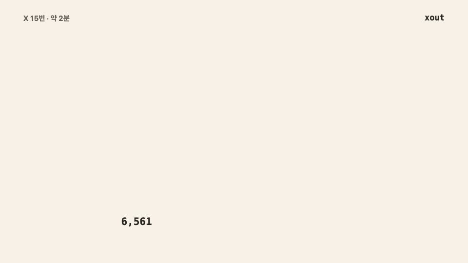
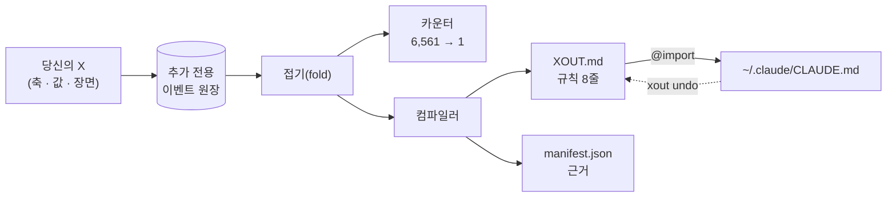

<div align="center">

<h1>xout</h1>


**다시 보고 싶지 않은 AI 행동에 X를 치세요.**


[](https://pypi.org/project/xout/) [](https://github.com/brnyxx/xout/actions/workflows/ci.yml) [](LICENSE)

[다섯 단계](#전체-흐름은-다섯-단계) · [지원 도구](#지원-도구) · [동작 방식](#동작-방식) · [먹히나?](#실제로-먹히나) · [명령어](#명령어) · [믿을 이유](#믿을-수-있는-이유)

<sub>Read in: [English](README.md) · 한국어 · [日本語](README.ja.md) · [简体中文](README.zh.md) · [소개 사이트](https://brnyxx.github.io/xout/ko/)</sub>

</div>

**AI 코딩 도구는 전부 규칙 파일을 따릅니다. 그런데 그 파일을 제대로 쓰는 사람은 거의 없습니다.** xout이 대신 써 줍니다. 질문지를 내미는 대신 AI가 할 수 있는 두 가지 행동을 보여 주고 다시는 보고 싶지 않은 쪽에 X를 치게 합니다. X 15번, 약 2분. 살아남은 선택이 규칙 8줄이 되어 당신이 실제로 쓰는 도구에 꽂힙니다. Claude Code, Codex, OpenCode, Gemini CLI, Copilot CLI, pi, oh-my-pi, Kiro, 그리고 `AGENTS.md`를 읽는 모든 도구.

```bash
uvx xout
```

이게 전부입니다. 세션은 터미널 안에서 끝납니다. 2분쯤 X를 치고 마지막에 `y`를 누르면 에이전트에 규칙 8줄이 들어갑니다.


<sub>위 영상은 연출이 아닙니다. 녹화기가 실제 세션을 그대로 찍기 때문에 화면의 페어와 규칙은 전부 엔진의 진짜 출력입니다.</sub>

**클라우드 없음. 텔레메트리 없음. 세션 중 LLM 호출 없음. 자기 폴더 밖에 쓰는 것은 전부 세이브포인트 뒤에서, 명령 하나로 되돌립니다.**

**v1.0.1 · Python 3.10–3.14 · MIT · 서드파티 런타임 패키지 0개**

<details>
<summary><strong>다른 설치 경로</strong> (pip, venv)</summary>

```bash
pip install xout
xout
```

완전 격리를 원하면:

```bash
python3 -m venv .venv
.venv/bin/python -m pip install xout
.venv/bin/xout
```

Popper 1.x에서 올라오는 경우? `xout`을 한 번 실행하면 됩니다: `~/.claude/popper/`의 데이터가 `~/.claude/xout/`으로 이동하고 소유된 import 한 줄은 xout이 직접 썼다고 증명 가능할 때만 갱신됩니다.

</details>

## 전체 흐름은 다섯 단계

| | 무슨 일이 일어나나 | 당신이 치는 것 |
|---|---|---|
| **1. 이미 있는 것을 읽는다** | 기존 규칙 파일(`CLAUDE.md`, `AGENTS.md`, `.cursorrules`, 전역 `~/.claude/CLAUDE.md`)을 한 번 읽고 화면의 행동과 관련된 줄을 페어 옆에 보여 줍니다. 복사도 수정도 하지 않습니다. | 없음 (`xout mine`으로 목록 확인) |
| **2. X를 15번 친다** | 같은 작업에 대한 구체적 행동 두 개. 다시 보고 싶지 않은 쪽에 X. 실제 장면 셋: 버그픽스, 기능 추가, 위험한 마이그레이션. | `xout` |
| **3. 규칙이 착지한다** | 근거가 붙은 규칙 8줄이 `~/.claude/xout/`에 쓰입니다. 다른 파일은 아직 손대지 않습니다. | 없음 |
| **4. 도구에 꽂는다** | Claude Code에는 xout 소유의 `@import` 한 줄, 다른 도구에는 그 도구의 규칙 파일 끝에 소유 블록 하나. 둘 다 영수증이 남습니다. | 마지막에 `y`, 또는 `xout enable --grant --target codex` |
| **5. 확인하고 정리하고 언제든 되돌린다** | 규칙이 먹히는지 에이전트 본인에게 묻고 옛 파일이 이제 반복하는 줄을 지우고 밖에 쓰기 전엔 항상 세이브포인트. `xout undo`는 xout이 쓴 것만 정확히 지웁니다. | `xout probe` · `xout reconcile` · `xout undo` |

## 지원 도구

xout의 규칙은 평범한 마크다운이라 도구마다 다른 건 *그 도구가 규칙을 어디서 읽느냐*뿐입니다. 아래 경로는 전부 각 도구의 공식 문서에서 확인한 것이고 확인하지 못한 도구는 등록하지 않았습니다.

| 도구 | 규칙이 들어가는 곳 | 방식 | `xout enable --grant --target …` |
|---|---|---|---|
| [Claude Code](https://code.claude.com/docs/en/memory) | `~/.claude/CLAUDE.md` | 소유 `@import` 한 줄 | `claude` (기본) |
| [OpenAI Codex CLI](https://learn.chatgpt.com/docs/agent-configuration/agents-md) | `~/.codex/AGENTS.md` | 소유 블록 | `codex` |
| [OpenCode](https://opencode.ai/docs/rules/) | `~/.config/opencode/AGENTS.md` | 소유 블록 | `opencode` |
| [Gemini CLI](https://geminicli.com/docs/cli/gemini-md/) | `~/.gemini/GEMINI.md` | 소유 블록 | `gemini` |
| [GitHub Copilot CLI](https://docs.github.com/en/copilot/how-tos/copilot-cli/customize-copilot/add-custom-instructions) | `~/.copilot/copilot-instructions.md` | 소유 블록 | `copilot` |
| [pi](https://github.com/badlogic/pi-mono/blob/main/packages/coding-agent/README.md) | `~/.pi/agent/AGENTS.md` | 소유 블록 | `pi` |
| [oh-my-pi](https://github.com/can1357/oh-my-pi/blob/main/docs/context-files.md) | `~/.omp/agent/AGENTS.md` | 소유 블록 | `omp` |
| [gajae-code](https://github.com/Yeachan-Heo/gajae-code/blob/main/docs/customization.md) | `~/.gjc/agent/AGENTS.md` | 소유 블록 | `gjc` |
| [Kiro](https://kiro.dev/docs/steering/) | `~/.kiro/steering/xout.md` | 소유 steering 파일 | `kiro` |
| [AGENTS.md를 읽는 모든 도구](https://agents.md) | 프로젝트의 `./AGENTS.md` | 소유 블록 | `agents` |

`xout targets`가 이 표를 각 도구의 현재 상태와 함께 보여 줍니다. `xout enable --grant --target all`로 한 번에 다 꽂고 `xout undo`로 한 번에 다 뺍니다.

소유 블록은 이렇게 생겼고 xout이 그 파일 안에서 손대는 건 이 블록뿐입니다:

```markdown
<!-- xout:begin sha256=… -->
<!-- managed by xout - edit XOUT.md, not this block; remove with: xout undo -->
# xout Rules
…
<!-- xout:end -->
```

gajae-code는 공개 문서에 규칙 파일이 적혀 있지 않습니다. 위 경로는 설치된 패키지 소스(`@gajae-code/coding-agent` 0.15.6, `system-prompt.d.ts`: "Native user-global files (`~/.gjc/agent/AGENTS.md`) come first")에서 확인한 것이라 문서 검증이 아니라 소스 검증으로 봐야 합니다.

## 동작 방식



<sub>X 하나가 남은 것을 반으로 갈라 싫은 반을 버립니다. 여덟 번 자르면 규칙 여덟 줄이 되어 당신의 도구에 꽂힙니다. Remotion으로 렌더했고 소스는 `video/`에 있습니다.</sub>

1. **세 장면에서 싫은 행동에 X를 칩니다.** 일상 버그픽스, 신규 기능, 그리고 운영 DB 마이그레이션. 매 페어는 실제 에이전트 행동 둘을 비교합니다: 먼저 물어보기 vs 먼저 실행하기, 표준 라이브러리 vs 패키지 설치, 사본 리허설 vs 재독으로 충분.
2. **xout이 컴파일합니다.** 살아남은 선택들이 실행 가능한 규칙 8줄이 되어 근거와 출처를 담은 채 `~/.claude/xout/`에 원자적으로 기록됩니다. 그리고 일상 작업과 고위험 작업에서 당신의 X가 갈리면, 규칙에 **그 조건이 그대로 붙습니다**:

   > 짧은 계획을 먼저 적고 곧바로 이어서 실행한다. **단, 삭제, push, 배포, 마이그레이션처럼 되돌리기 어려운 작업에서는 실행 전에 반드시 승인을 받는다.**

   이 조건절은 템플릿이 아닙니다. 당신이 마이그레이션 장면에서 다르게 그었기 때문에 존재합니다. 설문형 도구는 이걸 만들 수 없습니다.
3. **키 입력 한 번으로 꽂습니다.** 완료 화면에서 "지금 적용할까요?"를 물으며 예라고 하면 `~/.claude/CLAUDE.md`에 xout 소유의 `@import` 한 줄만 추가됩니다. 다른 도구는 `xout enable --grant --target codex`(또는 `opencode`, `gemini`, `copilot`, `pi`, `omp`, `kiro`, `agents`, `all`)가 그 도구의 규칙 파일에 소유 블록 하나를 넣습니다. `xout undo`는 xout이 쓴 것만 지웁니다.

에이전트의 새 세션에서 예전에 거슬리던 요청을 다시 해보고 규칙이 지켜지는지 확인하세요. 규칙이 낡았다 싶으면 다시 `xout`.

<details>
<summary><strong>안쪽 구조</strong> (그림 한 장)</summary>



X 하나가 이벤트 하나입니다. 카운터, 규칙, manifest는 전부 그 스트림을 접은 결과라서 어떤 규칙이든 다시 재생하고 그 X까지 소급할 수 있습니다.

</details>

## 모든 규칙은 자기 증거를 댑니다

`xout why`는 어떤 규칙이든 그것을 만든 X까지 소급합니다:

```text
$ xout why autonomy
[자율성]
규칙: 짧은 계획을 먼저 적고 곧바로 이어서 실행한다. 단, ... 승인을 받는다.
상태: 판별시험 통과 / 출처: 당신의 X
근거:
  - 일상 작업 장면(scn-bugfix)에서 ask_first에 X (세션 a3f2c9d1)
  - 되돌리기 어려운 작업 장면(scn-risky)에서 act_then_report에 X (세션 a3f2c9d1)
```

소급할 수 없는 규칙은 믿을 수 없는 규칙입니다. xout의 모든 규칙은 영수증을 갖고 있습니다.

> `--lang en`, `--lang ja`, `--lang zh`를 붙이면 페어, 규칙, 화면 문구까지 세션 전체가 그 언어로 진행됩니다. 플래그가 없으면 한국어입니다. 일본어와 중국어는 지금 `main`에 있고 다음 릴리스에 실립니다. 이벤트 원장은 어느 쪽이든 언어 중립입니다.

## 실제로 먹히나?

`xout probe`는 그 질문을 에이전트 본인에게 던집니다. 측정한 장면마다 외부 러너(기본 `claude -p`)에 같은 A/B를 두 번 묻습니다. 한 번은 규칙 없이, 한 번은 착지된 `XOUT.md`를 앞세워서. 그리고 규칙별로 유지됐는지, 선택을 움직였는지 영수증으로 남깁니다. 착지된 프로필로 실제 돌린 한 번의 기록입니다(Claude Code 2.1.257, 기본 모델, 손대지 않음):

```text
$ xout probe --lang en
Probing 15 cases x 2 (bare / with XOUT.md) - runner: claude -p --output-format text
  [Scope adherence] scn-bugfix: strict -> adjacent_fix_ok  (rule: adjacent_fix_ok)  moved
  [Test discipline] scn-bugfix: test_first -> test_first  (rule: test_after)  missed
  [Comments and docs] scn-bugfix: minimal -> minimal  (rule: minimal)  held
  [Scope adherence] scn-feature: strict -> adjacent_fix_ok  (rule: adjacent_fix_ok)  moved
  [Test discipline] scn-feature: test_first -> test_after  (rule: test_after)  moved
  [Dependency policy] scn-risky: ask_first -> ask_first  (rule: ask_first)  held
  ... 9 more, all held

rule held 14/15 · rule moved the choice 3 · matched without rules 11 · unparsed 0
receipt: ~/.claude/xout/probes/probe-20260902T003141.json
```

읽는 법은 이렇습니다. 11개는 규칙 없이도 이미 일치했으니 그 부분은 모델의 기본값이 이 프로필과 같은 겁니다. 3개는 규칙이 선택을 움직였습니다. 1개는 불일치입니다. 버그픽스에서 에이전트는 규칙이 "먼저 고치고 회귀 테스트를 나중에 붙여라"라고 명시해도 여전히 실패하는 테스트를 먼저 씁니다. 그만큼 강한 습관이고 그게 당신의 문장보다 세다는 걸 알려주는 게 탐침입니다. 이전 실행에는 의존성 불일치가 하나 더 있었는데 A/B 쌍이 약했던 탓이었습니다(기존 의존성 우선은 설치 전 확인과 양립합니다). 그래서 탐침은 이제 규칙을 항상 정반대 값과 짝짓습니다. 불일치가 쓸모 있는 부분입니다. 어느 규칙 문장을 다듬어야 하는지 알려주고 탐침은 1분이면 도니 고친 뒤 바로 확인할 수 있습니다. 탐침이 아닌 것: 강제 A/B 답은 지시 아래에서의 의도를 재는 것이지 긴 에이전트 루프 안의 행동이 아니고 이건 모델 하나에서 한 번 돌린 기록입니다. 영수증은 원문 답변을 전부 담고 있어 누구든 다시 읽을 수 있습니다.

같은 프로필을 이 머신의 다른 에이전트로도 탐침했습니다(`--quick`: 축당 장면 하나, 8건씩):

| 러너 | 규칙 유지 | 규칙이 선택을 움직임 | 규칙 없이도 일치 |
|---|---|---|---|
| `codex exec` (OpenAI Codex CLI) | 8/8 | 2 | 6 |
| `opencode run` (OpenCode) | 8/8 | 3 | 5 |
| `gjc -p` (gajae-code) | 8/8 | 2 | 6 |

Gemini CLI는 이 머신에 인증이 없어 돌리지 못했습니다. 러너는 아래 표에 있으니 직접 돌릴 수 있습니다.

러너는 프롬프트를 마지막 인자로 받아 답을 출력하는 아무 명령이면 됩니다. 기본은 Claude Code이고 아래는 각 도구가 문서로 밝힌 헤드리스 모드입니다:

| 도구 | `xout probe --runner "…"` |
|---|---|
| Claude Code | `claude -p --output-format text` (기본) |
| OpenAI Codex CLI | `codex exec` (outside a git repo add `--skip-git-repo-check`) |
| OpenCode | `opencode run` |
| Gemini CLI | `gemini -p` |
| GitHub Copilot CLI | `copilot -p` |
| pi | `pi -p` |
| oh-my-pi | `omp -p` |
| gajae-code | `gjc -p` |
| Kiro | `kiro-cli chat --no-interactive` |

## 이미 갖고 있는 프롬프트

규칙 파일이 이미 있을 겁니다. xout은 그걸 경쟁자가 아니라 증거로 다룹니다.

- **세션 중에는** 페어마다 당신의 파일이 그 행동에 대해 이미 말하는 줄이 보입니다. `~/.claude/CLAUDE.md:12 "편집 전에 항상 물어라" → ask_first` 같은 식이라 예전에 쓴 걸 확인하거나 뒤집을 수 있습니다.
- **착지 뒤에는** `xout conflicts`가 새 규칙과 반대로 말하는 줄을 file:line으로 보여 줍니다. 모순 줄은 절대 편집하지 않습니다. 프로젝트 자체 지시가 이긴다는 건 규칙 파일이 이미 말하고 있습니다.
- **`xout reconcile`**은 옛 파일이 이제 `XOUT.md`를 반복하는 줄을 찾고 `~/.claude/xout/reconcile/`에 패치를 제안합니다. 그 중복 줄을 실제로 지우는 건 `xout reconcile --apply --grant`뿐이고 그때도 세이브포인트를 먼저 만듭니다.
- **`xout savepoint`**는 언제든 규칙 파일을 바이트 그대로 스냅샷하고 `xout savepoint restore <id>`로 되돌립니다. `enable`, `undo`, `reconcile --apply`는 자동으로 하나씩 만듭니다.

## 얻는 것

15번째 X 이후 `~/.claude/xout/`에 세 파일이 착지합니다:

| 파일 | 내용 |
|---|---|
| `XOUT.md` | 읽는 에이전트를 위해 쓴 실행 규칙 8줄: 누구의 선호이며 정면 충돌 시 프로젝트 규칙이 이긴다는 한 문단 프리앰블, 일상 작업 섹션, 조건을 한 번만 정의하고 애매할 때의 판단을 강조한 되돌리기 어려운 작업 섹션. 각 규칙에는 당신이 X로 지운 대안이 적힙니다 |
| `manifest.json` | 규칙 값, 확신 라벨, 출처, 콘텐츠 해시 |
| `settings.xout.json` | 검토 가능한 설정 제안 |

X로 직접 확정한 규칙은 **확정**, xout이 묻지 않고 추정한 기본값은 정직하게 **추정**으로 표시되고 다시 고르기 대기열에 들어갑니다. 명시적 동의 없이 활성화되는 것은 없습니다.

*(Popper 1.x에서는 같은 파일이 `POPPER.md`, `settings.popper.json`으로 `~/.claude/popper/`에 착지했습니다. xout이 첫 실행 시 자동으로 마이그레이션합니다.)*

## 지도

8축을 3장면에서 측정합니다. 5축은 **두 맥락 모두**에서 측정되어, 일상/고위험 경계에서 증거와 함께 갈라질 수 있습니다.

| 축 | 일상 장면 | 고위험 장면 | 분기 가능 |
|---|---|---|---|
| 자율성 | 버그픽스 | 마이그레이션 | O |
| 에러 시 행동 | 버그픽스 | 마이그레이션 | O |
| 완료 전 검증 | 기능 추가 | 마이그레이션 | O |
| 의존성 정책 | 기능 추가 | 마이그레이션 | O |
| 커밋 정책 | 기능 추가 | 마이그레이션 | O |
| 범위 준수 | 버그픽스 + 기능 추가 | - | 두 번 측정 |
| 테스트 규율 | 버그픽스 + 기능 추가 | - | 두 번 측정 |
| 주석과 문서화 | 버그픽스 | - | 아니오 |

이 8축도, 추정 기본값도 허공에서 만들지 않았습니다. 1만~24만+ 스타 프롬프트/에이전트 프로젝트 100여 개를 조사했습니다 - codex/gemini-cli/Devin이 실제로 출하하는 시스템프롬프트, rust/node/pytorch/transformers의 AGENTS.md, 커뮤니티 룰 컬렉션까지 - 그리고 영수증을 남겼습니다: 원문 인용, 실측 스타 수, 축별 집계 전부가 [`docs/mined-prior.md`](docs/mined-prior.md)에 있습니다. 기본값 8개 중 6개는 현장 최빈값과 일치했고 2개는 달라서 교정했습니다. 당신의 환경도 출처가 됩니다: `xout mine`이 이미 갖고 있는 규칙 파일을 file:line 영수증과 함께 읽어줍니다.

## 마지막 페어 하나

이제 어떻게 하는지 아실 겁니다. 두 행동, X 하나:

> (1) ~~CLAUDE.md를 기억으로 씁니다. 규칙에는 출처가 없고 버그픽스와 운영 마이그레이션에 똑같이 적용되며 에이전트가 다시 거슬릴 때까지 조용히 낡아갑니다.~~
>
> (2) 실제로 보고 싫었던 행동에 X를 칩니다. 모든 규칙이 당신의 X로 소급되고 X가 갈린 곳에서만 일상/고위험 경계로 분기하며 영수증으로 증명되는 한 줄로 되돌아가고 낡으면 2분 세션에서 다시 긋습니다.

그 X가 이 제품의 전부입니다.

## 명령어

| 명령 | 하는 일 | 쓰는 곳 | 동의 |
|---|---|---|---|
| `xout` | 세션 시작 (미완료가 있으면 자동 재개) | 소유 디렉토리만 | - |
| `xout why [축]` | 규칙을 만든 X까지 증거를 소급 | 없음 | - |
| `xout status` | 규칙 8줄과 활성 여부 | 없음 | - |
| `xout targets` | 꽂을 수 있는 도구, 경로, 현재 활성 상태 | 없음 | - |
| `xout enable --grant [--target …]` | 꽂기: 소유 `@import` 한 줄(Claude Code) 또는 소유 블록(다른 도구) | 소유 한 줄/블록, 세이브포인트 선행 | 명시적 |
| `xout undo [--target …]` | xout이 쓴 것만 정확히 제거 - 전체 롤백 | 소유 한 줄/블록 | - |
| `xout mine [경로]` | 기존 규칙 파일(프로젝트 + `~/.claude`)을 축 관측으로 읽기 - file:line 영수증 동반 | 없음 | - |
| `xout conflicts [경로]` | 규칙 파일 중 당신의 규칙과 반대로 말하는 줄 | 없음 | - |
| `xout reconcile [경로]` | 규칙 파일이 이제 `XOUT.md`를 반복하는 줄. 패치 제안. `--apply --grant`면 세이브포인트 뒤에서 제거 | 소유 디렉토리. 규칙 파일은 `--apply --grant`일 때만 | 명시적 |
| `xout savepoint [list\|restore <id>]` | 규칙 파일을 바이트 그대로 스냅샷하고 되돌리기 | 소유 디렉토리. restore는 저장한 파일을 다시 씀 | - |
| `xout probe` | 외부 러너에 같은 A/B를 규칙 없이/규칙과 함께 두 번 묻고 규칙별 유지 여부를 영수증으로 | 소유 디렉토리(`probes/`) | 옵트인 |
| `xout pair` / `xout strike` | 에이전트·스크립트용 헤드리스 JSON 세션 | 소유 디렉토리만 | - |

## 믿을 수 있는 이유

- **로컬 온리.** 세션 중 LLM 호출, 텔레메트리, 쿠키, 네트워크 없음.
- **크래시 안전.** append-only 원장과 원자적 쓰기: 어디서 끊겨도 재개되고 정확히 한 번만 착지.
- **되돌릴 수 있습니다.** 활성화는 도구당 소유 import 한 줄 또는 소유 블록 하나이고 자기 폴더 밖에 쓰기 전엔 항상 세이브포인트를 만듭니다. `xout undo`는 xout이 썼다고 증명할 수 있는 것만 지웁니다.
- **정직함.** 살아남은 행동은 "아직 X를 안 맞았을 뿐"이지 "옳다고 증명된 것"이 아닙니다. 추정 기본값은 추정이라고 표시합니다.

xout은 모든 규칙에 증거를 요구하는 도구라서, 자기 주장에도 같은 모양의 영수증을 답니다:

```text
주장: 어디서 끊겨도 재개되고 정확히 한 번만 착지한다
근거:
  - 테스트 스위트가 긋기 도중 세션을 죽이고 디스크의 원장을 재생한다 -
    복원된 상태는 매번 동일하다
  - 중복 세션은 거부되고 착지는 콘텐츠 해시 뒤에서 원자적으로 일어난다
  - 매 커밋마다 전체 스위트(400+ 테스트), Python 3.10-3.14, macOS/Linux/Windows
```

```text
주장: xout은 자기가 썼다고 증명 못 하는 줄을 지울 수 없다
근거:
  - ~/.claude/CLAUDE.md에 손대기 전에 영수증을 남긴다 - 파일 앞부분의
    해시와 한 줄이 삽입된 정확한 바이트 위치
  - xout undo는 제거 전에 그 영수증부터 재검증한다. 줄 주변이 바뀌었으면
    추측하는 대신 거부한다
```

```text
주장: 정직함은 xout 자신의 결함에도 적용된다
근거:
  - 영문 팩을 도그푸딩하다 xout why가 "규칙: None"을 출력하는 것을
    잡아냈다 - manifest의 잘못된 키를 읽고 있었다
  - 결함은 CHANGELOG.md에 기록으로 남았고 수정은 회귀 테스트와 같은
    커밋으로 착지했다
```

<details>
<summary><strong>이 주장들을 받치는 엔지니어링</strong></summary>

모든 X는 fsync되는 append-only JSONL 이벤트이고 착지는 콘텐츠 해시를 동반한 원자적 쓰기이며 세션은 결정적으로 재생되고 중복 세션은 거부되며 수동 편집은 착지 전에 감지됩니다. 페어 판별력은 맥락별로 판정되어 일상 긋기가 고위험 장면을 굶기지 않고 판별 증거가 5축 미만인 세션은 무효 처리됩니다. 15번의 X는 6,561개(8축 x 3값)의 가능한 에이전트 공간을 하나로 좁힙니다 - 그리고 살아남은 쪽은 "아직 X를 안 맞았을 뿐"이지 "옳다고 증명된 것"이 아닙니다. 봉인된 사전등록은 [`docs/prereg/prereg_sealed.json`](docs/prereg/prereg_sealed.json), 동결된 8축 카탈로그는 [`docs/axis_locality_table.md`](docs/axis_locality_table.md)에 있습니다. 8축 카탈로그는 의도적으로 동결되어 있습니다: xout은 로컬 행동 컴파일러이지, 프롬프트 매니저나 클라우드 프로필, 에이전트 오케스트레이터가 아닙니다.

</details>

## 에이전트 채팅 안에서 (Claude Code 플러그인 & Agent Skills)

xout은 Claude Code 안에서 대화로 실행됩니다: `/xout:xout`이 행동 페어를 채팅으로 보여주고 당신이 X 칠 쪽을 고르면 에이전트는 그 명시적 선택만 기록합니다. `/xout:xout status`, `/xout:xout undo`도 동일합니다.

같은 스킬을 오픈 [Agent Skills](https://github.com/vercel-labs/skills) 생태계로도 설치할 수 있습니다 - 명령 한 줄, 지원되는 어떤 에이전트든:

```bash
npx skills@latest add brnyxx/xout
```

<details>
<summary><strong>체크섬 검증 플러그인 설치</strong></summary>

[v1.0.1 릴리스](../../releases/tag/v1.0.1)에서 `xout-plugin-1.0.1.zip`, `SHA256SUMS`, `verify_checksums.py`를 받아 한 디렉토리에 두고:

```bash
python3 verify_checksums.py SHA256SUMS \
  --only xout-plugin-1.0.1.zip verify_checksums.py
DEST="$HOME/.local/share/xout-plugin-1.0.1"
test ! -e "$DEST" || { echo "destination already exists: $DEST" >&2; exit 1; }
python3 -m zipfile -e xout-plugin-1.0.1.zip "$DEST"
claude plugin marketplace add "$DEST"
claude plugin install xout@xout-marketplace
```

이후 새 Claude Code 세션에서 `/xout:xout doctor`, `/xout:xout`.

</details>

## 제거

```bash
xout undo        # 비활성화: 소유된 import 한 줄만 제거
```

규칙과 이벤트 히스토리는 `~/.claude/xout/`에 남습니다 (보관도 삭제도 사용자의 것). 패키지를 지워도 이 데이터는 건드리지 않습니다.

## 개발

```bash
python3 -m pip install -e '.[test,release]'
python3 -m pytest tests/ -q
```

CI는 macOS/Linux/Windows에서 Python 3.10-3.14를 커버합니다. 릴리스에는 wheel, sdist, 플러그인 ZIP, `SHA256SUMS`, 아티팩트 출처 증명이 포함됩니다.

## Credits

`/xout` 스킬은 오픈 [Agent Skills](https://github.com/vercel-labs/skills) 생태계(MIT)로 설치되고 [mattpocock/skills](https://github.com/mattpocock/skills)(MIT)가 확립한 `SKILL.md` 관례를 따릅니다. 스킬 아래의 모든 것 - append-only 이벤트 원장, 순수 fold 컴파일러, 봉인 사전등록 - 은 xout 고유의 것입니다.

MIT © 2026 Brian Kim.
