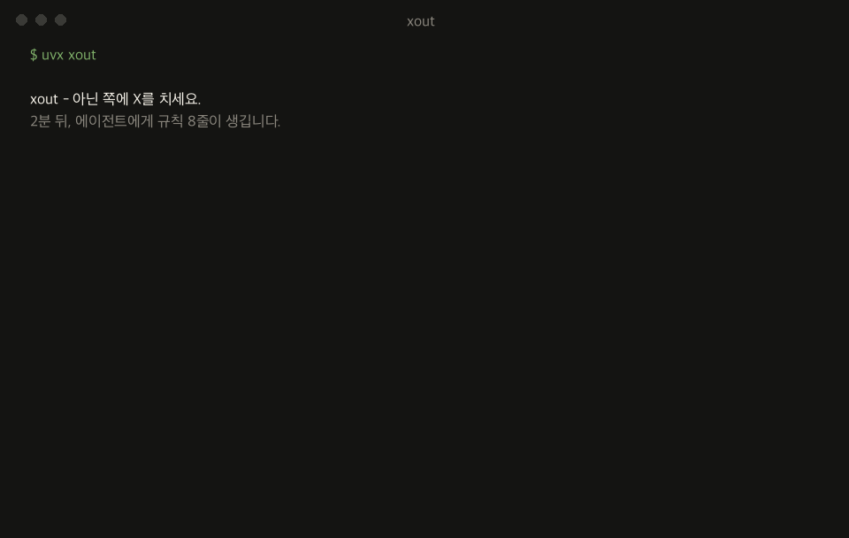

<div align="center">

<h1>xout</h1>


**다시 보고 싶지 않은 AI 행동에 X를 치세요.**


[](https://pypi.org/project/xout/) [](https://github.com/brnyxx/xout/actions/workflows/ci.yml) [](LICENSE)

[English](README.md) · [소개 사이트](https://brnyxx.github.io/xout/)

</div>

코딩 에이전트가 행동할 수 있는 두 가지 방식을 보여줍니다. 아닌 쪽에 X를 치세요. 2분, 15번의 X 후에 살아남은 선택들이 Claude Code가 `CLAUDE.md`에서 읽는 로컬 규칙 8줄로 컴파일됩니다.

```bash
uvx xout
```

이게 전부입니다. 세션은 터미널 안에서 그대로 진행되고, 2분 정도 X를 치면 에이전트에게 규칙 8줄이 생깁니다.



**클라우드 없음. 텔레메트리 없음. LLM 호출 없음. 롤백은 한 줄.**

**v1.0.0 · Python 3.10–3.14 · MIT · 서드파티 런타임 패키지 0개**

<details>
<summary><strong>다른 설치 경로</strong> (pip, venv)</summary>

```bash
pip install xout
xout
```

완전 격리를 원하면:

```bash
python3 -m venv .venv
.venv/bin/python -m pip install xout
.venv/bin/xout
```

Popper 1.x에서 올라오는 경우? `xout`을 한 번 실행하면 됩니다: `~/.claude/popper/`의 데이터가 `~/.claude/xout/`으로 이동하고, 소유된 import 한 줄은 xout이 직접 썼다고 증명 가능할 때만 갱신됩니다.

</details>

## 동작 방식

1. **세 장면에서 싫은 행동에 X를 칩니다.** 일상 버그픽스, 신규 기능, 그리고 운영 DB 마이그레이션. 매 페어는 실제 에이전트 행동 둘을 비교합니다: 먼저 물어보기 vs 먼저 실행하기, 표준 라이브러리 vs 패키지 설치, 사본 리허설 vs 재독으로 충분.
2. **xout이 컴파일합니다.** 살아남은 선택들이 실행 가능한 규칙 8줄이 되어 근거와 출처를 담은 채 `~/.claude/xout/`에 원자적으로 기록됩니다. 그리고 일상 작업과 고위험 작업에서 당신의 X가 갈리면, 규칙에 **그 조건이 그대로 붙습니다**:

   > 짧은 계획을 먼저 적고 곧바로 이어서 실행한다. **단, 삭제, push, 배포, 마이그레이션처럼 되돌리기 어려운 작업에서는 실행 전에 반드시 승인을 받는다.**

   이 조건절은 템플릿이 아닙니다. 당신이 마이그레이션 장면에서 다르게 그었기 때문에 존재합니다. 설문형 도구는 이걸 만들 수 없습니다.
3. **키 입력 한 번으로 적용합니다.** 완료 화면에서 "지금 적용할까요?"를 물으며, 예라고 하면 `~/.claude/CLAUDE.md`에 xout 소유의 `@import` 한 줄만 추가됩니다. `xout undo`가 그 한 줄만 제거합니다.

새 Claude Code 세션에서 예전에 거슬리던 요청을 다시 해보고 규칙이 지켜지는지 확인하세요. 규칙이 낡았다 싶으면 다시 `xout`.

## 모든 규칙은 자기 증거를 댑니다

`xout why`는 어떤 규칙이든 그것을 만든 X까지 소급합니다:

```text
$ xout why autonomy
[자율성]
규칙: 짧은 계획을 먼저 적고 곧바로 이어서 실행한다. 단, ... 승인을 받는다.
상태: 판별시험 통과 / 출처: 당신의 X
근거:
  - 일상 작업 장면(scn-bugfix)에서 ask_first에 X (세션 a3f2c9d1)
  - 되돌리기 어려운 작업 장면(scn-risky)에서 act_then_report에 X (세션 a3f2c9d1)
```

소급할 수 없는 규칙은 믿을 수 없는 규칙입니다. xout의 모든 규칙은 영수증을 갖고 있습니다.

## 얻는 것

15번째 X 이후 `~/.claude/xout/`에 세 파일이 착지합니다:

| 파일 | 내용 |
|---|---|
| `XOUT.md` | Claude Code용 실행 가능한 규칙 8줄 |
| `manifest.json` | 규칙 값, 확신 라벨, 출처, 콘텐츠 해시 |
| `settings.xout.json` | 검토 가능한 설정 제안 |

X로 직접 확정한 규칙은 **확정**, xout이 묻지 않고 추정한 기본값은 정직하게 **추정**으로 표시되고 다시 고르기 대기열에 들어갑니다. 명시적 동의 없이 활성화되는 것은 없습니다.

*(Popper 1.x에서는 같은 파일이 `POPPER.md`, `settings.popper.json`으로 `~/.claude/popper/`에 착지했습니다. xout이 첫 실행 시 자동으로 마이그레이션합니다.)*

## 지도

8축을 3장면에서 측정합니다. 5축은 **두 맥락 모두**에서 측정되어, 일상/고위험 경계에서 증거와 함께 갈라질 수 있습니다.

| 축 | 일상 장면 | 고위험 장면 | 분기 가능 |
|---|---|---|---|
| 자율성 | 버그픽스 | 마이그레이션 | O |
| 에러 시 행동 | 버그픽스 | 마이그레이션 | O |
| 완료 전 검증 | 기능 추가 | 마이그레이션 | O |
| 의존성 정책 | 기능 추가 | 마이그레이션 | O |
| 커밋 정책 | 기능 추가 | 마이그레이션 | O |
| 범위 준수 | 버그픽스 + 기능 추가 | - | 교차 검증 |
| 테스트 규율 | 버그픽스 + 기능 추가 | - | 교차 검증 |
| 주석과 문서화 | 버그픽스 | - | 스타일 축 |

## 명령어

| 명령 | 하는 일 | 쓰는 곳 | 동의 |
|---|---|---|---|
| `xout` | 세션 시작(미완료 세션은 자동 재개) | 소유 디렉토리만 | - |
| `xout why [축]` | 규칙을 만든 X까지 증거를 소급 | 없음 | - |
| `xout status` | 규칙 8줄과 활성화 여부 표시 | 없음 | - |
| `xout undo` | 소유한 import 한 줄 제거 - 완전한 롤백 | 소유한 한 줄 | - |
| `xout enable --grant` | 활성화: 소유 `@import` 한 줄 추가 | 소유한 한 줄 | 명시적 |
| `xout pair` / `xout strike` | 에이전트/스크립트용 헤드리스 JSON 세션 | 소유 디렉토리만 | - |

## 믿을 수 있는 이유

- **로컬 온리.** 세션 중 LLM 호출, 텔레메트리, 쿠키, 네트워크 없음.
- **크래시 안전.** append-only 원장과 원자적 쓰기: 어디서 끊겨도 재개되고, 정확히 한 번만 착지.
- **되돌릴 수 있음.** 활성화는 소유된 import 한 줄뿐이고, `xout undo`는 xout이 썼다고 증명 가능한 것만 제거.
- **정직함.** 살아남은 행동은 "아직 X를 안 맞았을 뿐"이지 "옳다고 증명된 것"이 아닙니다. 추정 기본값은 추정이라고 표시합니다.

<details>
<summary><strong>이 주장들을 받치는 엔지니어링</strong></summary>

모든 X는 fsync되는 append-only JSONL 이벤트이고, 착지는 콘텐츠 해시를 동반한 원자적 쓰기이며, 세션은 결정적으로 재생되고, 중복 세션은 거부되며, 수동 편집은 착지 전에 감지됩니다. 페어 판별력은 맥락별로 판정되어 일상 긋기가 고위험 장면을 굶기지 않고, 판별 증거가 5축 미만인 세션은 무효 처리됩니다. 15번의 X는 6,561개(8축 x 3값)의 가능한 에이전트 공간을 하나로 좁힙니다 - 그리고 살아남은 쪽은 "아직 X를 안 맞았을 뿐"이지 "옳다고 증명된 것"이 아닙니다. 봉인된 사전등록은 [`docs/prereg/prereg_sealed.json`](docs/prereg/prereg_sealed.json), 동결된 8축 카탈로그는 [`docs/axis_locality_table.md`](docs/axis_locality_table.md)에 있습니다. 8축 카탈로그는 의도적으로 동결되어 있습니다: xout은 로컬 행동 컴파일러이지, 프롬프트 매니저나 클라우드 프로필, 에이전트 오케스트레이터가 아닙니다.

</details>

## Claude Code 플러그인

xout은 Claude Code 안에서 대화로 실행됩니다: `/xout:xout`이 행동 페어를 채팅으로 보여주고, 당신이 X 칠 쪽을 고르면 에이전트는 그 명시적 선택만 기록합니다. `/xout:xout status`, `/xout:xout undo`도 동일합니다.

<details>
<summary><strong>체크섬 검증 플러그인 설치</strong></summary>

[v1.0.0 릴리스](../../releases/tag/v1.0.0)에서 `xout-plugin-1.0.0.zip`, `SHA256SUMS`, `verify_checksums.py`를 받아 한 디렉토리에 두고:

```bash
python3 verify_checksums.py SHA256SUMS \
  --only xout-plugin-1.0.0.zip verify_checksums.py
DEST="$HOME/.local/share/xout-plugin-1.0.0"
test ! -e "$DEST" || { echo "destination already exists: $DEST" >&2; exit 1; }
python3 -m zipfile -e xout-plugin-1.0.0.zip "$DEST"
claude plugin marketplace add "$DEST"
claude plugin install xout@xout-marketplace
```

이후 새 Claude Code 세션에서 `/xout:xout doctor`, `/xout:xout`.

</details>

## 제거

```bash
xout undo        # 비활성화: 소유된 import 한 줄만 제거
```

규칙과 이벤트 히스토리는 `~/.claude/xout/`에 남습니다 (보관도 삭제도 사용자의 것). 패키지를 지워도 이 데이터는 건드리지 않습니다.

## 개발

```bash
python3 -m pip install -e '.[test,release]'
python3 -m pytest tests/ -q
```

CI는 macOS/Linux/Windows에서 Python 3.10-3.14를 커버합니다. 릴리스에는 wheel, sdist, 플러그인 ZIP, `SHA256SUMS`, 아티팩트 출처 증명이 포함됩니다.

MIT © 2026 Brian Kim.
