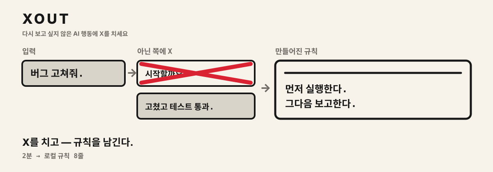
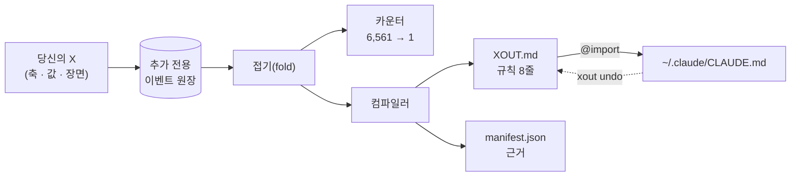

<div align="center">

<h1>xout</h1>


**다시 보고 싶지 않은 AI 행동에 X를 치세요.**



[](https://pypi.org/project/xout/) [](https://github.com/brnyxx/xout/actions/workflows/ci.yml) [](LICENSE)

[다섯 단계](#전체-흐름은-다섯-단계) · [지원 도구](#지원-도구) · [동작 방식](#동작-방식) · [먹히나?](#실제로-먹히나) · [명령어](#명령어) · [믿을 이유](#믿을-수-있는-이유)

<sub>Read in: [English](README.md) · 한국어 · [日本語](README.ja.md) · [简体中文](README.zh.md) · [소개 사이트](https://brnyxx.github.io/xout/ko/)</sub>

</div>

**AI 코딩 도구는 전부 규칙 파일을 따릅니다. 그런데 그 파일을 제대로 쓰는 사람은 거의 없습니다.** xout이 대신 써 줍니다. 질문지를 내미는 대신 AI가 할 법한 행동 두 개를 나란히 보여 주고 다시는 보고 싶지 않은 쪽에 X를 치게 합니다. X 15번, 약 2분. 남은 쪽이 규칙 8줄이 되어 당신이 실제로 쓰는 도구에 꽂힙니다. Claude Code, Codex, OpenCode, Gemini CLI, Copilot CLI, pi, oh-my-pi, Kiro, 그리고 `AGENTS.md`를 읽는 모든 도구.


<sub>X 하나가 남은 것을 반으로 갈라 싫은 반을 버립니다. 여덟 번 자르면 규칙 여덟 줄이 되어 당신의 도구에 꽂힙니다. Remotion으로 렌더했고 소스는 `video/`에 있습니다.</sub>

```bash
uvx xout
```

이게 전부입니다. 세션은 터미널 안에서 끝납니다. 2분쯤 X를 치고 마지막에 `y`를 누르면 에이전트에 규칙 8줄이 들어갑니다.


<sub>위 영상은 연출이 아닙니다. 실제 세션을 그대로 녹화한 것이라 화면에 나오는 페어와 규칙은 전부 엔진이 실제로 낸 출력입니다.</sub>

**클라우드 없음. 텔레메트리 없음. 세션 중 LLM 호출 없음. 자기 폴더 밖에 뭔가 쓸 때는 항상 세이브포인트를 먼저 만들고 명령 하나면 되돌립니다.**

**v1.1.0 · Python 3.10–3.14 · MIT · 서드파티 런타임 패키지 0개**

<details>
<summary><strong>다른 설치 경로</strong> (pip, venv)</summary>

```bash
pip install xout
xout
```

완전 격리를 원하면:

```bash
python3 -m venv .venv
.venv/bin/python -m pip install xout
.venv/bin/xout
```

Popper 1.x를 쓰고 있었다면 `xout`을 한 번 실행하면 됩니다. `~/.claude/popper/`의 데이터를 `~/.claude/xout/`으로 옮기고 import 한 줄은 xout이 직접 썼다고 증명할 수 있을 때만 바꿔 씁니다.

</details>

## 전체 흐름은 다섯 단계

| | 무슨 일이 생기나 | 당신이 할 일 |
|---|---|---|
| **1. 이미 있는 것을 읽는다** | 기존 규칙 파일(`CLAUDE.md`, `AGENTS.md`, `.cursorrules`, 전역 `~/.claude/CLAUDE.md`)을 한 번 읽고 화면의 행동과 관련된 줄을 페어 옆에 보여 줍니다. 복사도 수정도 하지 않습니다. | 없음 (`xout mine`으로 목록 확인) |
| **2. X를 15번 친다** | 같은 작업을 두고 에이전트가 할 법한 구체적 행동 둘. 다시 보고 싶지 않은 쪽에 X. 장면은 셋: 버그픽스, 기능 추가, 위험한 마이그레이션. | `xout` |
| **3. 규칙이 착지한다** | 근거가 붙은 규칙 8줄을 `~/.claude/xout/`에 씁니다. 다른 파일은 아직 손대지 않습니다. | 없음 |
| **4. 도구에 꽂는다** | Claude Code에는 xout 소유의 `@import` 한 줄, 다른 도구에는 그 도구의 규칙 파일 끝에 소유 블록 하나. 둘 다 영수증이 남습니다. | 마지막에 `y`, 또는 `xout enable --grant --target codex` |
| **5. 확인하고 정리하고 언제든 되돌린다** | 규칙이 먹히는지 에이전트에게 직접 물어봅니다. 옛 파일에서 이제 겹치는 줄은 지웁니다. 밖에 쓰기 전엔 항상 세이브포인트를 만들고 `xout undo`는 xout이 쓴 것만 정확히 지웁니다. | `xout probe` · `xout reconcile` · `xout undo` |

## 지원 도구

xout의 규칙은 평범한 마크다운이라 도구마다 다른 건 *그 도구가 규칙을 어디서 읽느냐*뿐입니다. 아래 경로는 전부 각 도구의 공식 문서에서 확인했고 확인 안 된 도구는 넣지 않았습니다.

| 도구 | 규칙이 들어가는 곳 | 방식 | `xout enable --grant --target …` |
|---|---|---|---|
| [Claude Code](https://code.claude.com/docs/en/memory) | `~/.claude/CLAUDE.md` | 소유 `@import` 한 줄 | `claude` (기본) |
| [OpenAI Codex CLI](https://learn.chatgpt.com/docs/agent-configuration/agents-md) | `~/.codex/AGENTS.md` | 소유 블록 | `codex` |
| [OpenCode](https://opencode.ai/docs/rules/) | `~/.config/opencode/AGENTS.md` | 소유 블록 | `opencode` |
| [Gemini CLI](https://geminicli.com/docs/cli/gemini-md/) | `~/.gemini/GEMINI.md` | 소유 블록 | `gemini` |
| [GitHub Copilot CLI](https://docs.github.com/en/copilot/how-tos/copilot-cli/customize-copilot/add-custom-instructions) | `~/.copilot/copilot-instructions.md` | 소유 블록 | `copilot` |
| [pi](https://github.com/badlogic/pi-mono/blob/main/packages/coding-agent/README.md) | `~/.pi/agent/AGENTS.md` | 소유 블록 | `pi` |
| [oh-my-pi](https://github.com/can1357/oh-my-pi/blob/main/docs/context-files.md) | `~/.omp/agent/AGENTS.md` | 소유 블록 | `omp` |
| [gajae-code](https://github.com/Yeachan-Heo/gajae-code/blob/main/docs/customization.md) | `~/.gjc/agent/AGENTS.md` | 소유 블록 | `gjc` |
| [Kiro](https://kiro.dev/docs/steering/) | `~/.kiro/steering/xout.md` | 소유 steering 파일 | `kiro` |
| [AGENTS.md를 읽는 모든 도구](https://agents.md) | 프로젝트의 `./AGENTS.md` | 소유 블록 | `agents` |

`xout targets`가 이 표를 각 도구의 현재 상태와 함께 보여 줍니다. `xout enable --grant --target all`로 한 번에 다 꽂고 `xout undo`로 한 번에 다 뺍니다.

소유 블록은 이렇게 생겼고 xout이 그 파일 안에서 손대는 건 이 블록뿐입니다:

```markdown
<!-- xout:begin sha256=… -->
<!-- managed by xout - edit XOUT.md, not this block; remove with: xout undo -->
# xout Rules
…
<!-- xout:end -->
```

gajae-code는 공개 문서에 규칙 파일 경로가 없습니다. 위 경로는 설치된 패키지 소스(`@gajae-code/coding-agent` 0.15.6, `system-prompt.d.ts`: "Native user-global files (`~/.gjc/agent/AGENTS.md`) come first")에서 찾은 것이라 문서가 아니라 소스로 확인한 셈입니다.

## 동작 방식

1. **세 장면에서 싫은 행동에 X를 칩니다.** 일상 버그픽스, 신규 기능, 그리고 운영 DB 마이그레이션. 페어마다 에이전트가 실제로 할 법한 행동 둘을 나란히 놓습니다: 먼저 물어보기 vs 먼저 실행하기, 표준 라이브러리 vs 패키지 설치, 사본으로 리허설 vs 코드만 다시 읽고 끝.
2. **xout이 규칙으로 만듭니다.** 남은 쪽이 바로 쓸 수 있는 규칙 8줄이 되어 근거와 출처와 함께 `~/.claude/xout/`에 원자적으로 기록됩니다. 일상 작업과 고위험 작업에서 당신의 X가 갈리면 규칙에 **그 조건이 그대로 붙습니다**:

   > 짧은 계획을 먼저 적고 곧바로 이어서 실행한다. **단, 삭제, push, 배포, 마이그레이션처럼 되돌리기 어려운 작업에서는 실행 전에 반드시 승인을 받는다.**

   이 조건절은 템플릿이 아닙니다. 마이그레이션 장면에서 당신이 다르게 그었으니까 생긴 겁니다. 설문형 도구로는 못 만듭니다.
3. **키 입력 한 번으로 꽂습니다.** 완료 화면의 "지금 적용할까요?"에 `y`를 누르면 `~/.claude/CLAUDE.md`에 xout 소유의 `@import` 한 줄만 추가됩니다. 다른 도구는 `xout enable --grant --target codex`(또는 `opencode`, `gemini`, `copilot`, `pi`, `omp`, `kiro`, `agents`, `all`)가 그 도구의 규칙 파일에 소유 블록 하나를 넣습니다. `xout undo`는 xout이 쓴 것만 지웁니다.

에이전트의 새 세션에서 예전에 거슬리던 요청을 다시 해보고 규칙이 지켜지는지 확인하세요. 규칙이 낡았다 싶으면 다시 `xout`.

<details>
<summary><strong>안쪽 구조</strong> (그림 한 장)</summary>



X 하나가 이벤트 하나입니다. 카운터, 규칙, manifest는 전부 그 스트림을 접어서 나온 결과라 어떤 규칙이든 다시 재생해 그 규칙을 만든 X까지 거슬러 올라갈 수 있습니다.

</details>

## 규칙마다 근거가 붙습니다

`xout why`를 치면 어떤 규칙이든 그 규칙을 만든 X까지 거슬러 올라갑니다:

```text
$ xout why autonomy
[자율성]
규칙: 먼저 실행하고 변경 내역을 요약해 보고한다. 단, 삭제, push, 배포, 마이그레이션처럼 되돌리기 어려운 작업에서는 계획을 알린 뒤 진행하되 최종 적용은 승인을 기다린다.
상태: 당신의 X로 확정 / 출처: 당신의 X
근거:
  - 일상 작업 장면(scn-bugfix)에서 ask_first에 X (세션 9e94c9b1)
  - 되돌리기 어려운 작업 장면(scn-risky)에서 ask_first에 X (세션 9e94c9b1)
  - 일상 작업 장면(scn-bugfix)에서 propose_then_act에 X (세션 9e94c9b1)
```

어디서 왔는지 못 대는 규칙은 믿을 수 없습니다. xout의 규칙에는 전부 영수증이 있습니다.

> `--lang en`, `--lang ja`, `--lang zh`를 붙이면 페어, 규칙, 화면 문구까지 세션 전체가 그 언어로 진행됩니다. 플래그가 없으면 한국어입니다. 일본어와 중국어는 지금 `main`에 있고 다음 릴리스에 실립니다. 이벤트 원장은 어느 언어로 진행하든 같은 형식입니다.

## 실제로 먹히나?

`xout probe`가 그 질문을 에이전트에게 직접 던집니다. 장면마다 외부 러너(기본 `claude -p`)에 같은 A/B를 두 번 묻습니다. 한 번은 규칙 없이, 한 번은 `XOUT.md`를 앞에 붙여서. 그리고 규칙마다 지켜졌는지, 답이 바뀌었는지 영수증으로 남깁니다. 아래는 실제 프로필로 한 번 돌린 기록입니다(Claude Code 2.1.257, 기본 모델, 손대지 않음):

```text
$ xout probe --lang en
Probing 15 cases x 2 (bare / with XOUT.md) - runner: claude -p --output-format text
  [Scope adherence] scn-bugfix: strict -> adjacent_fix_ok  (rule: adjacent_fix_ok)  moved
  [Test discipline] scn-bugfix: test_first -> test_first  (rule: test_after)  missed
  [Comments and docs] scn-bugfix: minimal -> minimal  (rule: minimal)  held
  [Scope adherence] scn-feature: strict -> adjacent_fix_ok  (rule: adjacent_fix_ok)  moved
  [Test discipline] scn-feature: test_first -> test_after  (rule: test_after)  moved
  [Dependency policy] scn-risky: ask_first -> ask_first  (rule: ask_first)  held
  ... 9 more, all held

rule held 14/15 · rule moved the choice 3 · matched without rules 11 · unparsed 0
receipt: ~/.claude/xout/probes/probe-20260902T003141.json
```

읽는 법은 이렇습니다. 11개는 규칙 없이도 이미 같은 답이었으니 그 부분은 모델 기본값이 이 프로필과 같다는 뜻입니다. 3개는 규칙이 답을 바꿨습니다. 1개는 어긋났습니다. 버그픽스에서 에이전트는 규칙에 "먼저 고치고 회귀 테스트를 나중에 붙여라"라고 적혀 있어도 여전히 실패하는 테스트부터 씁니다. 그 습관이 당신의 문장보다 세다는 걸 보여 주는 게 이 탐침의 역할입니다. 이전 실행에는 의존성 쪽 어긋남이 하나 더 있었는데 A/B 쌍이 느슨했던 탓입니다(기존 의존성을 우선하는 것과 설치 전에 물어보는 것은 서로 충돌하지 않습니다). 그래서 지금은 탐침이 규칙을 항상 정반대 값과 짝지어 묻습니다. 어긋난 곳이 쓸모 있는 부분입니다. 어느 규칙 문장을 손봐야 하는지 알려 주고 탐침은 1분이면 도니 고치고 바로 다시 확인할 수 있습니다. 탐침이 재지 못하는 것도 있습니다. A/B로 답을 강제하면 지시를 받았을 때의 의도를 재는 것이지 긴 에이전트 루프 안에서의 행동은 아니고 이건 모델 하나로 한 번 돌린 기록입니다. 영수증에는 원문 답변이 전부 들어 있어 누구든 다시 읽어 볼 수 있습니다.

같은 프로필을 이 머신의 다른 에이전트로도 탐침했습니다(`--quick`: 축당 장면 하나, 8건씩):

| 러너 | 규칙 지킴 | 규칙이 답을 바꿈 | 규칙 없이도 같은 답 |
|---|---|---|---|
| `codex exec` (OpenAI Codex CLI) | 8/8 | 2 | 6 |
| `opencode run` (OpenCode) | 8/8 | 3 | 5 |
| `gjc -p` (gajae-code) | 8/8 | 2 | 6 |

Gemini CLI는 이 머신에 인증이 없어 돌리지 못했습니다. 러너는 아래 표에 있으니 직접 돌릴 수 있습니다.

질문 하나에 답 하나는 얇은 측정입니다. 그래서 `--repeat`은 같은 질문을 여러 번 묻고 다수결로 정합니다. 원문 답변은 전부 영수증에 남습니다. 15건 전부를 세 번씩, 같은 프로필로, 같은 날 돌렸습니다:

| 러너 | 규칙 지킴(다수결) | 세 번 다 지킴 | 지킨 시행 | 규칙이 답을 바꿈 | 규칙 없이도 같은 답 |
|---|---|---|---|---|---|
| `claude -p` (Claude Code) | 14/15 | 14/15 | 42/45 | 5 | 9 |
| `codex exec` | 15/15 | 14/15 | 44/45 | 4 | 11 |
| `opencode run` | 15/15 | 14/15 | 44/45 | 5 | 10 |
| `gjc -p` | 15/15 | 15/15 | 45/45 | 5 | 10 |

깔끔하지 않은 건은 전부 버그픽스 장면입니다. Claude는 세 번 다 실패하는 테스트를 먼저 썼고(위의 한 번짜리 기록에서 본 그 습관이 세 번으로 확인된 셈입니다) Codex는 한 번 "한 번만 재시도하고 보고하라"는 규칙을 넘겨 계속 재시도했고 OpenCode는 한 번 실패하는 테스트를 먼저 썼습니다. 나머지는 매번 지켜졌습니다.

규칙이 에이전트 앞에 혼자 놓이는 일은 드뭅니다. 그래서 `--context-file`은 규칙 없는 쪽과 규칙 있는 쪽 모두에 실제 프로젝트 문서를 규칙 앞에 놓습니다. 이 저장소의 `CLAUDE.md`(관계없는 유지보수 규칙 예순 줄쯤)를 위에 얹어 파묻어도 Claude는 각각 두 번씩 돌려 다시 14/15를 지켰고(시행으로는 28/30) 어긋난 건 아까 그 하나였습니다. 다른 언어 팩도 똑같이 굴러갑니다. 한국어, 일본어, 중국어 프로필을 축당 장면 하나로 두 번씩 돌렸더니 전부 7/8(시행으로는 14/16)이었고 어긋난 건 테스트 먼저 쓰는 그 하나뿐이었습니다.

규칙을 프롬프트에 넣어 묻는 건 규칙이 먹힐 수 있다는 데까지만 보여 줍니다. 도구가 xout이 실제로 쓴 파일을 읽느냐는 다른 질문이라 `xout probe --via-target codex`는 프롬프트에서 규칙을 아예 뺍니다. 규칙 없는 쪽은 `~/.codex/AGENTS.md`에서 xout 블록을 빼고 묻고, 규칙 있는 쪽은 블록을 도로 넣고 묻고, 끝나면 파일을 원래대로 되돌립니다(세이브포인트 선행). 같은 프로필, 축당 장면 하나:

| 도구와 그 도구의 규칙 파일 | 규칙 지킴 | 규칙이 답을 바꿈 | 규칙 없이도 같은 답 |
|---|---|---|---|
| Codex CLI, `~/.codex/AGENTS.md` | 8/8 | 3 | 5 |
| Claude Code, `~/.claude/CLAUDE.md`의 `@import` 한 줄 | 7/8 | 3 | 4 |
| gajae-code, `~/.gjc/agent/AGENTS.md` | 7/8 | 3 | 4 |
| OpenCode, `~/.config/opencode/AGENTS.md` | 6/8 | 2 | 5 |
| Kiro CLI, `~/.kiro/steering/xout.md` | 6/8 | 2 | 4 |

다섯 도구 모두 자기 파일을 읽었습니다. 표의 어느 줄에서든 블록이 거기 있다는 이유로 답이 최소 두 개는 바뀌었습니다. 어긋난 곳도 읽어 볼 만합니다. Claude가 어긋난 하나는 또 테스트를 먼저 쓰는 습관이었고 gajae-code와 Kiro는 버그픽스에서 먼저 제안하지 않고 바로 손댔고 Kiro는 에러가 나도 계속 혼자 고치려 들었습니다. OpenCode의 어긋남 둘은 하나가 선택지 글자가 없는 긴 산문 답변이었고 하나가 테스트 먼저 쓰는 습관이었습니다. Kiro 문서는 전역 steering은 IDE용, 워크스페이스 steering은 CLI용이라고 설명하는데 여기서는 CLI가 전역 파일을 읽었습니다. 탐침은 이런 걸 잡으라고 있습니다.

러너는 프롬프트를 마지막 인자로 받아 답을 출력하는 아무 명령이면 됩니다. 기본은 Claude Code이고 아래는 각 도구 문서에 나온 헤드리스 모드입니다:

| 도구 | `xout probe --runner "…"` |
|---|---|
| Claude Code | `claude -p --output-format text` (기본) |
| OpenAI Codex CLI | `codex exec` (outside a git repo add `--skip-git-repo-check`) |
| OpenCode | `opencode run` |
| Gemini CLI | `gemini -p` |
| GitHub Copilot CLI | `copilot -p` |
| pi | `pi -p` |
| oh-my-pi | `omp -p` |
| gajae-code | `gjc -p` |
| Kiro | `kiro-cli chat --no-interactive` |

기본 러너는 Claude Code를 `--safe-mode`로 띄웁니다. 사용자의 `CLAUDE.md`, 플러그인, MCP 서버를 싣지 않는 모드입니다. 이게 없으면 "규칙 없이" 패스가 규칙 없이가 아닙니다. 글로벌 규칙 파일이 이미 들어가 있고, 호출당 비용도 세 배쯤 됩니다. 이 페이지의 실측은 그게 기본값이 되기 전에 돌린 것이라 "규칙 없이도 같은 답" 열에는 작성자 본인의 규칙이 섞여 있습니다. "규칙 지킴" 열은 영향이 없습니다. `--safe-mode`로 다시 돌리면 계속 어긋나던 그 한 케이스가 사라집니다. 버그픽스 장면이 매 시행 test-after로 돌아옵니다. 테스트 먼저라는 답은 모델의 습관이 아니라, 두 패스에 같이 실려 있던 작성자 본인의 `~/.claude/CLAUDE.md`가 그렇게 시키고 있었던 것입니다. `--via-target claude`는 규칙을 `CLAUDE.md`로 전달하는 측정이라 일반 모드가 필요하고, `xout probe`가 그 조합을 거부합니다. 큰 배치는 `--model`로 작은 모델을 지정하세요. 답은 한 글자입니다.

## 이미 갖고 있는 프롬프트

규칙 파일이 이미 있을 겁니다. xout은 그 파일과 경쟁하지 않고 증거로 씁니다.

- **세션 중에는** 페어마다 당신의 파일에서 그 행동을 이미 다루는 줄이 옆에 보입니다. `~/.claude/CLAUDE.md:12 "편집 전에 항상 물어라" → ask_first` 같은 식이라 예전에 쓴 걸 그대로 두거나 뒤집을 수 있습니다.
- **그 파일을 읽는 건 기본적으로 패턴 매칭입니다.** 의존성이 없고 오프라인에서 돌고 걸린 줄마다 어떤 패턴이 잡았는지 함께 나옵니다. 패턴은 4개 언어 규칙 276줄에 라벨을 붙인 코퍼스로 재고 있습니다(정밀도 1.00, 가장 약한 축에서 재현율 0.96. 둘 중 하나라도 떨어지면 테스트가 깨집니다). 그래도 코퍼스 밖의 표현은 놓칩니다. 그래서 `xout mine --runner "claude -p --output-format text"`(아래 표의 러너면 아무거나)는 같은 줄을 당신의 에이전트에 넘겨 줄마다 어느 축의 어떤 값을 말하는 건지 답하게 합니다. 두 층의 결과를 나란히 비교하고 원문 답변은 영수증에 전부 남습니다. 이걸 쓴 사람의 187줄짜리 `~/.claude/CLAUDE.md`에서는 둘이 8줄에서 일치했고 에이전트가 패턴이 놓친 5줄을 더 찾았고("Minimal change principle"은 범위, "No unsolicited docstrings, comments, or type annotations"는 주석) 애초에 선호가 아니었던 패턴 히트 10개를 걷어냈습니다. `xout conflicts --runner …`도 같은 플래그를 받습니다. 붙이지 않으면 아무것도 달라지지 않습니다.
- **규칙이 들어간 뒤에는** `xout conflicts`가 새 규칙과 반대되는 줄을 file:line으로 보여 줍니다. 그 줄을 고치지는 않습니다. 정면으로 부딪히면 프로젝트 쪽 지시가 이긴다고 규칙 파일 첫 문단에 이미 적혀 있습니다.
- **`xout reconcile`**은 옛 파일에서 이제 `XOUT.md`와 겹치는 줄을 찾아 `~/.claude/xout/reconcile/`에 패치를 만들어 둡니다. 그 줄을 실제로 지우는 건 `xout reconcile --apply --grant`뿐이고 그때도 세이브포인트부터 만듭니다. 규칙과 비슷하게 읽히기만 하는 줄은 유사도 점수와 함께 따로 모아 보여 주고 절대 지우지 않습니다.
- **`xout savepoint`**는 언제든 규칙 파일을 바이트 그대로 스냅샷하고 `xout savepoint restore <id>`로 되돌립니다. `enable`, `undo`, `reconcile --apply`는 자동으로 하나씩 만듭니다.

## 이미 갖고 있는 규칙 파일 점검하기

세션이 재는 건 축 여덟 개입니다. 이미 써 둔 `CLAUDE.md`에는 그보다 훨씬 많은 줄이 들어 있고 그중 대부분은 에이전트 앞에 놓고 뭐가 달라지는지 본 적이 없습니다. `xout audit`은 그 줄들을 하나씩 잽니다.

줄마다 당신의 에이전트에 작은 장면을 쓰게 합니다. 할 일 하나, 그 줄을 따르는 다음 행동 하나, 그 줄을 어기는 다음 행동 하나. 그리고 그 장면을 두 번 묻습니다. 한 번은 그냥, 한 번은 그 한 줄만 상시 지시로 앞에 붙여서. 돌아온 답에 따라 그 줄은 넷 중 하나가 됩니다.

- **원래 그렇게 함** - 그 줄이 없어도 에이전트는 그쪽으로 갑니다. 문장이 아무 일도 하지 않으니 지워도 달라지는 게 없습니다.
- **그 줄이 일을 함** - 그냥 물으면 반대로 가는데 그 줄이 있으면 따릅니다. 규칙이라면 이래야 합니다.
- **무시됨** - 줄이 바로 앞에 있는데도 에이전트가 반대로 합니다. 이게 제일 중요합니다. 보호 장치처럼 읽히는데 아닙니다.
- **불분명** - 읽을 수 있는 답이 없거나 시행이 갈렸습니다.

파일마다 한 번씩 어느 줄들이 서로 반대로 당기는지도 묻고 그 짝을 알려 줍니다. 무엇도 고치지 않습니다. 원문 답변이 전부 든 영수증은 `~/.claude/xout/audits/`에 남습니다.

```bash
xout audit --runner "claude -p --safe-mode --output-format text"   # 프로젝트 파일과 ~/.claude
xout audit . --no-user --limit 20 --repeat 3           # 이 저장소만, 줄마다 세 번
xout audit --dry-run                                   # 무엇이 나가는지와 프롬프트 예시
```

제목 줄, 표의 행, 코드 블록, 한 단어짜리 줄은 보내기 전에 걸러내고 `--limit`(기본 60)이 나머지를 잘라 첫 실행이 싸게 끝납니다. 첫 판이 뭐라고 하는지 보고 나서 올리면 됩니다.

이걸 쓴 사람의 187줄짜리 전역 `CLAUDE.md`를 `claude -p` 러너로 처음 돌린 기록입니다. 36줄은 제목이나 코드라 걸러졌고 앞의 60줄이 나갔고 에이전트는 그중 57줄에 장면을 썼습니다(나머지 셋은 지시가 아니라고 봤습니다). 그 57줄 중 55줄은 원래 그렇게 하고 있었고 2줄은 그 줄이 일을 했고 무시된 줄은 0, 불분명도 0이었습니다. 몇 달에 걸쳐 손으로 쓴 규칙 파일이라도 거의 전부는 에이전트가 어차피 하는 일이고 점검은 어느 두 문장이 제 몫을 하고 있는지 짚어 줍니다. 쓸모 있었던 건 모순 쪽이었습니다. 네 쌍이 나왔는데 "always respond in Korean"과 "ASCII output only"(한글은 ASCII가 아닙니다), 그리고 "always end with a three-line summary"와 "explain only when it is not obvious"가 거기 있었습니다. 둘 다 아무도 눈치채지 못했습니다. 영수증에는 장면과 답변이 전부 들어 있습니다.

## 얻는 것

X를 15번 치고 나면 `~/.claude/xout/`에 파일 세 개가 생깁니다:

| 파일 | 내용 |
|---|---|
| `XOUT.md` | 에이전트가 읽으라고 쓴 실행 규칙 8줄. 누구의 선호이고 정면 충돌 시 프로젝트 규칙이 이긴다는 첫 문단, 일상 작업 섹션, 그리고 조건을 한 번만 적고 애매하면 어려운 쪽으로 보라고 강조한 되돌리기 어려운 작업 섹션. 규칙마다 당신이 X로 지운 대안이 함께 적힙니다 |
| `manifest.json` | 규칙 값, 확신 라벨, 출처, 콘텐츠 해시 |
| `settings.xout.json` | 검토용 설정 제안 |

X로 직접 고른 규칙은 **확정**, xout이 묻지 않고 짐작한 기본값은 있는 그대로 **추정**으로 표시하고 다시 물어볼 대기열에 넣습니다. 당신이 명시적으로 동의하기 전에는 아무것도 켜지지 않습니다.

8축이 당신이 신경 쓰는 걸 전부 담지는 못하고 그렇다고 카탈로그를 늘려 자리를 만들지도 않습니다. 나머지는 직접 쓰면 됩니다. `xout own add "로컬 셸에서 운영 DB를 건드리지 마라."` 이 문장은 `XOUT.md` 끝에 자기 섹션을 갖고 착지합니다. 당신이 친 그대로, 한 글자도 안 바꾸고. xout은 이 줄을 재지도 순위 매기지도 다시 쓰지도 않습니다. `xout own list`는 당신의 줄을 id와 함께 보여 주고 `xout own drop <id>`는 하나를 도로 거둡니다. 둘 다 그 자리에서 `XOUT.md`를 다시 착지시킵니다. 이 줄들은 당신의 X와 같은 append-only 원장에 들어가니 지워지는 건 없습니다. 줄을 거두면 툼스톤이 하나 붙고 다음 착지 때 접혀 나갑니다.

*(Popper 1.x에서는 같은 파일이 `POPPER.md`, `settings.popper.json`으로 `~/.claude/popper/`에 착지했습니다. xout이 첫 실행 시 자동으로 마이그레이션합니다.)*

## 지도

8축을 3장면에서 잽니다. 그중 5축은 **일상과 고위험 두 맥락 모두**에서 재기 때문에 X가 갈리면 그 경계에서 규칙도 근거와 함께 갈라집니다.

| 축 | 일상 장면 | 고위험 장면 | 분기 가능 |
|---|---|---|---|
| 자율성 | 버그픽스 | 마이그레이션 | O |
| 에러 시 행동 | 버그픽스 | 마이그레이션 | O |
| 완료 전 검증 | 기능 추가 | 마이그레이션 | O |
| 의존성 정책 | 기능 추가 | 마이그레이션 | O |
| 커밋 정책 | 기능 추가 | 마이그레이션 | O |
| 범위 준수 | 버그픽스 + 기능 추가 | - | 두 번 측정 |
| 테스트 규율 | 버그픽스 + 기능 추가 | - | 두 번 측정 |
| 주석과 문서화 | 버그픽스 | - | 아니오 |

이 8축도 추정 기본값도 허공에서 만들지 않았습니다. 1만~24만+ 스타 프롬프트/에이전트 프로젝트 100여 개를 뒤졌습니다. codex/gemini-cli/Devin이 실제로 내보내는 시스템 프롬프트, rust/node/pytorch/transformers의 AGENTS.md, 커뮤니티 룰 모음까지. 영수증도 남겼습니다. 원문 인용, 실제 스타 수, 축별 집계 전부 [`docs/mined-prior.md`](docs/mined-prior.md)에 있습니다. 기본값 8개 중 6개는 현장에서 가장 흔한 값과 같았고 2개는 달라서 고쳤습니다. 당신 환경도 출처가 됩니다. `xout mine`이 이미 있는 규칙 파일을 file:line 영수증과 함께 읽어 줍니다.

## 마지막 페어 하나

이제 어떻게 하는지 아실 겁니다. 두 행동, X 하나:

> (1) ~~CLAUDE.md를 기억에 의존해 씁니다. 규칙에 출처가 없고 버그픽스와 운영 마이그레이션에 똑같이 적용되고 에이전트가 다시 거슬리게 굴 때까지 조용히 낡아 갑니다.~~
>
> (2) 실제로 보고 싫었던 행동에 X를 칩니다. 규칙마다 어느 X에서 왔는지 보이고 X가 갈린 곳에서만 일상/고위험으로 나뉩니다. 영수증이 붙은 한 줄로 되돌아가고 낡으면 2분 세션에서 다시 그으면 됩니다.

그 X가 이 제품의 전부입니다.

## 명령어

| 명령 | 하는 일 | 쓰는 곳 | 동의 |
|---|---|---|---|
| `xout` | 세션 시작 (미완료가 있으면 자동 재개) | 소유 디렉토리만 | - |
| `xout why [축]` | 규칙을 만든 X까지 근거를 거슬러 올라감 | 없음 | - |
| `xout status` | 규칙 8줄과 활성 여부 | 없음 | - |
| `xout targets` | 꽂을 수 있는 도구, 경로, 현재 활성 상태 | 없음 | - |
| `xout enable --grant [--target …]` | 꽂기: 소유 `@import` 한 줄(Claude Code) 또는 소유 블록(다른 도구) | 소유 한 줄/블록, 세이브포인트 선행 | 명시적 |
| `xout undo [--target …]` | xout이 쓴 것만 정확히 제거 - 전체 롤백 | 소유 한 줄/블록 | - |
| `xout mine [경로]` | 기존 규칙 파일(프로젝트 + `~/.claude`)에서 축별 단서 읽기 - file:line 영수증 포함 | 없음 | - |
| `xout mine --runner "…"` | 같은 일을 당신의 에이전트가 줄마다 판정하고 그 결과를 패턴 쪽과 비교 | 소유 디렉토리(`judgments/`) | 옵트인 |
| `xout conflicts [경로] [--runner "…"]` | 규칙 파일에서 당신의 규칙과 반대되는 줄 | 없음(`--runner`면 영수증) | - |
| `xout reconcile [경로]` | 규칙 파일에서 이제 `XOUT.md`와 겹치는 줄. 패치 제안. `--apply --grant`면 세이브포인트를 만든 뒤 제거 | 소유 디렉토리. 규칙 파일은 `--apply --grant`일 때만 | 명시적 |
| `xout savepoint [list\|restore <id>]` | 규칙 파일을 바이트 그대로 스냅샷하고 되돌리기 | 소유 디렉토리. restore는 저장한 파일을 다시 씀 | - |
| `xout probe` | 외부 러너에 같은 A/B를 규칙 없이/규칙과 함께 두 번 묻고 규칙마다 지켜졌는지 영수증으로 남김 | 소유 디렉토리(`probes/`) | 옵트인 |
| `xout probe --repeat N` | 질문마다 N번씩 묻고 다수결로 정함. 답변은 전부 보관 | 소유 디렉토리(`probes/`) | 옵트인 |
| `xout probe --context-file FILE` | 실제 프로젝트 문서를 규칙 앞에 놓아 파묻혀도 버티는지 봄 | 소유 디렉토리(`probes/`) | 옵트인 |
| `xout probe --via-target ID` | 규칙을 프롬프트에서 빼고, 그 도구의 규칙 파일에서 블록을 뺀 채 한 번, 도로 넣고 한 번 물음 | 그 도구의 파일(세이브포인트 선행), 끝나면 원래대로 | 옵트인 |
| `xout audit [경로] --runner "…"` | 이미 있는 규칙 파일의 줄을 하나씩 잼: 에이전트가 어차피 하는 일인지, 그 줄이 답을 바꾸는지, 아니면 무시되는지 | 소유 디렉토리(`audits/`) | 옵트인 |
| `xout own add "…"` / `list` / `drop <id>` | 규칙 8줄 옆에 당신의 문장을 당신 말 그대로 | 소유 디렉토리만 | - |
| `xout pair` / `xout strike` | 에이전트·스크립트용 헤드리스 JSON 세션 | 소유 디렉토리만 | - |

## 믿을 수 있는 이유

- **전부 로컬.** 세션 중 LLM 호출, 텔레메트리, 쿠키, 네트워크 없음.
- **중간에 죽어도 괜찮습니다.** append-only 원장과 원자적 쓰기라 어디서 끊겨도 이어지고 규칙은 정확히 한 번만 씁니다.
- **되돌릴 수 있습니다.** 활성화는 도구당 소유 import 한 줄 또는 소유 블록 하나이고 자기 폴더 밖에 쓰기 전엔 항상 세이브포인트를 만듭니다. `xout undo`는 xout이 썼다고 증명할 수 있는 것만 지웁니다.
- **솔직합니다.** 남은 행동은 "아직 X를 안 맞았을 뿐"이지 "옳다고 증명된 것"이 아닙니다. 짐작한 기본값은 추정이라고 표시합니다.

규칙마다 근거를 요구하는 도구니까 자기 주장에도 같은 모양의 영수증을 답니다:

```text
주장: 어디서 끊겨도 재개되고 정확히 한 번만 착지한다
근거:
  - 테스트 스위트가 긋기 도중 세션을 죽이고 디스크의 원장을 재생한다 -
    복원된 상태는 매번 동일하다
  - 중복 세션은 거부되고 착지는 콘텐츠 해시 뒤에서 원자적으로 일어난다
  - 매 커밋마다 전체 스위트(400+ 테스트), Python 3.10-3.14, macOS/Linux/Windows
```

```text
주장: xout은 자기가 썼다고 증명 못 하는 줄을 지울 수 없다
근거:
  - ~/.claude/CLAUDE.md에 손대기 전에 영수증을 남긴다 - 파일 앞부분의
    해시와 한 줄이 삽입된 정확한 바이트 위치
  - xout undo는 제거 전에 그 영수증부터 재검증한다. 줄 주변이 바뀌었으면
    추측하는 대신 거부한다
```

```text
주장: 정직함은 xout 자신의 결함에도 적용된다
근거:
  - 영문 팩을 도그푸딩하다 xout why가 "규칙: None"을 출력하는 것을
    잡아냈다 - manifest의 잘못된 키를 읽고 있었다
  - 결함은 CHANGELOG.md에 기록으로 남았고 수정은 회귀 테스트와 같은
    커밋으로 착지했다
```

<details>
<summary><strong>이 주장들을 받치는 엔지니어링</strong></summary>

X 하나하나가 fsync되는 append-only JSONL 이벤트입니다. 규칙은 콘텐츠 해시를 붙여 원자적으로 쓰고 세션은 결정적으로 재생되고 중복 세션은 거부하고 손으로 고친 흔적은 쓰기 전에 잡아냅니다. 페어가 어느 축을 갈라내는지는 맥락별로 따로 세기 때문에 일상 장면의 X가 고위험 장면 몫을 가로채지 않고 갈라낸 축이 5개 미만인 세션은 무효로 칩니다. X 15번이면 6,561개(8축 x 3값)의 가능한 에이전트가 하나로 좁혀집니다. 남은 쪽은 "아직 X를 안 맞았을 뿐"이지 "옳다고 증명된 것"이 아닙니다. 봉인된 사전등록은 [`docs/prereg/prereg_sealed.json`](docs/prereg/prereg_sealed.json), 동결된 8축 카탈로그는 [`docs/axis_locality_table.md`](docs/axis_locality_table.md)에 있습니다. 8축 카탈로그는 일부러 동결해 뒀습니다. xout은 로컬 행동 컴파일러지 프롬프트 매니저나 클라우드 프로필, 에이전트 오케스트레이터가 아닙니다.

</details>

## 에이전트 채팅 안에서 (Claude Code 플러그인 & Agent Skills)

xout은 Claude Code 안에서 대화로 실행됩니다: `/xout:xout`이 행동 페어를 채팅으로 보여주고 당신이 X 칠 쪽을 고르면 에이전트는 당신이 고른 것만 기록합니다. `/xout:xout status`, `/xout:xout undo`도 동일합니다.

같은 스킬은 오픈 [Agent Skills](https://github.com/vercel-labs/skills) 생태계로도 설치됩니다. 명령 한 줄이면 되고 지원하는 에이전트 어디서든 됩니다:

```bash
npx skills@latest add brnyxx/xout
```

<details>
<summary><strong>체크섬 검증 플러그인 설치</strong></summary>

[v1.1.0 릴리스](../../releases/tag/v1.1.0)에서 `xout-plugin-1.1.0.zip`, `SHA256SUMS`, `verify_checksums.py`를 받아 한 디렉토리에 두고:

```bash
python3 verify_checksums.py SHA256SUMS \
  --only xout-plugin-1.1.0.zip verify_checksums.py
DEST="$HOME/.local/share/xout-plugin-1.1.0"
test ! -e "$DEST" || { echo "destination already exists: $DEST" >&2; exit 1; }
python3 -m zipfile -e xout-plugin-1.1.0.zip "$DEST"
claude plugin marketplace add "$DEST"
claude plugin install xout@xout-marketplace
```

이후 새 Claude Code 세션에서 `/xout:xout doctor`, `/xout:xout`.

</details>

## 제거

```bash
xout undo        # 비활성화: 소유된 import 한 줄만 제거
```

규칙과 이벤트 기록은 `~/.claude/xout/`에 남습니다(두든 지우든 당신 마음입니다). 패키지를 지워도 이 데이터는 건드리지 않습니다.

## 개발

```bash
python3 -m pip install -e '.[test,release]'
python3 -m pytest tests/ -q
```

CI는 macOS/Linux/Windows에서 Python 3.10-3.14를 돌립니다. 릴리스에는 wheel, sdist, 플러그인 ZIP, `SHA256SUMS`, 아티팩트 출처 증명이 들어갑니다.

## Credits

`/xout` 스킬은 오픈 [Agent Skills](https://github.com/vercel-labs/skills) 생태계(MIT)로 설치되고 [mattpocock/skills](https://github.com/mattpocock/skills)(MIT)가 확립한 `SKILL.md` 관례를 따릅니다. 스킬 아래에 있는 것들, 그러니까 append-only 이벤트 원장, 순수 fold 컴파일러, 봉인 사전등록은 전부 xout이 직접 만든 것입니다.

MIT © 2026 Brian Kim.
