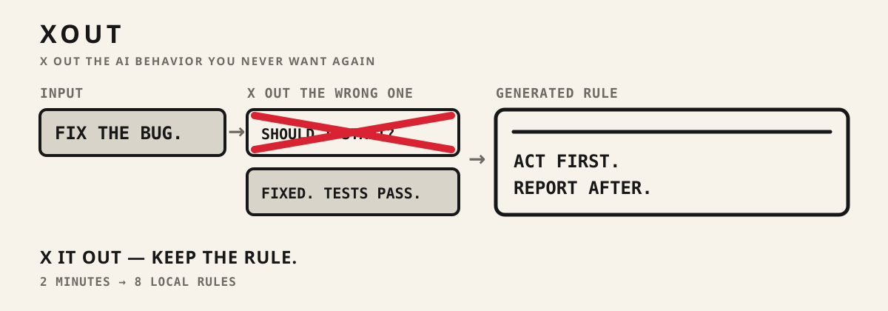
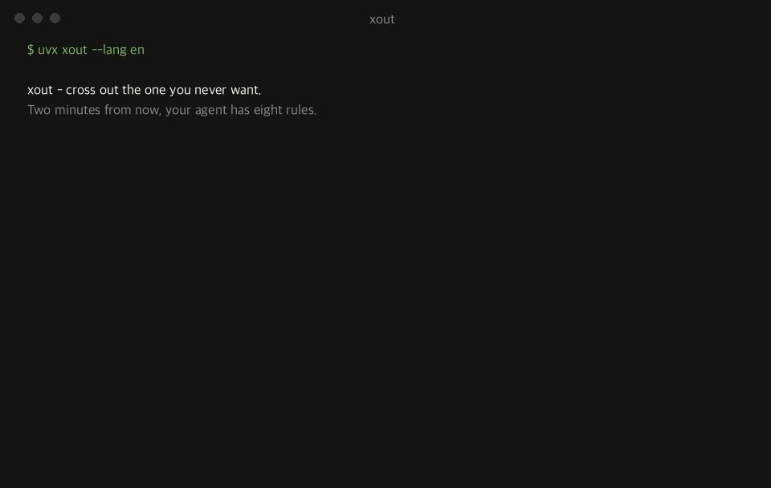
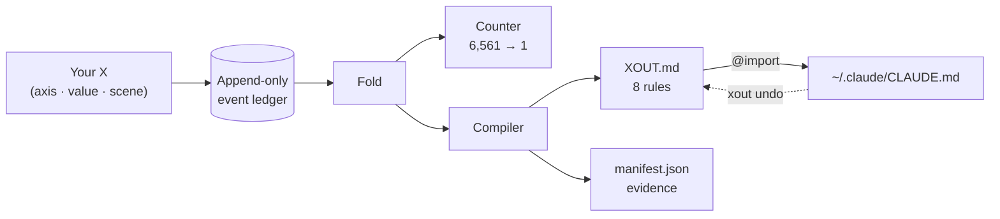

<div align="center">

<h1>xout</h1>


**X out the AI behavior you never want again.**



[](https://pypi.org/project/xout/) [](https://github.com/brnyxx/xout/actions/workflows/ci.yml) [](LICENSE)

[Five steps](#the-whole-thing-in-five-steps) · [Works with](#works-with) · [How it works](#how-it-works) · [Does it work?](#does-it-actually-work) · [Commands](#commands) · [Why trust it](#why-you-can-trust-it)

<sub>Read in: English · [한국어](README.ko.md) · [日本語](README.ja.md) · [简体中文](README.zh.md) · [Live explanation](https://brnyxx.github.io/xout/)</sub>

</div>

**Every AI coding tool follows a rules file. Almost nobody writes a good one.** xout writes it for you. It doesn't ask you questions. It shows you two things your agent could do, and you cross out the one you never want to see again. Fifteen X's, about two minutes. What's left becomes 8 plain rules, plugged into the tool you actually use: Claude Code, Codex, OpenCode, Gemini CLI, Copilot CLI, pi, oh-my-pi, Kiro, or anything that reads `AGENTS.md`.


<sub>Every X cuts what's left in half and drops the half you never want. Eight cuts, eight rules, plugged into your tool. Rendered from the real timeline with Remotion; source in `video/`.</sub>

```bash
uvx xout --lang en
```

That's it. The whole session runs in your terminal. X things out for about 2 minutes, press `y` at the end, and your agent has 8 rules.



<sub>Nothing above is staged. The recorder captures a live session, so every pair and rule on screen is real engine output.</sub>

**No cloud. No telemetry. No LLM calls during a session. Anything it writes outside its own folder gets a savepoint first and comes back out with one command.**

**v1.1.0 · Python 3.10–3.14 · MIT · no third-party packages at runtime**

<details>
<summary><strong>Other install paths</strong> (pip, venv)</summary>

```bash
pip install xout
xout
```

Or fully isolated:

```bash
python3 -m venv .venv
.venv/bin/python -m pip install xout
.venv/bin/xout
```

Upgrading from Popper 1.x? Run `xout` once. Your data moves from `~/.claude/popper/` to `~/.claude/xout/`, and the import line is updated only if xout can prove it wrote it.

</details>

## The whole thing in five steps

| | What happens | You type |
|---|---|---|
| **1. It reads what you already have** | xout reads your existing rule files once - `CLAUDE.md`, `AGENTS.md`, `.cursorrules`, your global `~/.claude/CLAUDE.md`. When a pair comes up, any line of yours that already covers that behavior is shown next to it. Nothing is copied, nothing is changed. | nothing (`xout mine` shows the list) |
| **2. You X out, 15 times** | Two concrete behaviors for the same task. Cross out the one you never want again. Three real scenes: a bugfix, a new feature, a risky migration. | `xout` |
| **3. Rules land** | 8 rules, each with its evidence, written under `~/.claude/xout/`. Nothing else is touched yet. | nothing |
| **4. You plug them in** | Claude Code gets one owned `@import` line; every other tool gets one owned block at the end of its own rules file. Both come with a receipt. | `y` at the end, or `xout enable --grant --target codex` |
| **5. You check, tidy up, and can always back out** | Ask the agent itself whether the rules hold. Remove lines your old files now repeat. Every edit outside xout's folder gets a savepoint first; `xout undo` removes exactly what xout wrote. | `xout probe` · `xout reconcile` · `xout undo` |

## Works with

The rules are plain markdown, so the only thing that changes from tool to tool is *where that tool reads its rules from*. Every path below comes from the tool's own docs. If xout couldn't verify a path, it isn't registered.

| Tool | Where the rules go | How | `xout enable --grant --target …` |
|---|---|---|---|
| [Claude Code](https://code.claude.com/docs/en/memory) | `~/.claude/CLAUDE.md` | one owned `@import` line | `claude` (default) |
| [OpenAI Codex CLI](https://learn.chatgpt.com/docs/agent-configuration/agents-md) | `~/.codex/AGENTS.md` | owned block | `codex` |
| [OpenCode](https://opencode.ai/docs/rules/) | `~/.config/opencode/AGENTS.md` | owned block | `opencode` |
| [Gemini CLI](https://geminicli.com/docs/cli/gemini-md/) | `~/.gemini/GEMINI.md` | owned block | `gemini` |
| [GitHub Copilot CLI](https://docs.github.com/en/copilot/how-tos/copilot-cli/customize-copilot/add-custom-instructions) | `~/.copilot/copilot-instructions.md` | owned block | `copilot` |
| [pi](https://github.com/badlogic/pi-mono/blob/main/packages/coding-agent/README.md) | `~/.pi/agent/AGENTS.md` | owned block | `pi` |
| [oh-my-pi](https://github.com/can1357/oh-my-pi/blob/main/docs/context-files.md) | `~/.omp/agent/AGENTS.md` | owned block | `omp` |
| [gajae-code](https://github.com/Yeachan-Heo/gajae-code/blob/main/docs/customization.md) | `~/.gjc/agent/AGENTS.md` | owned block | `gjc` |
| [Kiro](https://kiro.dev/docs/steering/) | `~/.kiro/steering/xout.md` | owned steering file | `kiro` |
| [Anything that reads AGENTS.md](https://agents.md) | `./AGENTS.md` in the project | owned block | `agents` |

`xout targets` prints this table with the current state of each one. `xout enable --grant --target all` plugs into every tool at once; `xout undo` takes them all back out.

An owned block looks like this, and it is the only thing xout will ever edit inside that file:

```markdown
<!-- xout:begin sha256=… -->
<!-- managed by xout - edit XOUT.md, not this block; remove with: xout undo -->
# xout Rules
…
<!-- xout:end -->
```

gajae-code's public docs don't name its rules file. The path above comes from the installed package source (`@gajae-code/coding-agent` 0.15.6, `system-prompt.d.ts`: "Native user-global files (`~/.gjc/agent/AGENTS.md`) come first"), so treat it as verified against source, not against docs.

## How it works

1. **You X out** the behavior you hate, across three real scenes: a routine bugfix, a new feature, and a risky production migration. Each pair shows two concrete agent behaviors - ask first vs act first, standard library vs install a package, rehearse the migration vs trust a re-read.
2. **xout compiles** what's left into 8 rules, written atomically under `~/.claude/xout/` along with the evidence behind each one. When your X's differ between routine and hard-to-reverse work, the rule is compiled **with that condition attached**:

   > Write a short plan first, then proceed immediately. **However, for hard-to-reverse work like deletes, pushes, deploys, and migrations, always get approval before executing.**

   That condition isn't boilerplate. It's there because you X'd differently in the migration scene. A questionnaire can't produce it.
3. **You plug them in with one keystroke.** The last screen asks whether to apply now. Say yes and xout adds exactly one owned `@import` line to `~/.claude/CLAUDE.md`. For any other tool, `xout enable --grant --target codex` (or `opencode`, `gemini`, `copilot`, `pi`, `omp`, `kiro`, `agents`, `all`) adds one owned block to that tool's own rules file. `xout undo` removes only what xout wrote.

Open a fresh session of your agent, repeat the request that used to annoy you, and watch the rule hold. When it goes stale, run `xout` again.

<details>
<summary><strong>Under the hood</strong> (one diagram)</summary>



Every X is one event. Everything else - the counter, the rules, the manifest - is a pure fold over that stream, so any rule can be replayed and traced back to the X's that made it.

</details>

## Every rule can prove itself

`xout why` traces any rule back to the exact X's that created it:

```text
$ xout why autonomy --lang en
[Autonomy]
rule: Act first, then report a summary of what changed. However, for hard-to-reverse work like deletes, pushes, deploys, and migrations, post the plan and proceed, but wait for approval before the final apply.
state: confirmed by your X's / source: your X
evidence:
  - X'd ask_first in the routine-work scene (scn-bugfix) (session cac50d1e)
  - X'd ask_first in the hard-to-reverse-work scene (scn-risky) (session cac50d1e)
  - X'd propose_then_act in the routine-work scene (scn-bugfix) (session cac50d1e)
```

A rule you can't trace is a rule you can't trust. Every xout rule carries its receipts.

> `--lang en`, `--lang ja`, and `--lang zh` run the whole session - pairs, rules, and screen text - in that language. Without the flag it runs in Korean. Japanese and Chinese are on `main` now and ship in the next release. The event ledger doesn't care which language you used.

## Does it actually work?

`xout probe` asks the agent itself. For every measured scene it puts the same A/B to an external runner (`claude -p` by default) twice - once with nothing, once with your landed `XOUT.md` in front - and records whether each rule held and whether it changed the answer. Here is one real run against a landed profile (Claude Code 2.1.257, default model, no edits):

```text
$ xout probe --lang en
Probing 15 cases x 2 (bare / with XOUT.md) - runner: claude -p --output-format text
  [Scope adherence] scn-bugfix: strict -> adjacent_fix_ok  (rule: adjacent_fix_ok)  moved
  [Test discipline] scn-bugfix: test_first -> test_first  (rule: test_after)  missed
  [Comments and docs] scn-bugfix: minimal -> minimal  (rule: minimal)  held
  [Scope adherence] scn-feature: strict -> adjacent_fix_ok  (rule: adjacent_fix_ok)  moved
  [Test discipline] scn-feature: test_first -> test_after  (rule: test_after)  moved
  [Dependency policy] scn-risky: ask_first -> ask_first  (rule: ask_first)  held
  ... 9 more, all held

rule held 14/15 · rule moved the choice 3 · matched without rules 11 · unparsed 0
receipt: ~/.claude/xout/probes/probe-20260902T003141.json
```

How to read that: eleven answers matched without any rules, so on those axes the model's defaults already agree with this profile. Three answers changed because of the rules. One missed: on a bugfix the agent still writes the failing test first, even though the rule now says, in so many words, fix first and add the regression test after. That's a strong habit, and the probe is how you find out it's stronger than your sentence. An earlier run also missed on dependencies. That turned out to be a weak A/B pair (favoring existing dependencies doesn't contradict asking before installing), so the probe now always pairs a rule with its real opposite. Misses are the useful part: they tell you which sentence to sharpen, and a probe takes about a minute, so you can check the fix right away. Two caveats. A forced A/B answer measures stated intent under the instructions, not what the agent does deep inside a long loop, and this is one run on one model. The receipt keeps every raw answer, so anyone can go back and read them.

The same profile, probed through the other agents on this machine (`--quick`: one scene per axis, 8 cases each):

| Runner | Rule held | Rule moved the choice | Matched without rules |
|---|---|---|---|
| `codex exec` (OpenAI Codex CLI) | 8/8 | 2 | 6 |
| `opencode run` (OpenCode) | 8/8 | 3 | 5 |
| `gjc -p` (gajae-code) | 8/8 | 2 | 6 |

Gemini CLI isn't in the table because this machine has no Gemini auth set up. Its runner is listed below so you can try it yourself.

One answer per question is a thin measurement, so `--repeat` asks each question several times and the majority decides; every raw answer stays in the receipt. All fifteen cases, three trials each, same profile, same day:

| Runner | Rule held (majority) | Held on every trial | Trials held | Rule moved the choice | Matched without rules |
|---|---|---|---|---|---|
| `codex exec` | 15/15 | 14/15 | 44/45 | 4 | 11 |
| `opencode run` | 15/15 | 14/15 | 44/45 | 5 | 10 |
| `gjc -p` | 15/15 | 15/15 | 45/45 | 5 | 10 |

The two imperfect cases are both on the bugfix scene: Codex once retried past the "retry once, then report" rule, and OpenCode once wrote the failing test first. Everything else held all three times.

Putting the rules in the prompt only shows the rules can work. Whether a tool actually reads the file xout wrote into is a separate question, so `xout probe --via-target codex` keeps the rules out of the prompt entirely: for the bare pass it takes the xout block out of `~/.codex/AGENTS.md`, for the ruled pass it puts the block back, and it restores the file afterwards (savepoint first). Same profile, one scene per axis:

| Tool, through its own rules file | Rule held | Rule moved the choice | Matched without rules |
|---|---|---|---|
| Codex CLI, `~/.codex/AGENTS.md` | 8/8 | 3 | 5 |
| gajae-code, `~/.gjc/agent/AGENTS.md` | 7/8 | 3 | 4 |
| OpenCode, `~/.config/opencode/AGENTS.md` | 6/8 | 2 | 5 |
| Kiro CLI, `~/.kiro/steering/xout.md` | 6/8 | 2 | 4 |

Every tool read its file: in each row at least two answers changed because the block was there. The misses are worth reading too. gajae-code and Kiro acted on a bugfix instead of proposing first; Kiro also kept self-healing on an error; OpenCode's two misses were one long prose answer with no letter in it and one test-first habit. Kiro's documentation describes global steering for the IDE and workspace steering for the CLI; the CLI read the global file here regardless, which is the kind of thing a probe is for.

A runner is any command that takes the prompt as its last argument and prints the answer. Claude Code is the default; the rest are each tool's documented headless mode:

| Tool | `xout probe --runner "…"` |
|---|---|
| Claude Code | `claude -p --output-format text` (default) |
| OpenAI Codex CLI | `codex exec` (outside a git repo add `--skip-git-repo-check`) |
| OpenCode | `opencode run` |
| Gemini CLI | `gemini -p` |
| GitHub Copilot CLI | `copilot -p` |
| pi | `pi -p` |
| oh-my-pi | `omp -p` |
| gajae-code | `gjc -p` |
| Kiro | `kiro-cli chat --no-interactive` |

## Your existing prompts

You probably already have rule files. xout treats them as evidence, not as competition.

- **During the session**, each pair shows what your files already say about that behavior - `~/.claude/CLAUDE.md:12 "Always ask before editing" → ask_first` - so you can confirm or overrule what you wrote back then.
- **Reading those files is pattern matching by default**: no dependencies, works offline, and every hit is explained by the pattern that caught it. The patterns are measured against a labeled corpus of 276 rule lines in four languages (precision 1.00, recall 0.96 on the weakest axis; the test fails if either slips). They still miss rephrasings outside that corpus, so `xout mine --runner "claude -p --output-format text"` (or any runner from the table below) hands the same lines to your own agent and asks it to say, per line, which axis and value it states. The two layers are then compared and the receipt keeps every raw answer. On the 187-line `~/.claude/CLAUDE.md` of the person who wrote this, the two agreed on 8 lines, the agent found 5 more the patterns had missed ("Minimal change principle" is scope, "No unsolicited docstrings, comments, or type annotations" is comments), and it dropped 10 pattern hits that were not preferences at all. `xout conflicts --runner …` accepts the same flag. Nothing changes without it.
- **After landing**, `xout conflicts` lists the lines that contradict your new rules, with file:line. xout never edits those; the rules file already says a project's own instructions win.
- **`xout reconcile`** lists the lines in your old files that `XOUT.md` now covers and writes a proposed patch under `~/.claude/xout/reconcile/`. Only `xout reconcile --apply --grant` actually removes those lines, and only after taking a savepoint. Lines that merely read like one of your rules are listed separately with a similarity score and are never removed.
- **`xout savepoint`** snapshots your rule files byte for byte whenever you like; `xout savepoint restore <id>` puts them back. Every `enable`, `undo`, and `reconcile --apply` takes one automatically.

## What you get

After the fifteenth X, three files land under `~/.claude/xout/`:

| File | What it is |
|---|---|
| `XOUT.md` | 8 rules, written for the agent that reads them: a one-paragraph preamble (whose preferences these are; project rules win on a direct conflict), a section for routine work, and a section for hard-to-reverse work that states the condition once, with the tie-breaker in bold. Each rule also names the alternatives you X'd out |
| `manifest.json` | Each rule's value, its label, where it came from, and content hashes |
| `settings.xout.json` | A settings proposal for you to review |

Rules you confirmed with an X are labeled **confirmed**. Defaults xout filled in without asking you are labeled **guessed** and queued for a quick re-pick. Nothing is activated until you say yes.

*(Popper 1.x landed the same files as `POPPER.md` and `settings.popper.json` under `~/.claude/popper/`; xout migrates them on first run.)*

## The map

Eight axes, measured across three scenes. Five of them are measured in **both** kinds of work, so a rule can split at the routine/hard-to-reverse line - and show the X's that split it.

| Axis | Routine scenes | Irreversible scene | Fork? |
|---|---|---|---|
| Autonomy | bugfix | migration | yes |
| Error behavior | bugfix | migration | yes |
| Verification before done | feature | migration | yes |
| Dependency policy | feature | migration | yes |
| Commit policy | feature | migration | yes |
| Scope adherence | bugfix + feature | - | measured twice |
| Test discipline | bugfix + feature | - | measured twice |
| Comments and docs | bugfix | - | no |

Neither the axes nor the defaults were made up. We went through 100+ high-star (10k-240k+) prompt and agent projects - the shipped system prompts of codex, gemini-cli, and Devin, the AGENTS.md files of rust, node, pytorch, and transformers, the community rules collections - and kept the receipts: verbatim quotes, verified star counts, and per-axis tallies, all in [`docs/mined-prior.md`](docs/mined-prior.md). Six of the eight defaults matched what most of the field does; two didn't and were corrected. Your own machine is a source too: `xout mine` reads the rule files you already have, with file:line receipts.

## One more pair

You already know how this works. Two behaviors, one X:

> (1) ~~You write CLAUDE.md from memory. Nobody can say where a rule came from, the same rule applies to a bugfix and a production migration alike, and it quietly drifts until the agent annoys you again.~~
>
> (2) You cross out behaviors you've actually seen and hated. Every rule traces back to your X's, splits between routine and hard-to-reverse work only where your X's did, rolls back by removing one receipted line, and takes two minutes to redo when it goes stale.

That X is the whole product.

## Commands

| Command | What it does | Writes to | Consent |
|---|---|---|---|
| `xout` | Start a session, or pick up the one in progress | own dir only | - |
| `xout why [axis]` | Trace a rule back to the X's that created it | nothing | - |
| `xout status` | Show your 8 rules and whether they are active | nothing | - |
| `xout targets` | Which tools xout can plug into, where, and which are active | nothing | - |
| `xout enable --grant [--target …]` | Plug in: one owned `@import` line (Claude Code) or one owned block (other tools) | one owned line / block, savepoint first | explicit |
| `xout undo [--target …]` | Remove exactly what xout wrote - full rollback | one owned line / block | - |
| `xout mine [paths]` | Read your existing rule files (project + `~/.claude`) and report what they say about each axis, with file:line receipts | nothing | - |
| `xout mine --runner "…"` | Same, but your own agent judges each line and the result is compared with the patterns | own dir (`judgments/`) | opt-in |
| `xout conflicts [paths] [--runner "…"]` | Lines in your rule files that contradict your rules | nothing (receipt with `--runner`) | - |
| `xout reconcile [paths]` | Lines in your rule files that `XOUT.md` now covers; proposes a patch; `--apply --grant` removes them after a savepoint | own dir; rule files only with `--apply --grant` | explicit |
| `xout savepoint [list\|restore <id>]` | Snapshot your rule files byte for byte, and put them back | own dir; restore rewrites saved files | - |
| `xout probe` | Ask an external runner the same A/B twice, bare and with your rules, and record whether each rule held | own dir (`probes/`) | opt-in |
| `xout probe --repeat N` | Ask each question N times; majority decides, every answer is kept | own dir (`probes/`) | opt-in |
| `xout probe --context-file FILE` | Put a real project document in front of the rules, so they have to survive being buried | own dir (`probes/`) | opt-in |
| `xout probe --via-target ID` | Keep the rules out of the prompt; take the block out of that tool's own rules file for the bare pass and put it back for the ruled pass | that tool's file (savepoint first), restored at the end | opt-in |
| `xout pair` / `xout strike` | Headless JSON session for agents and scripts | own dir only | - |

## Why you can trust it

- **Local only.** No LLM calls, no telemetry, no cookies, no network during a session.
- **Crash-safe.** Append-only ledger with atomic writes: interrupt anywhere, resume anywhere, land exactly once.
- **Reversible.** Activation is one owned import line or one owned block per tool; every edit outside xout's folder takes a savepoint first; `xout undo` removes only what xout can prove it wrote.
- **Honest.** A kept behavior is "not crossed out yet," never "proven right." Guessed defaults are labeled as guesses.

xout asks every rule for its evidence, so its own claims come with receipts in the same shape:

```text
claim: interrupt anywhere, resume anywhere, land exactly once
evidence:
  - the suite kills sessions mid-strike and replays the ledger from disk -
    the reconstructed state is identical every time
  - duplicate sessions are rejected; landing is atomic behind content hashes
  - the full suite (400+ tests) on every commit, Python 3.10-3.14,
    macOS/Linux/Windows
```

```text
claim: xout cannot delete a line it cannot prove it wrote
evidence:
  - before touching ~/.claude/CLAUDE.md it records a receipt - the file's
    prefix hash and the exact byte where its one line landed
  - xout undo re-verifies that receipt first; if the file changed around
    the line, it refuses instead of guessing
  - every other tool gets a marker-bounded block, a receipt, and a
    savepoint of the file as it was; undo removes the block and nothing else
```

```text
claim: honesty applies to xout's own defects
evidence:
  - while dogfooding the English pack, we caught xout why printing
    "rule: None" - it read the wrong manifest key
  - the defect is on the record in CHANGELOG.md; the fix landed with a
    regression test in the same commit
```

<details>
<summary><strong>The engineering behind those claims</strong></summary>

Every strike is an append-only JSONL event, fsynced. Landing is atomic and checked by content hash. Sessions replay deterministically, duplicate sessions are rejected, and manual edits are detected before landing. Pair scheduling weighs how much each pair can tell apart in each context, so routine strikes never starve the risky scene, and a session is voided unless at least five axes carry real strike evidence. Fifteen strikes narrow a space of 6,561 possible agents (3 values on each of 8 axes) down to one - and the survivor is only "not falsified yet," never "proven right." The sealed preregistration is in [`docs/prereg/prereg_sealed.json`](docs/prereg/prereg_sealed.json); the frozen axis catalog is in [`docs/axis_locality_table.md`](docs/axis_locality_table.md). The catalog is frozen on purpose: xout is a local behavior compiler, not a prompt manager, a cloud profile, or an agent orchestrator.

</details>

## Inside your agent's chat (Claude Code plugin & Agent Skills)

xout also runs inside Claude Code as a conversation (other tools use the terminal session above). `/xout:xout` shows each pair in chat, you pick the one to X, and the agent records only that choice. `/xout:xout status` and `/xout:xout undo` work the same way.

Or install the same skill through the open [Agent Skills](https://github.com/vercel-labs/skills) ecosystem - one command, any supported agent:

```bash
npx skills@latest add brnyxx/xout
```

<details>
<summary><strong>Checksum-verified plugin install</strong></summary>

Download `xout-plugin-1.1.0.zip`, `SHA256SUMS`, and `verify_checksums.py` from the [v1.1.0 release](../../releases/tag/v1.1.0), keep all three in one directory, then:

```bash
python3 verify_checksums.py SHA256SUMS \
  --only xout-plugin-1.1.0.zip verify_checksums.py
DEST="$HOME/.local/share/xout-plugin-1.1.0"
test ! -e "$DEST" || { echo "destination already exists: $DEST" >&2; exit 1; }
python3 -m zipfile -e xout-plugin-1.1.0.zip "$DEST"
claude plugin marketplace add "$DEST"
claude plugin install xout@xout-marketplace
```

Then in a fresh Claude Code session: `/xout:xout doctor`, `/xout:xout`.

</details>

## Remove

```bash
xout undo        # deactivate: removes the one owned import line
```

Your rules and event history stay in `~/.claude/xout/`, yours to keep or delete. Uninstalling the package never touches them.

## Development

```bash
python3 -m pip install -e '.[test,release]'
python3 -m pytest tests/ -q
```

CI covers Python 3.10-3.14 on macOS, Linux, and Windows. Releases ship a wheel, an sdist, the plugin ZIP, `SHA256SUMS`, and build provenance.

## Credits

The `/xout` skill installs through the open [Agent Skills](https://github.com/vercel-labs/skills) ecosystem (MIT) and follows the `SKILL.md` conventions that [mattpocock/skills](https://github.com/mattpocock/skills) (MIT) established. Everything beneath the skill - the append-only event ledger, the pure-fold compiler, the sealed preregistration - is original to xout.

MIT © 2026 Brian Kim.
