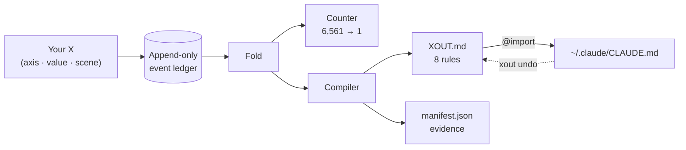

<div align="center">

<h1>xout</h1>


**X out the AI behavior you never want again.**


[](https://pypi.org/project/xout/) [](https://github.com/brnyxx/xout/actions/workflows/ci.yml) [](LICENSE)

[Five steps](#the-whole-thing-in-five-steps) · [Works with](#works-with) · [How it works](#how-it-works) · [Does it work?](#does-it-actually-work) · [Commands](#commands) · [Why trust it](#why-you-can-trust-it)

<sub>Read in: English · [한국어](README.ko.md) · [日本語](README.ja.md) · [简体中文](README.zh.md) · [Live explanation](https://brnyxx.github.io/xout/)</sub>

</div>

**Every AI coding tool follows a rules file. Almost nobody writes a good one.** xout writes it for you. It does not ask questions - it shows you two things your AI could do and lets you cross out the one you never want to see again. Fifteen X's, about two minutes. The surviving choices become 8 plain rules, plugged into the tool you actually use: Claude Code, Codex, OpenCode, Gemini CLI, Copilot CLI, pi, oh-my-pi, Kiro, or anything that reads `AGENTS.md`.

```bash
uvx xout --lang en
```

That's it. The whole session runs right in your terminal. X things out for about 2 minutes, press `y` at the end, and your agent has 8 rules.


<sub>Nothing above is staged - the recorder photographs a live session, so every pair and rule on screen is the engine's real output.</sub>

**No cloud. No telemetry. No LLM calls during a session. Everything it writes outside its own folder is behind a savepoint and one command to undo.**

**v1.0.1 · Python 3.10–3.14 · MIT · zero third-party runtime packages**

<details>
<summary><strong>Other install paths</strong> (pip, venv)</summary>

```bash
pip install xout
xout
```

Or fully isolated:

```bash
python3 -m venv .venv
.venv/bin/python -m pip install xout
.venv/bin/xout
```

Upgrading from Popper 1.x? Just run `xout` once: your data in `~/.claude/popper/` moves to `~/.claude/xout/`, and the owned import line is updated only when xout can prove it wrote it.

</details>

## The whole thing in five steps

| | What happens | You type |
|---|---|---|
| **1. It reads what you already have** | Your existing rule files - `CLAUDE.md`, `AGENTS.md`, `.cursorrules`, your global `~/.claude/CLAUDE.md` - are read once, and the lines that talk about the behavior on screen are shown next to each pair. Nothing is copied, nothing is changed. | nothing (`xout mine` shows the list) |
| **2. You X out, 15 times** | Two concrete behaviors for the same task. Cross out the one you never want again. Three real scenes: a bugfix, a new feature, a risky migration. | `xout` |
| **3. Rules land** | 8 rules with evidence, written under `~/.claude/xout/`. No other file is touched yet. | nothing |
| **4. You plug them in** | Claude Code gets one owned `@import` line; every other tool gets one owned block at the end of its own rules file. Both come with a receipt. | `y` at the end, or `xout enable --grant --target codex` |
| **5. You check, tidy, and can always go back** | Ask the agent itself whether the rules hold. Remove lines your old files now repeat. Every edit outside xout's folder gets a savepoint first; `xout undo` removes exactly what xout wrote. | `xout probe` · `xout reconcile` · `xout undo` |

## Works with

xout's rules are plain markdown, so the only thing that differs per tool is *where that tool reads its rules from*. Every path below comes from the tool's own documentation; xout registers nothing it could not verify.

| Tool | Where the rules go | How | `xout enable --grant --target …` |
|---|---|---|---|
| [Claude Code](https://code.claude.com/docs/en/memory) | `~/.claude/CLAUDE.md` | one owned `@import` line | `claude` (default) |
| [OpenAI Codex CLI](https://learn.chatgpt.com/docs/agent-configuration/agents-md) | `~/.codex/AGENTS.md` | owned block | `codex` |
| [OpenCode](https://opencode.ai/docs/rules/) | `~/.config/opencode/AGENTS.md` | owned block | `opencode` |
| [Gemini CLI](https://geminicli.com/docs/cli/gemini-md/) | `~/.gemini/GEMINI.md` | owned block | `gemini` |
| [GitHub Copilot CLI](https://docs.github.com/en/copilot/how-tos/copilot-cli/customize-copilot/add-custom-instructions) | `~/.copilot/copilot-instructions.md` | owned block | `copilot` |
| [pi](https://github.com/badlogic/pi-mono/blob/main/packages/coding-agent/README.md) | `~/.pi/agent/AGENTS.md` | owned block | `pi` |
| [oh-my-pi](https://github.com/can1357/oh-my-pi/blob/main/docs/context-files.md) | `~/.omp/agent/AGENTS.md` | owned block | `omp` |
| [gajae-code](https://github.com/Yeachan-Heo/gajae-code/blob/main/docs/customization.md) | `~/.gjc/agent/AGENTS.md` | owned block | `gjc` |
| [Kiro](https://kiro.dev/docs/steering/) | `~/.kiro/steering/xout.md` | owned steering file | `kiro` |
| [Anything that reads AGENTS.md](https://agents.md) | `./AGENTS.md` in the project | owned block | `agents` |

`xout targets` prints this table with the live state of each one. `xout enable --grant --target all` plugs into every tool at once; `xout undo` takes them all out again.

An owned block looks like this and is the only thing xout will ever edit inside that file:

```markdown
<!-- xout:begin sha256=… -->
<!-- managed by xout - edit XOUT.md, not this block; remove with: xout undo -->
# xout Rules
…
<!-- xout:end -->
```

gajae-code's public docs do not name its rules file; the path above comes from the installed package source (`@gajae-code/coding-agent` 0.15.6, `system-prompt.d.ts`: "Native user-global files (`~/.gjc/agent/AGENTS.md`) come first"). Treat it as source-verified, not doc-verified.

## How it works


<sub>Every X cuts what's left in half and drops the half you never want. Eight cuts, eight rules, plugged into your tool. Rendered from the real timeline with Remotion; source in `video/`.</sub>

1. **You X out** the behavior you hate, across three real scenes: a routine bugfix, a new feature, and a risky production migration. Each pair shows two concrete agent behaviors - ask first vs act first, standard library vs install-a-package, rehearse the migration vs trust a re-read.
2. **xout compiles** the survivors into 8 executable rules, written atomically under `~/.claude/xout/` with evidence and provenance. And when your X's diverge between routine and irreversible work, the rule compiles **with that condition attached**:

   > Write a short plan first, then proceed immediately. **However, for hard-to-reverse work like deletes, pushes, deploys, and migrations, always get approval before executing.**

   That condition is not a template. It exists because you X'd differently in the migration scene. No interview-based tool can produce it.
3. **You plug it in with one keystroke.** The completion screen asks "apply now?" - saying yes adds exactly one owned `@import` line to `~/.claude/CLAUDE.md`. For any other tool, `xout enable --grant --target codex` (or `opencode`, `gemini`, `copilot`, `pi`, `omp`, `kiro`, `agents`, `all`) adds one owned block to that tool's own rules file. `xout undo` removes only what xout wrote.

Repeat the request that used to annoy you in a fresh session of your agent and watch the rule hold. When it ever feels stale, `xout` again.

<details>
<summary><strong>Under the hood</strong> (one diagram)</summary>



Every X is one event. Everything else - the counter, the rules, the manifest - is a pure fold of that stream, so any rule can be replayed and traced back to its X's.

</details>

## Every rule can prove itself

`xout why` traces any rule back to the exact X's that created it:

```text
$ xout why autonomy --lang en
[Autonomy]
rule: Write a short plan first, then proceed immediately. However, ... get approval before executing.
state: discriminated / source: your X
evidence:
  - X'd ask_first in the routine-work scene (scn-bugfix) (session a3f2c9d1)
  - X'd act_then_report in the hard-to-reverse-work scene (scn-risky) (session a3f2c9d1)
```

A rule you can't trace is a rule you can't trust. Every xout rule carries its receipts.

> `--lang en`, `--lang ja`, and `--lang zh` run the whole session in that language (pairs, rules, and screen text); the default without the flag is Korean. Japanese and Chinese are on `main` today and ship with the next release. The event ledger is language-neutral either way.

## Does it actually work?

`xout probe` puts the question to the agent itself. For every measured scene it asks an external runner (default `claude -p`) the same A/B twice - once bare, once with your landed `XOUT.md` in front - and receipts whether each rule held and whether it moved the choice. One real run against a landed profile (Claude Code 2.1.257, default model, no edits):

```text
$ xout probe --lang en
Probing 15 cases x 2 (bare / with XOUT.md) - runner: claude -p --output-format text
  [Scope adherence] scn-bugfix: strict -> adjacent_fix_ok  (rule: adjacent_fix_ok)  moved
  [Test discipline] scn-bugfix: test_first -> test_first  (rule: test_after)  missed
  [Comments and docs] scn-bugfix: minimal -> minimal  (rule: minimal)  held
  [Scope adherence] scn-feature: strict -> adjacent_fix_ok  (rule: adjacent_fix_ok)  moved
  [Test discipline] scn-feature: test_first -> test_after  (rule: test_after)  moved
  [Dependency policy] scn-risky: ask_first -> ask_first  (rule: ask_first)  held
  ... 9 more, all held

rule held 14/15 · rule moved the choice 3 · matched without rules 11 · unparsed 0
receipt: ~/.claude/xout/probes/probe-20260902T003141.json
```

Read it the way it is meant. Eleven choices already matched without rules, so the model's defaults agree with this profile there. Three were moved by the rules. One missed: on a bugfix the agent still writes the failing test first, even though the rule now says in so many words to fix first and add the regression test after - that is a strong habit, and the probe is how you find out it is stronger than your sentence. An earlier run had a second miss on dependencies; it turned out the A/B pair was weak (favoring existing dependencies is compatible with asking before installing), so the probe now always pairs a rule with its true opposite. Misses are the useful part - they name the rule sentence to sharpen, and a probe takes a minute, so you can check the fix. What a probe is not: a forced A/B answer measures stated intent under the instructions, not behavior deep inside an agent loop, and this is one run on one model. The receipt keeps every raw answer so anyone can re-read it.

The same profile, probed through other agents on this machine (`--quick`: one scene per axis, 8 cases each):

| Runner | Rule held | Rule moved the choice | Matched without rules |
|---|---|---|---|
| `codex exec` (OpenAI Codex CLI) | 8/8 | 2 | 6 |
| `opencode run` (OpenCode) | 8/8 | 3 | 5 |
| `gjc -p` (gajae-code) | 8/8 | 2 | 6 |

Gemini CLI was not probed here because this machine has no Gemini auth configured; its runner is listed below so you can run it yourself.

The runner is any command that takes the prompt as its last argument and prints the answer. The default is Claude Code; the others below are the documented headless modes of each tool:

| Tool | `xout probe --runner "…"` |
|---|---|
| Claude Code | `claude -p --output-format text` (default) |
| OpenAI Codex CLI | `codex exec` (outside a git repo add `--skip-git-repo-check`) |
| OpenCode | `opencode run` |
| Gemini CLI | `gemini -p` |
| GitHub Copilot CLI | `copilot -p` |
| pi | `pi -p` |
| oh-my-pi | `omp -p` |
| gajae-code | `gjc -p` |
| Kiro | `kiro-cli chat --no-interactive` |

## Your existing prompts

You probably already have rule files. xout treats them as evidence, not as competition.

- **During the session** every pair shows the lines your files already say about that behavior - `~/.claude/CLAUDE.md:12 "Always ask before editing" → ask_first` - so you can confirm or overrule what you once wrote.
- **After landing**, `xout conflicts` lists the lines that say the opposite of your new rules, with file:line. Conflicts are never edited: the rules file already says that a project's own instructions win.
- **`xout reconcile`** lists the lines your old files now repeat from `XOUT.md` and writes a proposed patch under `~/.claude/xout/reconcile/`. Only `xout reconcile --apply --grant` removes those duplicate lines - and only after taking a savepoint.
- **`xout savepoint`** snapshots your rule files byte for byte whenever you want; `xout savepoint restore <id>` puts them back. Every `enable`, `undo`, and `reconcile --apply` takes one automatically.

## What you get

After the fifteenth X, three files land under `~/.claude/xout/`:

| File | What it is |
|---|---|
| `XOUT.md` | 8 executable rules, written for the agent that reads them: a one-paragraph preamble (whose preferences these are, project rules win on a direct conflict), a routine section, and a hard-to-reverse section that defines the condition once with an emphasized tie-breaker. Each rule names the alternatives you X'd out |
| `manifest.json` | Rule value, confidence label, source, and content hashes |
| `settings.xout.json` | A reviewable settings proposal |

Rules you confirmed by X'ing are labeled **confirmed**; defaults xout guessed without asking you are honestly labeled **guessed** and queued for a quick re-pick. Nothing is ever activated without your explicit yes.

*(Popper 1.x landed the same files as `POPPER.md` and `settings.popper.json` under `~/.claude/popper/`; xout migrates them automatically on first run.)*

## The map

Eight axes, measured across three scenes. Five axes are measured in **both** contexts, so they can fork on the routine/irreversible boundary - with evidence.

| Axis | Routine scenes | Irreversible scene | Fork? |
|---|---|---|---|
| Autonomy | bugfix | migration | yes |
| Error behavior | bugfix | migration | yes |
| Verification before done | feature | migration | yes |
| Dependency policy | feature | migration | yes |
| Commit policy | feature | migration | yes |
| Scope adherence | bugfix + feature | - | measured twice |
| Test discipline | bugfix + feature | - | measured twice |
| Comments and docs | bugfix | - | no |

These eight axes weren't invented in a vacuum, and neither were the defaults. We surveyed 100+ high-star (10k-240k+) prompt and agent projects - shipped system prompts of codex/gemini-cli/Devin, the AGENTS.md files of rust/node/pytorch/transformers, community rules collections - and kept receipts: verbatim quotes, verified star counts, per-axis tallies, all in [`docs/mined-prior.md`](docs/mined-prior.md). Six of eight defaults matched the field's mode; two didn't and were corrected. And your own environment is a source too: `xout mine` reads the rule files you already have, with file:line receipts.

## One more pair

You already know how this works. Two behaviors, one X:

> (1) ~~You write CLAUDE.md from memory. The rules have no provenance, apply one-size-fits-all to a bugfix and a production migration alike, and drift silently until the agent annoys you again.~~
>
> (2) You cross out behaviors you have actually seen and hated. Every rule traces to your X's, forks on the routine/irreversible boundary only where your X's diverged, rolls back by one receipt-proofed line, and gets re-struck in two minutes when it goes stale.

That X is the whole product.

## Commands

| Command | What it does | Writes to | Consent |
|---|---|---|---|
| `xout` | Start (or automatically resume) a session | own dir only | - |
| `xout why [axis]` | Trace a rule back to the X's that created it | nothing | - |
| `xout status` | Show your 8 rules and whether they are active | nothing | - |
| `xout targets` | Which tools xout can plug into, where, and which are active | nothing | - |
| `xout enable --grant [--target …]` | Plug in: one owned `@import` line (Claude Code) or one owned block (other tools) | one owned line / block, savepoint first | explicit |
| `xout undo [--target …]` | Remove exactly what xout wrote - full rollback | one owned line / block | - |
| `xout mine [paths]` | Read your existing rule files (project + `~/.claude`) into axis observations, with file:line receipts | nothing | - |
| `xout conflicts [paths]` | Lines in your rule files that say the opposite of your rules | nothing | - |
| `xout reconcile [paths]` | Lines your rule files now repeat from `XOUT.md`; proposes a patch; `--apply --grant` removes them behind a savepoint | own dir; rule files only with `--apply --grant` | explicit |
| `xout savepoint [list\|restore <id>]` | Snapshot your rule files byte for byte, and put them back | own dir; restore rewrites saved files | - |
| `xout probe` | Ask an external runner the same A/B twice, bare and with your rules, and receipt whether each rule held | own dir (`probes/`) | opt-in |
| `xout pair` / `xout strike` | Headless JSON session for agents and scripts | own dir only | - |

## Why you can trust it

- **Local only.** No LLM calls, no telemetry, no cookies, no network during a session.
- **Crash-safe.** Append-only ledger with atomic writes: interrupt anywhere, resume anywhere, land exactly once.
- **Reversible.** Activation is one owned import line or one owned block per tool; every edit outside xout's folder takes a savepoint first; `xout undo` removes only what xout can prove it wrote.
- **Honest.** A kept behavior is "not crossed out yet," never "proven right." Guessed defaults are labeled as guesses.

xout demands evidence from every rule, so its own claims file receipts in the same shape:

```text
claim: interrupt anywhere, resume anywhere, land exactly once
evidence:
  - the suite kills sessions mid-strike and replays the ledger from disk -
    the reconstructed state is identical every time
  - duplicate sessions are rejected; landing is atomic behind content hashes
  - the full suite (400+ tests) on every commit, Python 3.10-3.14,
    macOS/Linux/Windows
```

```text
claim: xout cannot delete a line it cannot prove it wrote
evidence:
  - before touching ~/.claude/CLAUDE.md it records a receipt - the file's
    prefix hash and the exact byte where its one line landed
  - xout undo re-verifies that receipt first; if the file changed around
    the line, it refuses instead of guessing
  - every other tool gets a marker-bounded block, a receipt, and a
    savepoint of the file as it was; undo removes the block and nothing else
```

```text
claim: honesty applies to xout's own defects
evidence:
  - while dogfooding the English pack, we caught xout why printing
    "rule: None" - it read the wrong manifest key
  - the defect is on the record in CHANGELOG.md; the fix landed with a
    regression test in the same commit
```

<details>
<summary><strong>The engineering behind those claims</strong></summary>

Every strike is an append-only JSONL event with fsync; landing is atomic with content hashes; sessions replay deterministically; duplicate sessions are rejected; manual edits are detected before landing. Pair scheduling judges discriminative power per context, so routine strikes never starve the risky scene; a session is voided unless at least five axes carry real strike evidence. The 15 strikes narrow a 6,561-agent hypothesis space (3 values across 8 axes) down to one - and the survivor is only "not falsified yet," never "proven right." The sealed preregistration lives in [`docs/prereg/prereg_sealed.json`](docs/prereg/prereg_sealed.json); the frozen axis catalog lives in [`docs/axis_locality_table.md`](docs/axis_locality_table.md). The eight-axis catalog is deliberately frozen: xout is a local behavior compiler, not a prompt manager, cloud profile, or agent orchestrator.

</details>

## Inside your agent's chat (Claude Code plugin & Agent Skills)

xout also runs inside Claude Code as a conversation (other tools use the terminal session above): `/xout:xout` shows each behavior pair in chat, you pick the one to X, and the agent records only your explicit choice. `/xout:xout status`, `/xout:xout undo` work the same way.

Or install the same skill through the open [Agent Skills](https://github.com/vercel-labs/skills) ecosystem - one command, any supported agent:

```bash
npx skills@latest add brnyxx/xout
```

<details>
<summary><strong>Checksum-verified plugin install</strong></summary>

Download `xout-plugin-1.0.1.zip`, `SHA256SUMS`, and `verify_checksums.py` from the [v1.0.1 release](../../releases/tag/v1.0.1), keep all three in one directory, then:

```bash
python3 verify_checksums.py SHA256SUMS \
  --only xout-plugin-1.0.1.zip verify_checksums.py
DEST="$HOME/.local/share/xout-plugin-1.0.1"
test ! -e "$DEST" || { echo "destination already exists: $DEST" >&2; exit 1; }
python3 -m zipfile -e xout-plugin-1.0.1.zip "$DEST"
claude plugin marketplace add "$DEST"
claude plugin install xout@xout-marketplace
```

Then in a fresh Claude Code session: `/xout:xout doctor`, `/xout:xout`.

</details>

## Remove

```bash
xout undo        # deactivate: removes the one owned import line
```

Your rules and event history stay in `~/.claude/xout/` (yours to keep or delete). Uninstalling the package never touches them.

## Development

```bash
python3 -m pip install -e '.[test,release]'
python3 -m pytest tests/ -q
```

CI covers Python 3.10-3.14 on macOS, Linux, and Windows. Releases ship wheel, sdist, plugin ZIP, `SHA256SUMS`, and artifact provenance.

## Credits

The `/xout` skill installs through the open [Agent Skills](https://github.com/vercel-labs/skills) ecosystem (MIT) and follows the `SKILL.md` conventions that [mattpocock/skills](https://github.com/mattpocock/skills) (MIT) established. Everything beneath the skill - the append-only event ledger, the pure-fold compiler, the sealed preregistration - is original to xout.

MIT © 2026 Brian Kim.
