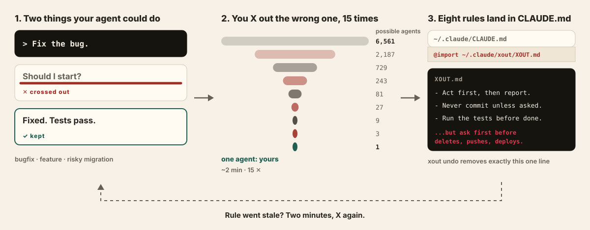
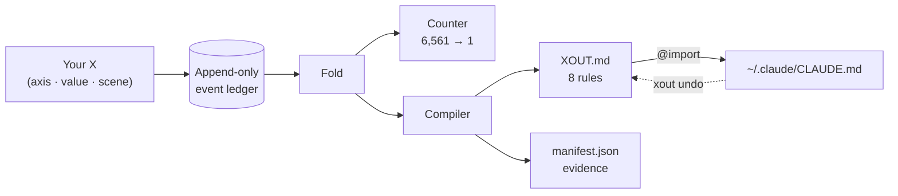

<div align="center">

<h1>xout</h1>


**X out the AI behavior you never want again.**


[](https://pypi.org/project/xout/) [](https://github.com/brnyxx/xout/actions/workflows/ci.yml) [](LICENSE)

[Quickstart](#how-it-works) · [Every rule proves itself](#every-rule-can-prove-itself) · [The map](#the-map) · [Commands](#commands) · [Why trust it](#why-you-can-trust-it)

<sub>Read in: English · [한국어](README.ko.md) · [日本語](README.ja.md) · [简体中文](README.zh.md) · [Live explanation](https://brnyxx.github.io/xout/)</sub>

</div>

Your coding agent shows two concrete ways it could behave. You X out the wrong one. Two minutes and 15 X's later, the surviving choices are compiled into 8 local rules that Claude Code loads from `CLAUDE.md`.

```bash
uvx xout --lang en
```

That's it. The whole session runs right in your terminal. X things out for about 2 minutes. Your agent gets 8 rules.


<sub>Nothing above is staged - the recorder photographs a live session, so every pair and rule on screen is the engine's real output.</sub>

**No cloud. No telemetry. No LLM calls. One-line rollback.**

**v1.0.1 · Python 3.10–3.14 · MIT · zero third-party runtime packages**

<details>
<summary><strong>Other install paths</strong> (pip, venv)</summary>

```bash
pip install xout
xout
```

Or fully isolated:

```bash
python3 -m venv .venv
.venv/bin/python -m pip install xout
.venv/bin/xout
```

Upgrading from Popper 1.x? Just run `xout` once: your data in `~/.claude/popper/` moves to `~/.claude/xout/`, and the owned import line is updated only when xout can prove it wrote it.

</details>

## How it works



<sub>Left to right: one X removes one behavior, 15 X's leave one agent, and that agent is written down as 8 rules.</sub>

1. **You X out** the behavior you hate, across three real scenes: a routine bugfix, a new feature, and a risky production migration. Each pair shows two concrete agent behaviors - ask first vs act first, standard library vs install-a-package, rehearse the migration vs trust a re-read.
2. **xout compiles** the survivors into 8 executable rules, written atomically under `~/.claude/xout/` with evidence and provenance. And when your X's diverge between routine and irreversible work, the rule compiles **with that condition attached**:

   > Write a short plan first, then proceed immediately. **However, for hard-to-reverse work like deletes, pushes, deploys, and migrations, always get approval before executing.**

   That condition is not a template. It exists because you X'd differently in the migration scene. No interview-based tool can produce it.
3. **You apply with one keystroke.** The completion screen asks "apply now?" - saying yes adds exactly one owned `@import` line to `~/.claude/CLAUDE.md`. `xout undo` removes only that line.

Repeat the request that used to annoy you in a fresh Claude Code session and watch the rule hold. When it ever feels stale, `xout` again.

<details>
<summary><strong>Under the hood</strong> (one diagram)</summary>



Every X is one event. Everything else - the counter, the rules, the manifest - is a pure fold of that stream, so any rule can be replayed and traced back to its X's.

</details>

## Every rule can prove itself

`xout why` traces any rule back to the exact X's that created it:

```text
$ xout why autonomy --lang en
[Autonomy]
rule: Write a short plan first, then proceed immediately. However, ... get approval before executing.
state: discriminated / source: your X
evidence:
  - X'd ask_first in the routine-work scene (scn-bugfix) (session a3f2c9d1)
  - X'd act_then_report in the hard-to-reverse-work scene (scn-risky) (session a3f2c9d1)
```

A rule you can't trace is a rule you can't trust. Every xout rule carries its receipts.

> `--lang en`, `--lang ja`, and `--lang zh` run the whole session in that language (pairs, rules, and screen text); the default without the flag is Korean. Japanese and Chinese are on `main` today and ship with the next release. The event ledger is language-neutral either way.

## Does it actually work?

`xout probe` puts the question to the agent itself. For every measured scene it asks an external runner (default `claude -p`) the same A/B twice - once bare, once with your landed `XOUT.md` in front - and receipts whether each rule held and whether it moved the choice. One real run against a landed profile (Claude Code 2.1.257, default model, no edits):

```text
$ xout probe --lang en
Probing 15 cases x 2 (bare / with XOUT.md) - runner: claude -p --output-format text
  [Scope adherence] scn-bugfix: strict -> adjacent_fix_ok  (rule: adjacent_fix_ok)  moved
  [Test discipline] scn-bugfix: test_first -> test_first  (rule: test_after)  missed
  [Comments and docs] scn-bugfix: minimal -> minimal  (rule: minimal)  held
  [Test discipline] scn-feature: test_first -> test_after  (rule: test_after)  moved
  [Behavior on errors] scn-risky: retry_then_report -> stop_and_report  (rule: stop_and_report)  moved
  [Dependency policy] scn-risky: prefer_existing -> prefer_existing  (rule: ask_first)  missed
  ... 9 more, all held

rule held 13/15 · rule moved the choice 4 · matched without rules 9 · unparsed 0
receipt: ~/.claude/xout/probes/probe-20260901T231554.json
```

Read it the way it is meant. Nine choices already matched without rules, so the model's defaults agree with this profile there. Four were moved by the rules. Two missed: the agent kept writing the failing test first on a bugfix, and treated "favor existing dependencies" as already satisfying "ask before installing" in the risky scene. Misses are the useful part - they name the rule sentence to sharpen, and a probe takes a minute, so you can check the fix. What a probe is not: a forced A/B answer measures stated intent under the instructions, not behavior deep inside an agent loop, and this is one run on one model. The receipt keeps every raw answer so anyone can re-read it.

## What you get

After the fifteenth X, three files land under `~/.claude/xout/`:

| File | What it is |
|---|---|
| `XOUT.md` | 8 executable rules, written for the agent that reads them: a one-paragraph preamble (whose preferences these are, project rules win on a direct conflict), a routine section, and a hard-to-reverse section that defines the condition once with an emphasized tie-breaker. Each rule names the alternatives you X'd out |
| `manifest.json` | Rule value, confidence label, source, and content hashes |
| `settings.xout.json` | A reviewable settings proposal |

Rules you confirmed by X'ing are labeled **confirmed**; defaults xout guessed without asking you are honestly labeled **guessed** and queued for a quick re-pick. Nothing is ever activated without your explicit yes.

*(Popper 1.x landed the same files as `POPPER.md` and `settings.popper.json` under `~/.claude/popper/`; xout migrates them automatically on first run.)*

## The map

Eight axes, measured across three scenes. Five axes are measured in **both** contexts, so they can fork on the routine/irreversible boundary - with evidence.

| Axis | Routine scenes | Irreversible scene | Can fork |
|---|---|---|---|
| Autonomy | bugfix | migration | yes |
| Error behavior | bugfix | migration | yes |
| Verification before done | feature | migration | yes |
| Dependency policy | feature | migration | yes |
| Commit policy | feature | migration | yes |
| Scope adherence | bugfix + feature | - | cross-checked |
| Test discipline | bugfix + feature | - | cross-checked |
| Comments and docs | bugfix | - | style axis |

These eight axes weren't invented in a vacuum, and neither were the defaults. We surveyed 100+ high-star (10k-240k+) prompt and agent projects - shipped system prompts of codex/gemini-cli/Devin, the AGENTS.md files of rust/node/pytorch/transformers, community rules collections - and kept receipts: verbatim quotes, verified star counts, per-axis tallies, all in [`docs/mined-prior.md`](docs/mined-prior.md). Six of eight defaults matched the field's mode; two didn't and were corrected. And your own environment is a source too: `xout mine` reads the rule files you already have, with file:line receipts.

## One more pair

You already know how this works. Two behaviors, one X:

> (1) ~~You write CLAUDE.md from memory. The rules have no provenance, apply one-size-fits-all to a bugfix and a production migration alike, and drift silently until the agent annoys you again.~~
>
> (2) You cross out behaviors you have actually seen and hated. Every rule traces to your X's, forks on the routine/irreversible boundary only where your X's diverged, rolls back by one receipt-proofed line, and gets re-struck in two minutes when it goes stale.

That X is the whole product.

## Commands

| Command | What it does | Writes to | Consent |
|---|---|---|---|
| `xout` | Start (or automatically resume) a session | own dir only | - |
| `xout why [axis]` | Trace a rule back to the X's that created it | nothing | - |
| `xout status` | Show your 8 rules and whether they are active | nothing | - |
| `xout undo` | Remove the one import line xout owns - full rollback | one owned line | - |
| `xout enable --grant` | Activate: add one owned `@import` line | one owned line | explicit |
| `xout mine [paths]` | Read your existing CLAUDE.md/AGENTS.md/.cursorrules into axis observations, with file:line receipts | nothing | - |
| `xout conflicts [paths]` | Lines in a project's rule files that ask for a different value than your rules, with file:line | nothing | - |
| `xout probe` | Ask an external runner (default `claude -p`) the same A/B twice, bare and with your `XOUT.md`, and receipt whether each rule held | own dir only (`probes/`) | opt-in |
| `xout pair` / `xout strike` | Headless JSON session for agents and scripts | own dir only | - |

## Why you can trust it

- **Local only.** No LLM calls, no telemetry, no cookies, no network during a session.
- **Crash-safe.** Append-only ledger with atomic writes: interrupt anywhere, resume anywhere, land exactly once.
- **Reversible.** Activation is one owned import line; `xout undo` removes only what xout can prove it wrote.
- **Honest.** A kept behavior is "not crossed out yet," never "proven right." Guessed defaults are labeled as guesses.

xout demands evidence from every rule, so its own claims file receipts in the same shape:

```text
claim: interrupt anywhere, resume anywhere, land exactly once
evidence:
  - the suite kills sessions mid-strike and replays the ledger from disk -
    the reconstructed state is identical every time
  - duplicate sessions are rejected; landing is atomic behind content hashes
  - the full suite (400+ tests) on every commit, Python 3.10-3.14,
    macOS/Linux/Windows
```

```text
claim: xout cannot delete a line it cannot prove it wrote
evidence:
  - before touching ~/.claude/CLAUDE.md it records a receipt - the file's
    prefix hash and the exact byte where its one line landed
  - xout undo re-verifies that receipt first; if the file changed around
    the line, it refuses instead of guessing
```

```text
claim: honesty applies to xout's own defects
evidence:
  - while dogfooding the English pack, we caught xout why printing
    "rule: None" - it read the wrong manifest key
  - the defect is on the record in CHANGELOG.md; the fix landed with a
    regression test in the same commit
```

<details>
<summary><strong>The engineering behind those claims</strong></summary>

Every strike is an append-only JSONL event with fsync; landing is atomic with content hashes; sessions replay deterministically; duplicate sessions are rejected; manual edits are detected before landing. Pair scheduling judges discriminative power per context, so routine strikes never starve the risky scene; a session is voided unless at least five axes carry real strike evidence. The 15 strikes narrow a 6,561-agent hypothesis space (3 values across 8 axes) down to one - and the survivor is only "not falsified yet," never "proven right." The sealed preregistration lives in [`docs/prereg/prereg_sealed.json`](docs/prereg/prereg_sealed.json); the frozen axis catalog lives in [`docs/axis_locality_table.md`](docs/axis_locality_table.md). The eight-axis catalog is deliberately frozen: xout is a local behavior compiler, not a prompt manager, cloud profile, or agent orchestrator.

</details>

## Claude Code plugin & Agent Skills

xout also runs inside Claude Code as a conversation: `/xout:xout` shows each behavior pair in chat, you pick the one to X, and the agent records only your explicit choice. `/xout:xout status`, `/xout:xout undo` work the same way.

Or install the same skill through the open [Agent Skills](https://github.com/vercel-labs/skills) ecosystem - one command, any supported agent:

```bash
npx skills@latest add brnyxx/xout
```

<details>
<summary><strong>Checksum-verified plugin install</strong></summary>

Download `xout-plugin-1.0.1.zip`, `SHA256SUMS`, and `verify_checksums.py` from the [v1.0.1 release](../../releases/tag/v1.0.1), keep all three in one directory, then:

```bash
python3 verify_checksums.py SHA256SUMS \
  --only xout-plugin-1.0.1.zip verify_checksums.py
DEST="$HOME/.local/share/xout-plugin-1.0.1"
test ! -e "$DEST" || { echo "destination already exists: $DEST" >&2; exit 1; }
python3 -m zipfile -e xout-plugin-1.0.1.zip "$DEST"
claude plugin marketplace add "$DEST"
claude plugin install xout@xout-marketplace
```

Then in a fresh Claude Code session: `/xout:xout doctor`, `/xout:xout`.

</details>

## Remove

```bash
xout undo        # deactivate: removes the one owned import line
```

Your rules and event history stay in `~/.claude/xout/` (yours to keep or delete). Uninstalling the package never touches them.

## Development

```bash
python3 -m pip install -e '.[test,release]'
python3 -m pytest tests/ -q
```

CI covers Python 3.10-3.14 on macOS, Linux, and Windows. Releases ship wheel, sdist, plugin ZIP, `SHA256SUMS`, and artifact provenance.

## Credits

The `/xout` skill installs through the open [Agent Skills](https://github.com/vercel-labs/skills) ecosystem (MIT) and follows the `SKILL.md` conventions that [mattpocock/skills](https://github.com/mattpocock/skills) (MIT) established. Everything beneath the skill - the append-only event ledger, the pure-fold compiler, the sealed preregistration - is original to xout.

MIT © 2026 Brian Kim.
