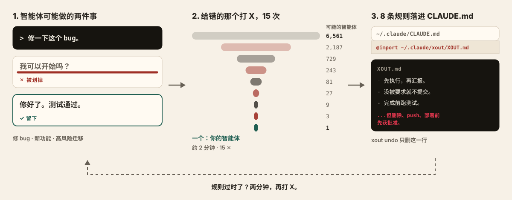
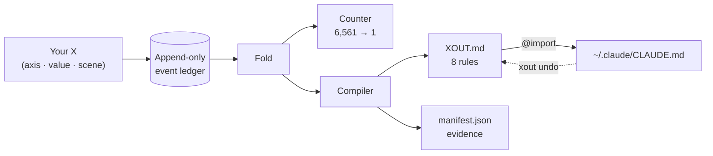

<div align="center">

<h1>xout</h1>


**把你再也不想看到的 AI 行为，一笔划掉。**


[](https://pypi.org/project/xout/) [](https://github.com/brnyxx/xout/actions/workflows/ci.yml) [](LICENSE)

[快速开始](#工作原理) · [每条规则都能自证](#每条规则都能自证) · [行为地图](#行为地图) · [命令](#命令) · [为什么值得信任](#为什么值得信任)

<sub>Read in: [English](README.md) · [한국어](README.ko.md) · [日本語](README.ja.md) · 简体中文 · [在线讲解](https://brnyxx.github.io/xout/)</sub>

</div>

你的编码智能体给出两种具体的行为方式，你把错的那个 X 掉。两分钟、15 个 X 之后，幸存下来的选择会被编译成 8 条本地规则，由 Claude Code 从 `CLAUDE.md` 加载。

```bash
uvx xout --lang zh
```

就这么简单。整个会话直接在你的终端里进行，花大约 2 分钟画 X，你的智能体就有了 8 条规则。


<sub>上面的内容没有任何摆拍：录制器拍下的是一场真实会话，屏幕上的每一对行为和每一条规则都是引擎的真实输出。</sub>

**不上云。无遥测。不调用 LLM。一行即可回滚。**

**v1.0.1 · Python 3.10–3.14 · MIT · 零第三方运行时依赖**

<details>
<summary><strong>其他安装方式</strong>（pip、venv）</summary>

```bash
pip install xout
xout
```

或者完全隔离安装：

```bash
python3 -m venv .venv
.venv/bin/python -m pip install xout
.venv/bin/xout
```

从 Popper 1.x 升级？运行一次 `xout` 即可：`~/.claude/popper/` 下的数据会迁移到 `~/.claude/xout/`，而那行由 xout 拥有的 import 只有在 xout 能证明是自己写入的情况下才会被更新。

</details>

## 工作原理



<sub>从左到右：一个 X 去掉一种行为，15 个 X 只留下一个智能体，而这个智能体被写成 8 条规则。</sub>

1. **你来 X 掉**讨厌的行为，跨越三个真实场景：一次日常 bugfix、一个新功能、一次有风险的生产环境迁移。每一对都展示两种具体的智能体行为：先问再做 vs 先做再说、只用标准库 vs 装个包、先演练迁移 vs 相信再读一遍代码就够了。
2. **xout 编译**幸存的选择，生成 8 条可执行的规则，连同依据和来源一起原子写入 `~/.claude/xout/`。而当你在日常工作和不可逆工作中画下的 X 出现分歧时，规则会**带着这个条件**一起编译出来：

   > 先写一个简短的方案，然后直接开始执行。**不过，对于删除、push、部署、迁移这类难以撤销的工作，执行前一定先获得批准。**

   这个条件不是模板。它之所以存在，是因为你在迁移场景里画了不一样的 X。任何基于问卷的工具都产不出它。
3. **一次按键即可应用。**完成界面会问“现在应用吗？”，回答“是”，就会在 `~/.claude/CLAUDE.md` 里恰好加入一行由 xout 拥有的 `@import`。`xout undo` 只删除这一行。

在一个全新的 Claude Code 会话里重复那个曾经让你烦躁的请求，看规则是否守得住。哪天觉得它过时了，再跑一次 `xout` 就行。

<details>
<summary><strong>内部机制</strong>（一张图）</summary>



每个 X 就是一个事件。其余的一切，包括计数器、规则和 manifest，都是对这条事件流的纯折叠（fold），所以任何规则都可以被重放，并追溯回产生它的那些 X。

</details>

## 每条规则都能自证

`xout why` 可以把任意一条规则追溯回创造它的那几个 X：

```text
$ xout why autonomy --lang zh
[自主性]
规则: 先执行，再汇报一份改动摘要。不过，对于删除、push、部署、迁移这类难以撤销的工作，先告知方案再推进，但最终应用要等批准。
状态: 通过判别试验 / 来源: 你的 X
依据:
  - 在日常工作场景(scn-bugfix)给 ask_first 打了 X (会话 94207efb)
  - 在难以撤销的工作场景(scn-risky)给 ask_first 打了 X (会话 94207efb)
  - 在日常工作场景(scn-bugfix)给 propose_then_act 打了 X (会话 94207efb)
```

追溯不了的规则，就是信不过的规则。xout 的每一条规则都带着自己的凭据。

> `--lang en`、`--lang ja` 和 `--lang zh` 会让整个会话（行为对、规则和屏幕文字）以该语言运行；不带参数时默认是韩语。日语和中文目前已在 `main` 分支上，将随下一个版本发布。无论哪种语言，事件账本本身都是语言无关的。

## 真的管用吗？

`xout probe` 把这个问题直接丢给智能体本人。对每个测量过的场景，它向外部运行器（默认 `claude -p`）把同一道 A/B 题问两次：一次不带规则，一次把落地的 `XOUT.md` 放在前面，然后逐条记录规则是否保持、是否改变了选择。这是对一份落地档案实际跑的一次记录（Claude Code 2.1.257，默认模型，未做任何修改）：

```text
$ xout probe --lang en
Probing 15 cases x 2 (bare / with XOUT.md) - runner: claude -p --output-format text
  [Scope adherence] scn-bugfix: strict -> adjacent_fix_ok  (rule: adjacent_fix_ok)  moved
  [Test discipline] scn-bugfix: test_first -> test_first  (rule: test_after)  missed
  [Comments and docs] scn-bugfix: minimal -> minimal  (rule: minimal)  held
  [Test discipline] scn-feature: test_first -> test_after  (rule: test_after)  moved
  [Behavior on errors] scn-risky: retry_then_report -> stop_and_report  (rule: stop_and_report)  moved
  [Dependency policy] scn-risky: prefer_existing -> prefer_existing  (rule: ask_first)  missed
  ... 9 more, all held

rule held 13/15 · rule moved the choice 4 · matched without rules 9 · unparsed 0
receipt: ~/.claude/xout/probes/probe-20260901T231554.json
```

该这样读它。9 个选择在没有规则时就已经一致，说明模型的默认值在这些地方与这份档案相同。4 个被规则改变了。2 个不符：修 bug 时智能体坚持先写失败的测试，在高风险场景里把"优先用现有依赖"当成已经满足了"安装前先问"。不符的部分才有用：它点名了该打磨的那条规则，而一次探针只要一分钟，改完就能验证。探针不是什么：强制 A/B 的回答衡量的是指示之下的意图，不是长智能体循环里的实际行为，而且这只是一个模型上的一次运行。回执保留了全部原始回答，任何人都能重读。

## 你会得到什么

第十五个 X 之后，三个文件会落入 `~/.claude/xout/`：

| 文件 | 是什么 |
|---|---|
| `XOUT.md` | 为读它的智能体而写的 8 条可执行规则：一段前言（这是谁的偏好、正面冲突时以项目规则为准）、日常工作一节、以及只定义一次条件并强调拿不准时如何判断的难以撤销工作一节。每条规则都标出你用 X 划掉的备选 |
| `manifest.json` | 规则取值、置信度标签、来源以及内容哈希 |
| `settings.xout.json` | 一份可供审阅的设置提案 |

你通过画 X 确认过的规则会标为**已确认**；xout 没有问过你、自己猜出来的默认值会如实标为**猜测**，并排进一个快速重选的队列。没有你明确的“是”，什么都不会被激活。

*（Popper 1.x 把同样的文件以 `POPPER.md` 和 `settings.popper.json` 的名字放在 `~/.claude/popper/` 下；xout 首次运行时会自动迁移它们。）*

## 行为地图

八个轴，在三个场景中测量。其中五个轴会在**两种**语境下同时测量，因此它们可以在“日常 / 不可逆”这条边界上分叉，而且有据可查。

| 轴 | 日常场景 | 不可逆场景 | 可分叉 |
|---|---|---|---|
| 自主性 | bugfix | 迁移 | 是 |
| 出错时的行为 | bugfix | 迁移 | 是 |
| 完成前的验证 | 功能开发 | 迁移 | 是 |
| 依赖策略 | 功能开发 | 迁移 | 是 |
| 提交策略 | 功能开发 | 迁移 | 是 |
| 范围遵守 | bugfix + 功能开发 | - | 交叉校验 |
| 测试纪律 | bugfix + 功能开发 | - | 交叉校验 |
| 注释与文档 | bugfix | - | 风格轴 |

这八个轴不是凭空想出来的，默认值也不是。我们调研了 100 多个高星（10k 到 240k+）的 prompt 与智能体项目：codex / gemini-cli / Devin 实际发布的系统提示词、rust / node / pytorch / transformers 的 AGENTS.md、社区的规则合集，并且保留了凭据：原文引用、核实过的星标数、逐轴的统计，全都在 [`docs/mined-prior.md`](docs/mined-prior.md) 里。八个默认值中有六个与业界主流一致；另外两个不一致，已被修正。你自己的环境同样是一个来源：`xout mine` 会读取你已有的规则文件，并附上 file:line 凭据。

## 再来一对

你已经知道这是怎么玩的了。两种行为，一个 X：

> (1) ~~你凭记忆写 CLAUDE.md。规则没有来源，对 bugfix 和生产迁移一视同仁地一刀切，然后悄悄漂移，直到智能体再次惹恼你。~~
>
> (2) 你划掉的是自己亲眼见过、并且讨厌的行为。每条规则都能追溯到你的 X，只在你的 X 出现分歧的地方沿“日常 / 不可逆”边界分叉，靠一行有凭据的 import 就能回滚，过时了两分钟就能重新划一遍。

那个 X，就是这个产品的全部。

## 命令

| 命令 | 作用 | 写入位置 | 需要同意 |
|---|---|---|---|
| `xout` | 开始（或自动恢复）一次会话 | 仅自有目录 | - |
| `xout why [axis]` | 把规则追溯回创造它的那些 X | 无 | - |
| `xout status` | 显示你的 8 条规则以及它们是否生效 | 无 | - |
| `xout undo` | 删除 xout 拥有的那一行 import，完整回滚 | 一行自有内容 | - |
| `xout enable --grant` | 激活：加入一行由 xout 拥有的 `@import` | 一行自有内容 | 明确同意 |
| `xout mine [paths]` | 把你已有的 CLAUDE.md / AGENTS.md / .cursorrules 读成各轴的观察值，附 file:line 凭据 | 无 | - |
| `xout conflicts [paths]` | 报告项目规则文件中与你的规则要求不同值的行，附 file:line | 无 | - |
| `xout probe` | 向外部运行器（默认 `claude -p`）把同一道 A/B 题问两次：不带规则一次、带上 `XOUT.md` 一次，并把每条规则是否保持写成回执 | 仅自有目录（`probes/`） | 需明确开启 |
| `xout pair` / `xout strike` | 面向智能体和脚本的无头 JSON 会话 | 仅自有目录 | - |

## 为什么值得信任

- **只在本地。**会话期间不调用 LLM、无遥测、无 cookie、无网络。
- **崩溃安全。**追加写入的账本加原子写入：随处中断，随处恢复，恰好落地一次。
- **可逆。**激活只是一行由 xout 拥有的 import；`xout undo` 只删除 xout 能证明是自己写入的内容。
- **诚实。**保留下来的行为只是“还没被划掉”，从来不是“被证明正确”。猜出来的默认值会被标为猜测。

xout 要求每条规则拿出依据，所以它对自己的声明也用同样的格式记录凭据：

```text
claim: interrupt anywhere, resume anywhere, land exactly once
evidence:
  - the suite kills sessions mid-strike and replays the ledger from disk -
    the reconstructed state is identical every time
  - duplicate sessions are rejected; landing is atomic behind content hashes
  - the full suite (400+ tests) on every commit, Python 3.10-3.14,
    macOS/Linux/Windows
```

```text
claim: xout cannot delete a line it cannot prove it wrote
evidence:
  - before touching ~/.claude/CLAUDE.md it records a receipt - the file's
    prefix hash and the exact byte where its one line landed
  - xout undo re-verifies that receipt first; if the file changed around
    the line, it refuses instead of guessing
```

```text
claim: honesty applies to xout's own defects
evidence:
  - while dogfooding the English pack, we caught xout why printing
    "rule: None" - it read the wrong manifest key
  - the defect is on the record in CHANGELOG.md; the fix landed with a
    regression test in the same commit
```

<details>
<summary><strong>这些声明背后的工程实现</strong></summary>

每一次划除都是一条带 fsync 的追加写入 JSONL 事件；落地是带内容哈希的原子操作；会话可以确定性地重放；重复的会话会被拒绝；落地前会检测手动修改。行为对的调度会按语境评估区分能力，因此日常场景的划除永远不会挤占有风险的场景；除非至少五个轴带有真实的划除证据，否则会话作废。15 次划除把一个包含 6,561 个智能体的假设空间（8 个轴，每轴 3 个取值）收敛到一个，而幸存者也只是“尚未被证伪”，从来不是“被证明正确”。封存的预注册文档在 [`docs/prereg/prereg_sealed.json`](docs/prereg/prereg_sealed.json)；冻结的轴目录在 [`docs/axis_locality_table.md`](docs/axis_locality_table.md)。八轴目录是有意冻结的：xout 是一个本地行为编译器，不是 prompt 管理器、云端配置档案，也不是智能体编排器。

</details>

## Claude Code 插件与 Agent Skills

xout 也可以作为一段对话在 Claude Code 里运行：`/xout:xout` 会在聊天中逐对展示行为，你选出要 X 掉的那个，智能体只记录你的明确选择。`/xout:xout status`、`/xout:xout undo` 的用法相同。

或者通过开放的 [Agent Skills](https://github.com/vercel-labs/skills) 生态安装同一个技能，一条命令，任何受支持的智能体都可以：

```bash
npx skills@latest add brnyxx/xout
```

<details>
<summary><strong>经校验和验证的插件安装</strong></summary>

从 [v1.0.1 release](../../releases/tag/v1.0.1) 下载 `xout-plugin-1.0.1.zip`、`SHA256SUMS` 和 `verify_checksums.py`，把三个文件放在同一个目录，然后：

```bash
python3 verify_checksums.py SHA256SUMS \
  --only xout-plugin-1.0.1.zip verify_checksums.py
DEST="$HOME/.local/share/xout-plugin-1.0.1"
test ! -e "$DEST" || { echo "destination already exists: $DEST" >&2; exit 1; }
python3 -m zipfile -e xout-plugin-1.0.1.zip "$DEST"
claude plugin marketplace add "$DEST"
claude plugin install xout@xout-marketplace
```

然后在一个全新的 Claude Code 会话里：`/xout:xout doctor`、`/xout:xout`。

</details>

## 卸载

```bash
xout undo        # 停用：删除 xout 拥有的那一行 import
```

你的规则和事件历史仍会留在 `~/.claude/xout/`（保留或删除都由你决定）。卸载软件包永远不会碰它们。

## 开发

```bash
python3 -m pip install -e '.[test,release]'
python3 -m pytest tests/ -q
```

CI 覆盖 macOS、Linux 和 Windows 上的 Python 3.10-3.14。每次发布都附带 wheel、sdist、插件 ZIP、`SHA256SUMS` 以及构件溯源信息。

## 致谢

`/xout` 技能通过开放的 [Agent Skills](https://github.com/vercel-labs/skills) 生态（MIT）安装，并遵循 [mattpocock/skills](https://github.com/mattpocock/skills)（MIT）确立的 `SKILL.md` 约定。技能之下的一切，包括追加写入的事件账本、纯折叠编译器和封存的预注册，都是 xout 的原创。

MIT © 2026 Brian Kim.
