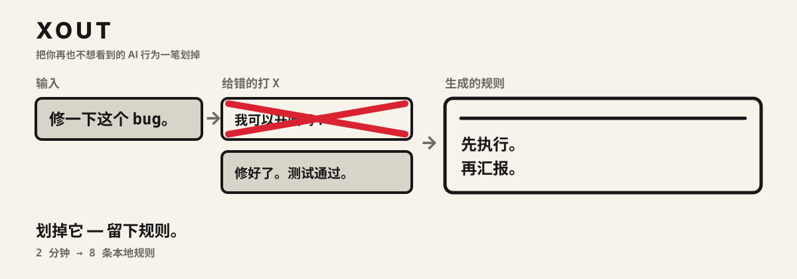
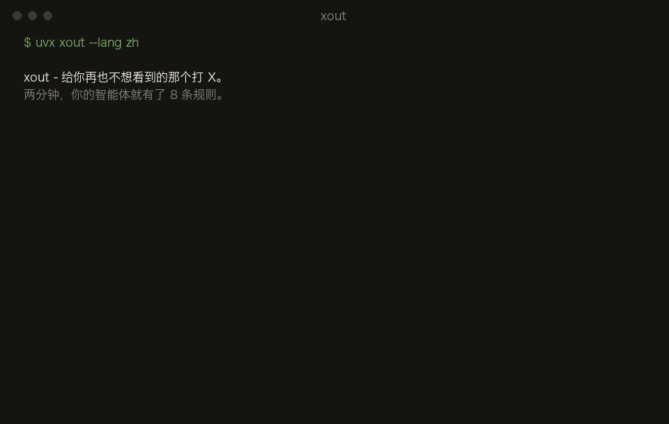
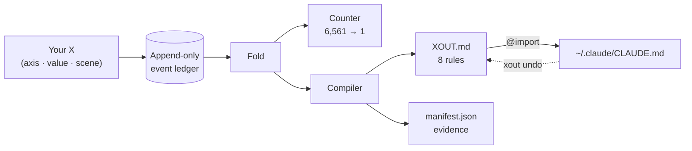

<div align="center">

<h1>xout</h1>


**把你再也不想看到的 AI 行为，一笔划掉。**



[](https://pypi.org/project/xout/) [](https://github.com/brnyxx/xout/actions/workflows/ci.yml) [](LICENSE)

[五步走完全程](#五步走完全程) · [支持的工具](#支持的工具) · [工作原理](#工作原理) · [真的管用吗？](#真的管用吗) · [命令](#命令) · [为什么值得信任](#为什么值得信任)

<sub>Read in: [English](README.md) · [한국어](README.ko.md) · [日本語](README.ja.md) · 简体中文 · [在线讲解](https://brnyxx.github.io/xout/zh/)</sub>

</div>

**每个 AI 编码工具都读一份规则文件，可几乎没人把它写得好。** xout 替你写。它不问问题，只把 AI 可能的两种做法摆在你面前，让你划掉再也不想看到的那个。十五个 X，两分钟左右。留下来的选择会变成 8 条大白话规则，接进你真正在用的工具：Claude Code、Codex、OpenCode、Gemini CLI、Copilot CLI、pi、oh-my-pi、Kiro，或者任何会读 `AGENTS.md` 的工具。


<sub>从左到右：一个 X 去掉一种行为，15 个 X 只剩一个智能体，这个智能体再写成 8 条规则。</sub>

```bash
uvx xout --lang zh
```

就这一步。整个过程都在你的终端里：花 2 分钟左右画 X，最后按一下 `y`，你的智能体就有了 8 条规则。



<sub>上面没有任何摆拍：录下来的是一场真实会话，屏幕上每一对行为、每一条规则都是引擎实际输出的。</sub>

**不上云。没有遥测。会话期间不调用 LLM。凡是写到自有目录之外的东西，都先做一个存档点，一条命令就能撤回。**

**v1.1.0 · Python 3.10–3.14 · MIT · 零第三方运行时依赖**

<details>
<summary><strong>其他安装方式</strong>（pip、venv）</summary>

```bash
pip install xout
xout
```

或者装进独立的虚拟环境：

```bash
python3 -m venv .venv
.venv/bin/python -m pip install xout
.venv/bin/xout
```

从 Popper 1.x 升级？跑一次 `xout` 就行：`~/.claude/popper/` 下的数据会搬到 `~/.claude/xout/`；那行 xout 自有的 import，只有在 xout 能证明确实是自己写的时候才会更新。

</details>

## 五步走完全程

| | 发生什么 | 你要敲的 |
|---|---|---|
| **1. 先读你已有的** | 你手头的规则文件（`CLAUDE.md`、`AGENTS.md`、`.cursorrules`、全局的 `~/.claude/CLAUDE.md`）只读一遍，里面提到屏幕上这个行为的那几行，会显示在每一对旁边。不复制，也不改。 | 不用敲（`xout mine` 可以列出来） |
| **2. 画 X，一共 15 次** | 同一个任务的两种具体做法，划掉你再也不想要的那个。三个真实场景：修一个 bug、加一个功能、做一次有风险的迁移。 | `xout` |
| **3. 规则落地** | 8 条带依据的规则写进 `~/.claude/xout/`。这一步不碰任何别的文件。 | 不用敲 |
| **4. 接进工具** | Claude Code 会多一行 xout 自有的 `@import`；其他工具则在各自规则文件的末尾多一个 xout 自有区块。两种都留回执。 | 结束时按 `y`，或者 `xout enable --grant --target codex` |
| **5. 检查、清理，随时退回** | 直接问智能体本人，规则守不守得住。把旧文件里现在重复的行清掉。xout 目录之外的每一次改动都先做存档点；`xout undo` 只删 xout 自己写的东西，一个字不多。 | `xout probe` · `xout reconcile` · `xout undo` |

## 支持的工具

xout 的规则就是普通 markdown，所以不同工具之间唯一的差别，只是*这个工具从哪儿读规则*。下表的每条路径都出自该工具自己的文档；xout 核实不了的，一概不登记。

| 工具 | 规则写到哪里 | 方式 | `xout enable --grant --target …` |
|---|---|---|---|
| [Claude Code](https://code.claude.com/docs/en/memory) | `~/.claude/CLAUDE.md` | 一行自有 `@import` | `claude`（默认） |
| [OpenAI Codex CLI](https://learn.chatgpt.com/docs/agent-configuration/agents-md) | `~/.codex/AGENTS.md` | 自有区块 | `codex` |
| [OpenCode](https://opencode.ai/docs/rules/) | `~/.config/opencode/AGENTS.md` | 自有区块 | `opencode` |
| [Gemini CLI](https://geminicli.com/docs/cli/gemini-md/) | `~/.gemini/GEMINI.md` | 自有区块 | `gemini` |
| [GitHub Copilot CLI](https://docs.github.com/en/copilot/how-tos/copilot-cli/customize-copilot/add-custom-instructions) | `~/.copilot/copilot-instructions.md` | 自有区块 | `copilot` |
| [pi](https://github.com/badlogic/pi-mono/blob/main/packages/coding-agent/README.md) | `~/.pi/agent/AGENTS.md` | 自有区块 | `pi` |
| [oh-my-pi](https://github.com/can1357/oh-my-pi/blob/main/docs/context-files.md) | `~/.omp/agent/AGENTS.md` | 自有区块 | `omp` |
| [gajae-code](https://github.com/Yeachan-Heo/gajae-code/blob/main/docs/customization.md) | `~/.gjc/agent/AGENTS.md` | 自有区块 | `gjc` |
| [Kiro](https://kiro.dev/docs/steering/) | `~/.kiro/steering/xout.md` | 自有 steering 文件 | `kiro` |
| [任何会读 AGENTS.md 的工具](https://agents.md) | 项目内的 `./AGENTS.md` | 自有区块 | `agents` |

`xout targets` 会打印这张表，外加每一项当前的状态。`xout enable --grant --target all` 一次全接上；`xout undo` 一次全拆掉。

xout 自有区块长这样，也是 xout 在那个文件里唯一会动的地方：

```markdown
<!-- xout:begin sha256=… -->
<!-- managed by xout - edit XOUT.md, not this block; remove with: xout undo -->
# xout Rules
…
<!-- xout:end -->
```

gajae-code 的公开文档没写规则文件在哪。上面的路径来自已安装包的源码（`@gajae-code/coding-agent` 0.15.6，`system-prompt.d.ts`: "Native user-global files (`~/.gjc/agent/AGENTS.md`) come first"），算源码核实，不算文档核实。

## 工作原理

1. **你划掉**讨厌的行为，三个真实场景：修一个日常 bug、加一个新功能、做一次有风险的生产迁移。每一对都是两种具体的智能体做法：先问再做还是先做再说、只用标准库还是装个包、先演练迁移还是觉得再读一遍代码就够了。
2. **xout 编译**留下来的选择，生成 8 条能直接执行的规则，连依据和来源一起原子写入 `~/.claude/xout/`。你在日常工作和难以撤销的工作里画的 X 不一样时，规则会**把这个条件一起编译进去**：

   > 先简短写下方案，然后直接动手。**不过，删除、push、部署、迁移这类难以撤销的工作，一定要先拿到批准再执行。**

   这个条件不是模板里带的。它存在，只因为你在迁移场景里画了不一样的 X。靠问卷的工具做不出这一条。
3. **按一下就接上。**结束时屏幕会问“现在应用吗？”，答“是”，`~/.claude/CLAUDE.md` 里就会多出一行 xout 自有的 `@import`，不多不少。其他工具用 `xout enable --grant --target codex`（或 `opencode`、`gemini`、`copilot`、`pi`、`omp`、`kiro`、`agents`、`all`），在那个工具自己的规则文件里加一个 xout 自有区块。`xout undo` 只删 xout 自己写的内容。

开一个全新的智能体会话，把当初让你烦的那个请求再发一遍，看规则守不守得住。哪天觉得过时了，再跑一次 `xout` 就是。

<details>
<summary><strong>内部机制</strong>（一张图）</summary>



每个 X 就是一个事件。其他所有东西，计数器、规则、manifest，都是对这条事件流的纯折叠（fold），所以任何一条规则都能重放，也都能追溯到产生它的那几个 X。

</details>

## 每条规则都能自证

`xout why` 能把任何一条规则追溯到产生它的那几个 X：

```text
$ xout why autonomy --lang zh
[自主性]
规则: 先做，做完再汇报一份改动摘要。不过，删除、push、部署、迁移这类难以撤销的工作，先说明方案再推进，最后一步的应用要等批准。
状态: 已通过判别测试 / 来源: 你的 X
依据:
  - 在日常工作场景(scn-bugfix)给 ask_first 打了 X (会话 7f632735)
  - 在难以撤销的工作场景(scn-risky)给 ask_first 打了 X (会话 7f632735)
  - 在日常工作场景(scn-bugfix)给 propose_then_act 打了 X (会话 7f632735)
```

追溯不了的规则，就信不过。xout 的每条规则都带着自己的凭据。

> `--lang en`、`--lang ja`、`--lang zh` 会让整个会话（行为对、规则、屏幕文字）都用这门语言；不带参数默认是韩语。日语和中文已经在 `main` 分支上，下一个版本随包发布。不管用哪种语言，事件账本本身都不分语言。

## 真的管用吗？

`xout probe` 把这个问题直接拿去问智能体本人。每个测过的场景，它都向外部运行器（默认 `claude -p`）把同一道 A/B 题问两遍：一遍不带规则，一遍把落地的 `XOUT.md` 放在前面，然后逐条记下规则有没有守住、有没有改变选择。下面是对一份落地档案实际跑的一次记录（Claude Code 2.1.257，默认模型，没做任何改动）：

```text
$ xout probe --lang en
Probing 15 cases x 2 (bare / with XOUT.md) - runner: claude -p --output-format text
  [Scope adherence] scn-bugfix: strict -> adjacent_fix_ok  (rule: adjacent_fix_ok)  moved
  [Test discipline] scn-bugfix: test_first -> test_first  (rule: test_after)  missed
  [Comments and docs] scn-bugfix: minimal -> minimal  (rule: minimal)  held
  [Scope adherence] scn-feature: strict -> adjacent_fix_ok  (rule: adjacent_fix_ok)  moved
  [Test discipline] scn-feature: test_first -> test_after  (rule: test_after)  moved
  [Dependency policy] scn-risky: ask_first -> ask_first  (rule: ask_first)  held
  ... 9 more, all held

rule held 14/15 · rule moved the choice 3 · matched without rules 11 · unparsed 0
receipt: ~/.claude/xout/probes/probe-20260902T003141.json
```

这份结果要这么看。11 个选择不带规则时就已经一致，说明模型在这些地方的默认做法和这份档案一样。3 个被规则改了过来。1 个不符：修 bug 时，规则明明写着“先修好，回归测试随后补”，智能体还是先写了失败测试。这是个很强的习惯，探针的用处就是告诉你，它比你那句话更强。上一次跑的时候，依赖那一轴也有一个不符，原因是那道 A/B 题本身出得不好（优先用现有依赖和装之前先问，两者并不冲突），所以现在探针一律拿规则和它真正的对立面配对。不符的地方才有用：它点出了该打磨的那条规则，一次探针只要一分钟，改完马上能验证。也得说清探针不是什么：强制二选一的回答测的是指示之下的意图，不是长时间智能体循环里的实际行为，而且这只是一个模型上跑的一次。回执保留了全部原始回答，谁都可以重看。

同一份档案也用这台机器上的其他智能体探过（`--quick`：每个轴一个场景，各 8 例）：

| 运行器 | 规则守住 | 规则改变了选择 | 不带规则也一致 |
|---|---|---|---|
| `codex exec` (OpenAI Codex CLI) | 8/8 | 2 | 6 |
| `opencode run` (OpenCode) | 8/8 | 3 | 5 |
| `gjc -p` (gajae-code) | 8/8 | 2 | 6 |

Gemini CLI 没跑，因为这台机器没配 Gemini 的认证；运行器列在下表，你可以自己跑。

运行器可以是任何一条命令，只要它把提示词当最后一个参数、并把回答打印出来。默认是 Claude Code；下面其他几个都是各工具文档里写明的无头模式：

| 工具 | `xout probe --runner "…"` |
|---|---|
| Claude Code | `claude -p --output-format text`（默认） |
| OpenAI Codex CLI | `codex exec`（不在 git 仓库里时加 `--skip-git-repo-check`） |
| OpenCode | `opencode run` |
| Gemini CLI | `gemini -p` |
| GitHub Copilot CLI | `copilot -p` |
| pi | `pi -p` |
| oh-my-pi | `omp -p` |
| gajae-code | `gjc -p` |
| Kiro | `kiro-cli chat --no-interactive` |

## 你已有的提示词

你多半已经有规则文件了。xout 把它们当依据，不当对手。

- **会话里**，每一对旁边都会显示你的文件里已经对这个行为表过态的那几行，比如 `~/.claude/CLAUDE.md:12 "Always ask before editing" → ask_first`，让你确认或者推翻自己当初写的东西。
- **落地之后**，`xout conflicts` 会列出和你新规则相反的那些行，带 file:line。冲突的行从来不会被改：规则文件里已经写明，项目自己的指令优先。
- **`xout reconcile`** 会列出旧文件里现在和 `XOUT.md` 重复的行，并在 `~/.claude/xout/reconcile/` 下写一份补丁提案。只有 `xout reconcile --apply --grant` 才会真的删掉这些重复行，而且一定先做存档点。
- **`xout savepoint`** 随时能把你的规则文件逐字节快照下来；`xout savepoint restore <id>` 再放回去。每次 `enable`、`undo`、`reconcile --apply` 都会自动做一个。

## 你会得到什么

第十五个 X 画完，`~/.claude/xout/` 下会多出三个文件：

| 文件 | 里面是什么 |
|---|---|
| `XOUT.md` | 写给智能体读的 8 条可执行规则：一段前言（这是谁的偏好、正面冲突时以项目规则为准）、一节日常工作、一节难以撤销的工作（条件只定义一次，并交代拿不准时怎么判断）。每条规则都标出你划掉的那个备选 |
| `manifest.json` | 规则取值、置信度标签、来源和内容哈希 |
| `settings.xout.json` | 一份给你过目的设置提案 |

你亲手画 X 确认过的规则会标成**已确认**；xout 没问过你、自己猜的默认值会老老实实标成**猜测**，并排进一条快速重选的队列。没有你明确点头，什么都不会生效。

*（Popper 1.x 把同样的文件叫 `POPPER.md` 和 `settings.popper.json`，放在 `~/.claude/popper/` 下；xout 第一次运行时会自动搬过来。）*

## 行为地图

八个轴，在三个场景里测量。其中五个轴会在**两种**情境下各测一次，所以它们可以沿着“日常 / 难以撤销”这条线分叉，而且分得有据可查。

| 轴 | 日常场景 | 难以撤销的场景 | 能否分叉 |
|---|---|---|---|
| 自主性 | bugfix | 迁移 | 是 |
| 出错时的行为 | bugfix | 迁移 | 是 |
| 完成前的验证 | 功能开发 | 迁移 | 是 |
| 依赖策略 | 功能开发 | 迁移 | 是 |
| 提交策略 | 功能开发 | 迁移 | 是 |
| 改动范围 | bugfix + 功能开发 | - | 测量两次 |
| 测试纪律 | bugfix + 功能开发 | - | 测量两次 |
| 注释与文档 | bugfix | - | 否 |

这八个轴不是拍脑袋想的，默认值也不是。我们调研了 100 多个高星（10k 到 240k+）的 prompt 和智能体项目：codex / gemini-cli / Devin 实际发布的系统提示词，rust / node / pytorch / transformers 的 AGENTS.md，还有社区的规则合集，凭据都留着：原文引用、核实过的星标数、逐轴统计，全在 [`docs/mined-prior.md`](docs/mined-prior.md) 里。八个默认值里六个和业界主流一致；另外两个不一致，已经改过来了。你自己的环境同样算一个来源：`xout mine` 会读你已有的规则文件，附上 file:line 凭据。

## 再来一对

玩法你已经会了。两种行为，一个 X：

> (1) ~~你凭记忆写 CLAUDE.md。规则没有出处，修 bug 和生产迁移一刀切，然后悄悄跑偏，直到智能体下次再惹你。~~
>
> (2) 你划掉的是自己亲眼见过、也真心讨厌的行为。每条规则都能追溯到你的 X，只在你的 X 不一致的地方沿“日常 / 难以撤销”那条线分叉，一行带凭据的 import 就能回滚，过时了花两分钟重新划一遍。

那一个 X，就是整个产品。

## 命令

| 命令 | 做什么 | 写到哪 | 要不要同意 |
|---|---|---|---|
| `xout` | 开始一次会话（有没做完的会自动接着） | 只写自有目录 | - |
| `xout why [axis]` | 把规则追溯到产生它的那几个 X | 不写 | - |
| `xout status` | 看你的 8 条规则，以及有没有生效 | 不写 | - |
| `xout targets` | xout 能接哪些工具、写到哪、哪些已经接上 | 不写 | - |
| `xout enable --grant [--target …]` | 接入：一行自有 `@import`（Claude Code）或一个自有区块（其他工具） | 一行 / 一个自有区块，先做存档点 | 明确同意 |
| `xout undo [--target …]` | 只删 xout 自己写的内容，完整回滚 | 一行 / 一个自有区块 | - |
| `xout mine [paths]` | 把你已有的规则文件（项目 + `~/.claude`）读成各轴的观测，附 file:line 凭据 | 不写 | - |
| `xout conflicts [paths]` | 规则文件里和你的规则相反的行 | 不写 | - |
| `xout reconcile [paths]` | 规则文件里现在和 `XOUT.md` 重复的行；给出一份补丁；`--apply --grant` 会先做存档点再删掉它们 | 自有目录；只有 `--apply --grant` 时才写规则文件 | 明确同意 |
| `xout savepoint [list\|restore <id>]` | 逐字节快照你的规则文件，或者放回去 | 自有目录；restore 会改写快照过的文件 | - |
| `xout probe` | 向外部运行器把同一道 A/B 题问两遍，一遍不带规则、一遍带上你的规则，再把每条规则守没守住写成回执 | 自有目录（`probes/`） | 要手动开启 |
| `xout pair` / `xout strike` | 给智能体和脚本用的无头 JSON 会话 | 只写自有目录 | - |

## 为什么值得信任

- **只在本地。**会话期间不调用 LLM，没有遥测，没有 cookie，不联网。
- **崩溃也不怕。**只追加的账本加原子写入：在哪断都行，从哪接着都行，落地只发生一次。
- **随时能退。**生效只靠每个工具一行自有 import 或一个自有区块；xout 目录之外的每次改动都先做存档点；`xout undo` 只删 xout 能证明是自己写的内容。
- **不装。**留下来的行为只是“还没被划掉”，从来不等于“被证明是对的”。猜出来的默认值就标成猜测。

xout 要求每条规则拿出依据，所以它对自己的说法也按同一格式留凭据：

```text
claim: interrupt anywhere, resume anywhere, land exactly once
evidence:
  - the suite kills sessions mid-strike and replays the ledger from disk -
    the reconstructed state is identical every time
  - duplicate sessions are rejected; landing is atomic behind content hashes
  - the full suite (400+ tests) on every commit, Python 3.10-3.14,
    macOS/Linux/Windows
```

```text
claim: xout cannot delete a line it cannot prove it wrote
evidence:
  - before touching ~/.claude/CLAUDE.md it records a receipt - the file's
    prefix hash and the exact byte where its one line landed
  - xout undo re-verifies that receipt first; if the file changed around
    the line, it refuses instead of guessing
  - every other tool gets a marker-bounded block, a receipt, and a
    savepoint of the file as it was; undo removes the block and nothing else
```

```text
claim: honesty applies to xout's own defects
evidence:
  - while dogfooding the English pack, we caught xout why printing
    "rule: None" - it read the wrong manifest key
  - the defect is on the record in CHANGELOG.md; the fix landed with a
    regression test in the same commit
```

<details>
<summary><strong>这些声明背后的工程实现</strong></summary>

每一次划除都是一条带 fsync 的追加 JSONL 事件；落地是带内容哈希的原子操作；会话可以确定性地重放；重复的会话会被拒绝；落地前会检查有没有被手动改过。行为对的调度按情境评估区分度，所以日常场景的划除永远不会挤掉高风险场景的名额；至少五个轴要有真实的划除证据，否则会话作废。15 次划除把 6,561 个智能体的假设空间（8 个轴，每轴 3 个取值）收敛到一个，而留下的那个也只是“还没被证伪”，从来不是“被证明正确”。封存的预注册文档在 [`docs/prereg/prereg_sealed.json`](docs/prereg/prereg_sealed.json)，冻结的轴目录在 [`docs/axis_locality_table.md`](docs/axis_locality_table.md)。八轴目录是故意冻结的：xout 是一个本地的行为编译器，不是 prompt 管理器，不是云端配置档案，也不是智能体编排器。

</details>

## 在智能体的聊天里使用（Claude Code 插件与 Agent Skills）

xout 也能以对话的形式在 Claude Code 里跑（其他工具请用上面的终端会话）：`/xout:xout` 会在聊天里一对一对地展示行为，你选出要划掉的那个，智能体只记录你明确的选择。`/xout:xout status`、`/xout:xout undo` 用法一样。

也可以通过开放的 [Agent Skills](https://github.com/vercel-labs/skills) 生态装同一个技能，一条命令，任何支持的智能体都行：

```bash
npx skills@latest add brnyxx/xout
```

<details>
<summary><strong>带校验和验证的插件安装</strong></summary>

从 [v1.1.0 release](../../releases/tag/v1.1.0) 下载 `xout-plugin-1.1.0.zip`、`SHA256SUMS` 和 `verify_checksums.py`，三个文件放同一个目录，然后：

```bash
python3 verify_checksums.py SHA256SUMS \
  --only xout-plugin-1.1.0.zip verify_checksums.py
DEST="$HOME/.local/share/xout-plugin-1.1.0"
test ! -e "$DEST" || { echo "destination already exists: $DEST" >&2; exit 1; }
python3 -m zipfile -e xout-plugin-1.1.0.zip "$DEST"
claude plugin marketplace add "$DEST"
claude plugin install xout@xout-marketplace
```

然后开一个全新的 Claude Code 会话：`/xout:xout doctor`、`/xout:xout`。

</details>

## 卸载

```bash
xout undo        # 停用：删除 xout 拥有的那一行 import
```

你的规则和事件历史还留在 `~/.claude/xout/`（留着还是删掉，由你决定）。卸载软件包不会碰它们。

## 开发

```bash
python3 -m pip install -e '.[test,release]'
python3 -m pytest tests/ -q
```

CI 覆盖 macOS、Linux、Windows 上的 Python 3.10-3.14。每次发布都带 wheel、sdist、插件 ZIP、`SHA256SUMS` 和构件溯源信息。

## 致谢

`/xout` 技能通过开放的 [Agent Skills](https://github.com/vercel-labs/skills) 生态（MIT）安装，遵循 [mattpocock/skills](https://github.com/mattpocock/skills)（MIT）定下的 `SKILL.md` 约定。技能之下的一切，只追加的事件账本、纯折叠编译器、封存的预注册，都是 xout 自己的东西。

MIT © 2026 Brian Kim.
